::: {custom-style="Portada-Centrado"}
{height=2.8cm}
:::

::: {custom-style="Portada-Centrado"}
**MAESTRÍA EN INGENIERÍA DE SOFTWARE**
:::

::: {custom-style="Portada-Centrado"}
**PROYECTO DE TESIS**
:::

::: {custom-style="Portada-Centrado"}
&nbsp;
:::

::: {custom-style="Portada-Centrado"}
**"MODELO DE INTEROPERABILIDAD BASADO EN HL7 FHIR PARA MEJORAR EL INTERCAMBIO DE INFORMACIÓN CLÍNICA EN CENTROS DE SALUD DEL MINSA - PERÚ"**
:::

::: {custom-style="Portada-Centrado"}
&nbsp;
:::

::: {custom-style="Portada-Centrado"}
PRESENTADO POR:
:::

::: {custom-style="Portada-Centrado"}
**Bach. Cangalaya Carrasco Henry Miguel**

**Bach. Guzmán Vargas Jhessel**

**Bach. Yanqui Rivera Maria de los Angeles**
:::

::: {custom-style="Portada-Centrado"}
&nbsp;
:::

::: {custom-style="Portada-Centrado"}
PARA OPTAR EL GRADO ACADÉMICO DE:
:::

::: {custom-style="Portada-Centrado"}
**MAESTRO(A) EN INGENIERÍA DE SOFTWARE**
:::

::: {custom-style="Portada-Centrado"}
&nbsp;
:::

::: {custom-style="Portada-Centrado"}
**LIMA**

**2026**
:::

\newpage

# Índice

\newpage

# Índice de tablas

\newpage

# Índice de figuras

\newpage

# Resumen

La presente investigación propone un modelo de interoperabilidad basado en HL7 FHIR para mejorar el intercambio de información clínica de pacientes atendidos en centros de salud del MINSA en Perú. El estudio se estructura en tres fases: diagnóstico de brechas de interoperabilidad, implementación piloto de una capa de integración FHIR y evaluación del impacto mediante comparación pre y post intervención. En la fase diagnóstica se analiza el cumplimiento de estándares y componentes clave (RNIEDS, PIDESALUD, HL7, CIE-10 y CPMS), así como la calidad de los registros clínicos. En la fase de implementación se plantea el diseño y despliegue de servicios de integración orientados a mejorar completitud, codificación, trazabilidad y continuidad de atención. En la fase de evaluación se utilizan indicadores de desempeño para medir cambios en la calidad del intercambio de información clínica. Los resultados esperados incluyen reducción de duplicidad de registros, mejora en codificación clínica, disminución de tiempos de validación y fortalecimiento de la continuidad asistencial, aportando lineamientos de escalabilidad para otros establecimientos del MINSA.

*Palabras clave:* Interoperabilidad en salud, Historia clínica electrónica, HL7 FHIR, MINSA, gestión pública de salud

\newpage

# Abstract

This research proposes an interoperability model based on HL7 FHIR to improve clinical information exchange for patients treated in MINSA health centers in Peru. The study is structured into three phases: interoperability gap diagnosis, pilot implementation of an FHIR integration layer, and impact evaluation through pre- and post-intervention comparison. The diagnostic phase assesses compliance with key standards and components (RNIEDS, PIDESALUD, HL7, ICD-10, and CPMS), as well as clinical data quality. The implementation phase focuses on the design and deployment of integration services aimed at improving record completeness, coding quality, traceability, and continuity of care. The evaluation phase uses performance indicators to measure changes in clinical information exchange quality. Expected outcomes include reduced record duplication, improved clinical coding, shorter administrative validation times, and stronger care continuity, providing scalability guidelines for other MINSA facilities.

*Keywords:* Health interoperability, Electronic health records, HL7 FHIR, MINSA, public health governance

\newpage

# Introducción

La interoperabilidad en salud constituye un factor crítico para garantizar la continuidad asistencial, la seguridad del paciente y la eficiencia administrativa en los sistemas públicos de atención. A nivel global, la fragmentación de los sistemas de información sanitarios ha sido identificada como un obstáculo persistente para el intercambio efectivo de datos clínicos (Torab-Miandoab et al., 2023; Holmgren et al., 2023). Según Vorisek et al. (2022), HL7 FHIR se ha consolidado como el estándar de referencia para habilitar la interoperabilidad, con un crecimiento sostenido en su adopción para investigación clínica y gestión de datos de salud.

En el contexto peruano, el Ministerio de Salud (MINSA) ha emitido un marco normativo específico —la Infraestructura de Estándares de Datos en Salud (IEDS), la Red Nacional de Interoperabilidad en Datos de Salud (RNIEDS) y la Plataforma de Interoperabilidad de Datos Estándares de Salud (PIDESALUD)— orientado a estandarizar el intercambio de información entre establecimientos del MINSA, articulando procesos asistenciales y administrativos financiados por el SIS cuando corresponde. Sin embargo, la implementación operativa de estas normativas permanece incompleta y heterogénea, como documentan Mauricio et al. (2024) al señalar que en Perú no existe actualmente un sistema integrado de historias clínicas electrónicas que permita compartir información automáticamente entre establecimientos.

Frente a este escenario, la presente investigación propone un modelo de interoperabilidad basado en HL7 FHIR que integra tres fases secuenciales: diagnóstico de brechas, implementación piloto de una capa de integración y evaluación de impacto mediante indicadores de calidad del intercambio de información clínica; y, a partir de los resultados obtenidos, formula lineamientos técnicos y operativos para la escalabilidad del modelo en otros establecimientos del MINSA. El estudio se sustenta en evidencia científica reciente —incluyendo revisiones sistemáticas de Amar et al. (2024), Tabari et al. (2024) y Pimenta et al. (2023)— y en experiencias internacionales de implementación en Estonia (Bossenko et al., 2024), Indonesia (Heryawan et al., 2025) y Sri Lanka (Jayathissa y Hewapathrana, 2024).

El documento se estructura en cinco capítulos. El Capítulo I presenta el planteamiento del problema, los objetivos, la justificación y las limitaciones. El Capítulo II desarrolla el marco teórico, incluyendo antecedentes internacionales y nacionales, bases teóricas y la definición de términos. El Capítulo III formula las hipótesis y operacionaliza las variables. El Capítulo IV describe la metodología del estudio. El Capítulo V presenta los aspectos administrativos, incluyendo el presupuesto y el cronograma de actividades.

\newpage

# Capítulo I: Planteamiento del estudio

## 1.1.- Planteamiento y formulación del problema

### 1.1.1.- Planteamiento del problema

Actualmente, en los centros de salud del Ministerio de Salud (MINSA) del Perú, los sistemas de gestión de historias clínicas operan con una interoperabilidad limitada. Si bien el MINSA ha establecido un marco normativo para la interoperabilidad (IEDS, RNIEDS, PIDESALUD), su implementación operativa es heterogénea y, en la práctica, no se ha logrado una adopción sistemática de estándares internacionales como HL7 FHIR (Fast Healthcare Interoperability Resources) que habilite un intercambio de información clínica con niveles adecuados de integridad, consistencia, disponibilidad y continuidad asistencial. Esta condición genera fragmentación de la información clínica del paciente, si bien cabe advertir que la sola adopción de un estándar no garantiza por sí misma la interoperabilidad efectiva sin la gestión adecuada de perfiles, terminologías y gobernanza institucional (Kramer y Moesel, 2023).

En el ámbito global, la ausencia de una integración fluida de datos se reconoce como un obstáculo crítico para la digitalización de la salud. Pimenta et al. (2023) señalan que, sin una regulación uniforme, los establecimientos adoptan sistemas heterogéneos según criterios propios, produciendo registros segregados y fragmentación informacional. Por su parte, Torab-Miandoab et al. (2023) subrayan que esta desarticulación no solo reduce la calidad de la atención y desperdicia recursos financieros, sino que hace imperativa la adopción de estándares como HL7 FHIR, CDA y SNOMED-CT para lograr una integración efectiva.

El panorama peruano refleja esta problemática de manera crítica. Bayona-Castañeda (2019) documenta que un paciente puede tener tantas historias clínicas como establecimientos visita, como resultado de un sistema segmentado y fragmentado. Arrué Pajares y Vargas Rioja (2022) señalan la ausencia de sistemas interoperables que optimicen la gestión de citas, camas y referencias. Mauricio et al. (2024) advierten que actualmente no existe un sistema integrado de historias clínicas electrónicas compartible entre establecimientos, lo que incrementa costos por exámenes duplicados y tiempos adicionales de gestión clínica. Porras-Gamarra (2024), con experiencia directa en interoperabilidad europea, contrasta que, durante la pandemia, mientras Europa debatía sobre estándares de mensajería, en Perú se construían sistemas aislados sin planificación ni estándares.

La siguiente figura ilustra la fragmentación del sistema de salud peruano y sus consecuencias directas sobre la continuidad de la información clínica del paciente.

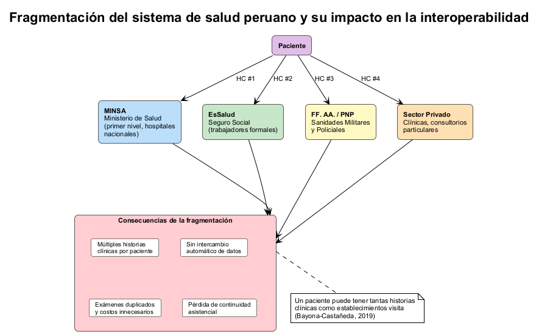

*Nota.* Elaboración propia a partir de Bayona-Castañeda (2019).

Si bien el MINSA ha establecido un marco normativo para la interoperabilidad mediante la Infraestructura de Estándares de Datos en Salud (IEDS), la Red Nacional de Interoperabilidad en Datos de Salud (RNIEDS) y la Plataforma de Interoperabilidad de Datos Estándares de Salud (PIDESALUD), reguladas por la RM N° 1104-2018-MINSA, RM N° 464-2019-MINSA y RM N° 1193-2019-MINSA, su implementación no es uniforme. La siguiente figura presenta la estructura del marco normativo y la brecha entre lo establecido y lo operativo.

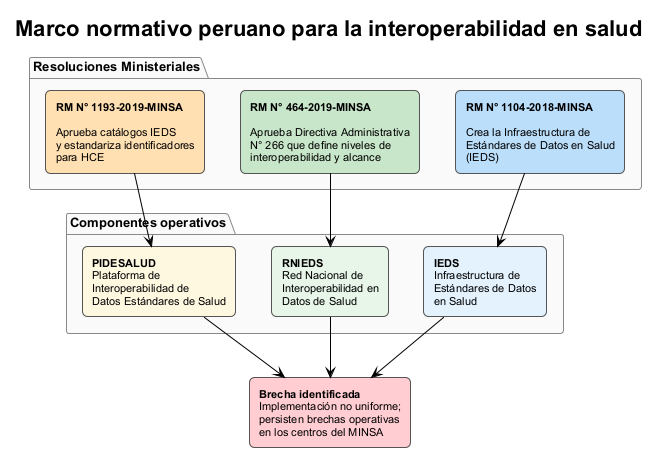

*Nota.* Elaboración propia a partir de RM N° 1104-2018-MINSA, RM N° 464-2019-MINSA y RM N° 1193-2019-MINSA.

Como resultado, persisten brechas operativas concretas en los centros de salud del MINSA:

- **Completitud de registros clínicos:** Información incompleta en historias clínicas que impide una visión integral del paciente.
- **Inconsistencias en codificación clínica:** Uso heterogéneo de CIE-10 y CPMS, afectando el registro y la trazabilidad diagnóstica.
- **Duplicidad de información:** Múltiples registros de un mismo paciente y exámenes repetidos entre establecimientos.
- **Limitaciones en trazabilidad y continuidad:** Dificultad para dar seguimiento a la atención entre distintos niveles y redes de salud.

La siguiente figura sintetiza las cuatro brechas identificadas y sus consecuencias directas sobre el sistema de salud.

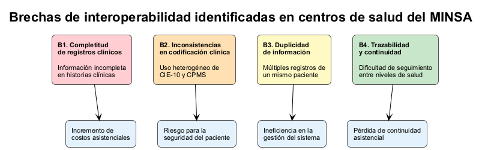

*Nota.* Elaboración propia.

En adición a las brechas detectadas, es crucial examinar la magnitud del asunto a través de datos cuantitativos que permitan entender su efecto en el sistema de salud.

Desde una perspectiva cuantitativa, el problema de interoperabilidad en el sistema de salud de Perú es considerable. De acuerdo con Fernández Infanzón y Huarac-Cuizano (2021), el 74% de las IPRESS no cuenta con un sistema adecuado para gestionar historias clínicas electrónicas, solo el 26% utiliza algún sistema digital y un 39% aún se basa en registros en papel, lo que revela un nivel de digitalización muy bajo. Además, un 83.33% de los usuarios expresa insatisfacción con la forma actual de manejar la información clínica, y el 81.48% opina que una historia clínica electrónica única podría mejorar notablemente la atención.

En cuanto a la adopción de tecnología, investigaciones recientes muestran que el grado de madurez en interoperabilidad en Perú es inferior al 10%, señalando una brecha importante respecto a estándares internacionales. La Tabla 1 presenta una comparación de los niveles de madurez de interoperabilidad de EHR en países de América Latina, evidenciando la posición rezagada del Perú en la región.

: Madurez de interoperabilidad de EHR en países de América Latina {#tbl:madurez-latam}

| País | Madurez de interoperabilidad EHR |
|:------------|:-----------------------------------:|
| Uruguay | 34 % |
| Argentina | 21 % |
| Chile | 11 % |
| Colombia | 11 % |
| **Perú** | **< 10 %** |

*Nota.* Adaptado de "Electronic Health Record Interoperability System in Peru Using Blockchain", por Mauricio et al., 2024, *International Journal of Online and Biomedical Engineering*, 20(6), p. 141.

Esta situación es aún más problemática en áreas fuera de Lima, donde menos del 4% ha adoptado historias clínicas electrónicas, en comparación con menos del 40% en la capital, mostrando así notables desigualdades territoriales.

Los efectos de esta escasa interoperabilidad son evidentes y medibles. Se ha registrado que la falta de integración da lugar a duplicación de registros clínicos, pérdida de datos y exámenes repetidos innecesariamente, lo que aumenta los gastos asistenciales y perjudica la calidad del servicio. Bayona-Castañeda (2019) indica que integrar datos clínicos podría resultar en un ahorro de hasta un 80% en costos vinculados a la repetición de pruebas médicas, subrayando así el impacto económico de la situación.

Además, la fragmentación de la información pone en riesgo la seguridad del paciente y la continuidad de la atención, especialmente en circunstancias críticas como la pandemia, donde la falta de sistemas interoperables limitó la capacidad de respuesta del sistema de salud (Vargas-Rioja y Arrué-Pajares, 2022). A esto se le añade el riesgo a la seguridad de la información, reflejado en incidentes como la filtración de más de 44,000 registros clínicos del MINSA, lo que pone de manifiesto debilidades en la gestión y protección de los datos.

En conjunto, estos datos demuestran que el problema de interoperabilidad no solo es de carácter estructural, sino que también tiene un impacto directo en la calidad de la atención, la eficiencia del sistema de salud y la seguridad del paciente, justificando así la necesidad de crear e implementar modelos basados en estándares como HL7 FHIR que permitan mejorar el intercambio de información clínica de manera eficiente.

Estos hallazgos subrayan que la problemática de interoperabilidad no es solo estructural, sino también cuantificable, afectando de manera directa la calidad, eficiencia y seguridad en la atención de salud. La Tabla 2 consolida los principales indicadores cuantitativos que dimensionan la brecha de interoperabilidad en el sistema de salud peruano.

: Indicadores cuantitativos de la brecha de interoperabilidad en el sistema de salud peruano {#tbl:indicadores-brecha}

| Indicador | Valor | Fuente |
|:---------------------------------------------------|:----------:|:-------------------------------------------|
| IPRESS sin sistema adecuado de HCE | 74 % | Fernández Infanzón y Huarac-Cuizano (2021) |
| IPRESS con algún sistema digital de HCE | 26 % | Fernández Infanzón y Huarac-Cuizano (2021) |
| IPRESS que aún utiliza registros en papel | 39 % | Fernández Infanzón y Huarac-Cuizano (2021) |
| Usuarios insatisfechos con gestión de información clínica | 83,33 % | Fernández Infanzón y Huarac-Cuizano (2021) |
| Usuarios que consideran que una HCE única mejoraría la atención | 81,48 % | Fernández Infanzón y Huarac-Cuizano (2021) |
| Madurez de interoperabilidad EHR en Perú | < 10 % | Mauricio et al. (2024) |
| Adopción de HCE fuera de Lima | < 4 % | Mauricio et al. (2024) |
| Adopción de HCE en Lima | < 40 % | Mauricio et al. (2024) |
| Ahorro potencial por integración de datos clínicos | hasta 80 % | Bayona-Castañeda (2019) |
| Establecimientos con integraciones HL7/FHIR | 22 % | Mauricio et al. (2024) |
| Errores en entrada de datos (establecimientos sin integración) | 35 % | Mauricio et al. (2024) |
| Pacientes crónicos con pérdida de datos en transiciones | 55 % | Mauricio et al. (2024) |

*Nota.* Elaboración propia a partir de las fuentes citadas.

La siguiente figura resume los indicadores clave que dimensionan esta problemática.

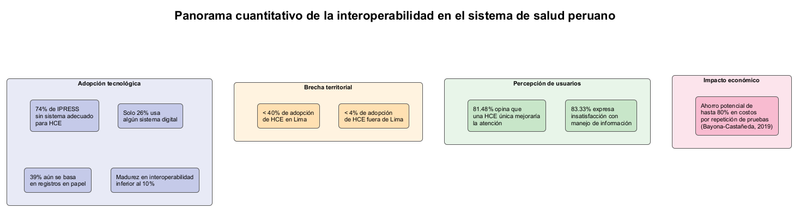

*Nota.* Elaboración propia a partir de Fernández Infanzón y Huarac-Cuizano (2021) y Bayona-Castañeda (2019).

La Organización Panamericana de la Salud (OPS, 2024) define la interoperabilidad como la capacidad de diferentes sistemas para intercambiar datos con exactitud, efectividad y consistencia, distinguiendo entre interoperabilidad técnica (transferencia fiable) e interoperabilidad semántica (comprensión mutua de la información). HL7 FHIR emerge como el estándar internacional más prometedor para abordar ambas dimensiones, tal como evidencian Vorisek et al. (2022) en su revisión sobre usos de FHIR en investigación, y Holmgren et al. (2023) en el análisis de marcos de políticas de interoperabilidad en países con mayor madurez.

Esta evidencia se complementa con hallazgos recientes sobre gobernanza e implementación: Richwine et al. (2025) muestran que la participación institucional en organizaciones de intercambio (HIO) incrementa de forma significativa el intercambio clínico efectivo; Raab et al. (2023) plantean arquitecturas federadas orientadas al control ciudadano de datos en el EHDS; Pedrera-Jiménez et al. (2023) demuestran la viabilidad de enfoques agnósticos donde OpenEHR, ISO 13606 y FHIR coexisten por capas; y Chatterjee et al. (2022) validan, en prueba de concepto, que la combinación FHIR + SNOMED-CT reduce pérdidas semánticas en intercambio bidireccional.

A pesar de la existencia de la normativa y avances en estándares de interoperabilidad, no se evidencian propuestas aplicadas y evaluadas en el contexto de los centros de salud del MINSA que integren un modelo basado en HL7 FHIR alineado a la normativa nacional y que demuestren empíricamente mejoras en la calidad del intercambio de información clínica. Esta ausencia constituye una brecha tanto práctica como científica que limita la toma de decisiones basada en evidencia en procesos de transformación digital en salud.

Frente a este panorama, se requiere una propuesta de intervención fundamentada en la evidencia que permita:

1.- Diagnosticar las brechas de interoperabilidad con instrumentos validados.

2.- Implementar una capa de integración basada en HL7 FHIR alineada con los estándares internacionales y el marco normativo nacional.

3.- Evaluar sus efectos medibles en la calidad del intercambio de información clínica del paciente.

La presente investigación responde a esta necesidad integrando las tres fases en un modelo coherente y replicable.

### 1.1.2.- Formulación del problema

1.- *Problema general*

¿De qué manera la implementación de un modelo de interoperabilidad basado en HL7 FHIR mejora el intercambio de información clínica en los centros de salud del MINSA del Perú?

2.- *Problemas específicos*

- ¿Cuáles son las brechas de interoperabilidad actuales en los centros de salud del MINSA del Perú en términos de completitud, codificación, duplicidad y trazabilidad de la información clínica?
- ¿Cuáles son los requerimientos técnicos, funcionales y normativos necesarios para la implementación un modelo de interoperabilidad basado en HL7 FHIR en el contexto del MINSA?
- ¿En qué medida un modelo de interoperabilidad basado en HL7 FHIR permite integrar sistemas heterogéneos en los centros de salud del MINSA?
- ¿Cuál es el efecto de la implementación del modelo propuesto en la calidad del intercambio de información clínica, medida a través de indicadores de integridad, consistencia, disponibilidad y continuidad?

La siguiente figura presenta la correspondencia entre los problemas específicos formulados y los objetivos específicos de la investigación, evidenciando la trazabilidad metodológica del estudio.

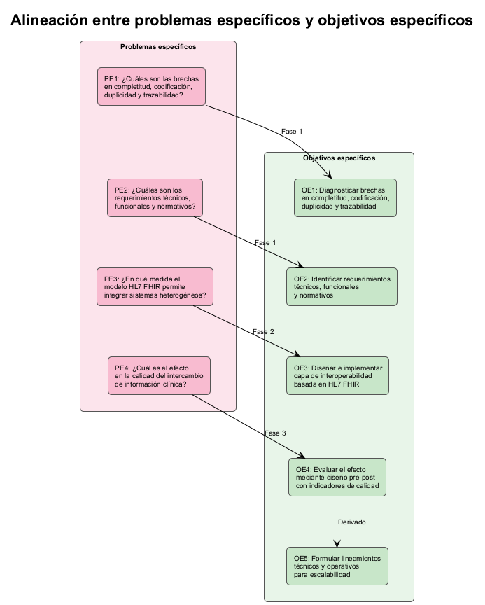

*Nota.* Elaboración propia.

## 1.2.- Determinación de objetivos

### 1.2.1.- Objetivo general

Evaluar el efecto de un modelo de interoperabilidad basado en HL7 FHIR en la mejora del intercambio de información clínica en centros de salud del MINSA del Perú, mediante el diagnóstico de brechas, el diseño e implementación de una capa de integración piloto y la medición de indicadores de calidad de la información.

### 1.2.2.- Objetivos específicos

- Diagnosticar las brechas de interoperabilidad en los centros de salud del MINSA del Perú en términos de completitud, codificación clínica, duplicidad y trazabilidad de la información.
- Identificar los requerimientos técnicos, funcionales y normativos necesarios para la implementación de un modelo de interoperabilidad basado en HL7 FHIR en el contexto del MINSA.
- Diseñar e implementar una capa de interoperabilidad basada en HL7 FHIR para la integración de sistemas heterogéneos en centros de salud del MINSA, considerando los requerimientos técnicos y el marco normativo vigente (IEDS, RNIEDS, PIDESALUD).
- Evaluar el efecto de la implementación del modelo mediante un diseño pre-post, utilizando indicadores de integridad, consistencia, disponibilidad y continuidad de la información clínica.
- Formular lineamientos técnicos y operativos para la escalabilidad del modelo de interoperabilidad propuesto, basados en los resultados de la implementación piloto y alineados con la infraestructura de estándares de datos en salud del MINSA.

## 1.3. Justificación e importancia del estudio

### 1.3.1. Justificación teórica

Como se evidenció en el planteamiento del problema (sección 1.1), la ausencia de propuestas aplicadas y evaluadas que integren un modelo basado en HL7 FHIR alineado a la normativa nacional constituye una brecha tanto práctica como científica. La presente investigación aporta al cierre de esta brecha al articular, en un marco analítico conjunto, las dimensiones estructural, semántica y tecnológica de la interoperabilidad con la evaluación de su impacto en las cuatro brechas diagnósticas identificadas: completitud de registros, consistencia en la codificación clínica, duplicidad de información y trazabilidad de la atención.

A través de una revisión de mapeo sistemático de más de 70 estudios sobre FHIR e interoperabilidad semántica, Amar et al. (2024) identificaron seis tipos de estrategias: mapeo (24,6%), servicios terminológicos (14,3%), enfoques con RDF/OWL (19%), mecanismos de anotación (14,3%), técnicas de aprendizaje automático y procesamiento del lenguaje natural (15,9%), y ontologías (11,9%). No obstante, los autores subrayan la falta de marcos que integren estas estrategias con la evaluación de impactos en contextos de operación específicos. De manera convergente, Tabari et al. (2024), en su revisión comprensiva sobre modelos de datos en FHIR, sostienen que, si bien el estándar posee un alto potencial transformador, aún se requieren ajustes contextuales para superar sus limitaciones y lograr implementaciones efectivas. La presente investigación aborda esta carencia al conectar estándares internacionales (HL7 FHIR, HL7 CDA, DICOM) con el marco regulatorio peruano (RM N.° 1104-2018-MINSA, RM N.° 464-2019-MINSA, RM N.° 1193-2019-MINSA), generando evidencia sobre su implementación práctica en sistemas públicos gestionados por el MINSA.

Complementariamente, Gaudet-Blavignac et al. (2021) proponen una estrategia semántica de tres pilares para el uso secundario de datos en redes nacionales, y Monsen et al. (2023) demuestran que el uso de terminologías estandarizadas en FHIR incrementa la reutilización de datos clínicos para analítica y toma de decisiones. Estos aportes refuerzan la pertinencia de un modelo que no solo atienda la integración técnica de sistemas, sino que preserve el significado clínico —aspecto directamente vinculado a las dimensiones de codificación y trazabilidad planteadas en los objetivos específicos— y habilite el valor posterior del dato.

### 1.3.2. Justificación metodológica

El enfoque metodológico de la presente investigación se estructura en tres fases secuenciales —diagnóstico de brechas, implementación piloto y evaluación de efectos— alineadas con el proceso lógico establecido en los objetivos (sección 1.2). Este diseño es consistente con las metodologías predominantes en estudios recientes del sector. Adelusi et al. (2025) evaluaron una arquitectura de interoperabilidad federada basada en FHIR, analizando velocidad de respuesta, precisión de datos y escalabilidad, obteniendo más del 95% de exactitud en la captura de información y una reducción del 38% en la latencia respecto de arquitecturas centralizadas. Asimismo, Liu et al. (2023) validaron un sistema de registros médicos electrónicos basado en FHIR mediante pruebas de carga con Apache JMeter, demostrando que la sustitución de gateways por servidores FHIR reduce significativamente los tiempos y costos asociados con la transformación de datos.

La presente investigación adopta un diseño pre-experimental con comparación pre-post intervención, que permite medir los cambios en los indicadores de calidad definidos en los objetivos específicos —integridad, consistencia, disponibilidad y continuidad de la información clínica— antes y después de la implementación de la capa FHIR. Este diseño garantiza replicabilidad en otros entornos de atención, al especificar herramientas, parámetros e indicadores con total claridad. La comparación pre-post proporciona evidencia empírica sobre la efectividad del modelo en las dimensiones diagnosticadas.

Adicionalmente, Mukhiya et al. (2021) evidencian que capas de interoperabilidad basadas en FHIR con interfaces flexibles (GraphQL) reducen el acoplamiento entre sistemas heterogéneos, y Richwine et al. (2025) reportan que los mayores beneficios se materializan cuando la integración técnica se acompaña de mecanismos de gobernanza del intercambio. Ambos hallazgos respaldan el enfoque metodológico del estudio, que combina diseño técnico de integración con evaluación operacional de resultados alineada a las brechas específicas identificadas en la fase diagnóstica.

*Nota.* Elaboración propia.

### 1.3.3. Justificación social

Las brechas de interoperabilidad descritas en el planteamiento del problema —registros incompletos, codificación heterogénea, duplicidad de información y limitaciones en la trazabilidad— tienen consecuencias directas sobre la calidad de atención a los usuarios de los establecimientos del MINSA, especialmente en poblaciones vulnerables con cobertura financiera del SIS. De acuerdo con Holmgren et al. (2023), una interoperabilidad eficiente puede frenar el aumento de los gastos en salud al disminuir el uso innecesario de servicios y aliviar la carga administrativa para los pacientes al permitir que sus datos los acompañen de manera consistente a lo largo de su atención. De igual manera, Pimenta et al. (2023) argumentan que el tratamiento adecuado de un paciente solo se logra cuando los profesionales de la salud tienen acceso a la información más reciente y completa, siendo la interoperabilidad condición esencial para una atención de calidad.

La OPS (2024) resalta que la interoperabilidad posibilita que los sistemas de información crucen los límites organizacionales y fomenten la prestación de servicios eficaces, al proporcionar la información pertinente a los proveedores de atención para que puedan entender y atender la salud de los individuos y las comunidades. Contar con información clínica más íntegra, consistente, disponible y trazable —las cuatro dimensiones de calidad que evalúa esta investigación— mejora la seguridad del paciente, disminuye la posibilidad de errores derivados de información fragmentada y promueve una atención más equitativa dentro del sistema público de salud peruano.

En el plano nacional, la evidencia reciente vincula la madurez de la historia clínica electrónica con resultados de gestión y atención: Esparza Morgan (2025) identifica una asociación positiva entre el uso de HCE única y la mejora de la gestión de calidad hospitalaria, Arias Geronimo (2025) reporta una relación significativa entre la confiabilidad del registro electrónico y el desempeño en servicios preventivos, y Morales-Camargo y Meneses-Claudio (2023) destacan efectos favorables de los registros médicos electrónicos en eficiencia y soporte a la decisión clínica cuando existen condiciones de estandarización y capacitación. Estos hallazgos refuerzan que mejorar la interoperabilidad en los centros de salud del MINSA —objetivo central de esta tesis— no solo es una necesidad técnica, sino una condición para fortalecer la calidad, equidad y continuidad asistencial en el sistema público de salud del Perú.

## 1.4. Limitaciones de la presente investigación

La siguiente figura presenta una visión integrada de las seis limitaciones identificadas y sus correspondientes estrategias de mitigación.

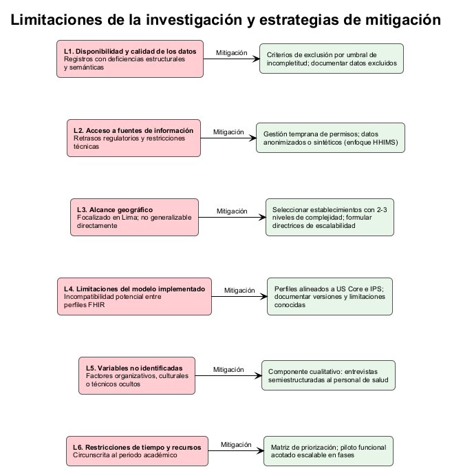

*Nota.* Elaboración propia.

### 1.4.1. Disponibilidad y calidad de los datos

Los registros clínico-administrativos de los establecimientos del MINSA presentan deficiencias estructurales, inconsistencias semánticas y ausencia de estándares uniformes, lo que afecta la exactitud de la fase diagnóstica de brechas definida en el objetivo específico 1. Torab-Miandoab et al. (2023), en su revisión sistemática de 45 estudios sobre sistemas EHR heterogéneos, documentan que los esquemas propietarios y la variabilidad en las convenciones de registro (por ejemplo, diferencias de nomenclatura entre establecimientos para un mismo diagnóstico) incrementan sustancialmente la complejidad de normalización y mapeo de datos, lo cual es directamente relevante para las brechas de codificación y completitud identificadas en el planteamiento del problema.

En el contexto peruano, esta limitación se manifiesta de manera concreta: los sistemas emplean esquemas propietarios no estandarizados que dificultan la extracción uniforme de datos, y la variabilidad en nomenclaturas clínicas entre establecimientos exige mapeos manuales que pueden introducir errores. Adicionalmente, la proporción de registros con campos incompletos en los sistemas del MINSA compromete la representatividad de la muestra diagnóstica y podría subestimar —o sobreestimar— la magnitud real de las brechas de completitud y codificación.

Ante esta limitación, en la presente investigación se implementarán criterios de exclusión para registros con grado de incompletitud superior a un umbral previamente definido, y se documentará el porcentaje de datos excluidos para delimitar con transparencia el alcance real de la muestra analizada.

### 1.4.2. Acceso a fuentes de información

La obtención de autorizaciones para acceder a los datos de los sistemas del MINSA enfrenta retrasos regulatorios derivados de las revisiones de comités de ética (IRB) y el cumplimiento de la Ley 29733 de Protección de Datos Personales. A estos plazos se suman restricciones técnicas específicas, como límites de velocidad en puntos de acceso o permisos de solo lectura en endpoints FHIR disponibles. Esta situación dificulta la incorporación oportuna de datos, especialmente en un entorno con divisiones verticales entre aseguramiento (SIS) y prestación (MINSA/HIS).

Mauricio et al. (2024), con base en su encuesta a 120 proveedores de salud en Perú, reportan hallazgos que dimensionan esta limitación:

- Apenas el 42 % de las instalaciones urbanas y el 18 % de las rurales cuentan con sistemas EHR operativos; en regiones de sierra y selva, el 65 % aún depende de registros en papel o planillas sin APIs disponibles, lo que restringe la verificación de las dimensiones de completitud y codificación.
- Las zonas rurales reportan que el 72 % de las interrupciones afectan la continuidad de la atención —por ejemplo, traslados interhospitalarios sin historial digital—, con tiempos de conciliación manual de 48 a 72 horas, situación que compromete directamente la trazabilidad.
- Solo el 22 % de los establecimientos posee integraciones HL7/FHIR; el resto recurre a documentos PDF escaneados, lo que eleva la tasa de errores en la entrada de datos al 35 % y dificulta la evaluación de la codificación estandarizada.
- El 55 % de los pacientes crónicos (diabetes, tuberculosis) experimenta pérdida de datos durante las transiciones de atención, con un 28 % de probabilidad adicional de readmisión atribuida a información incompleta, evidenciando el impacto de la baja integridad y consistencia de los registros.

La Tabla 3 sintetiza estos hallazgos con sus implicaciones directas para las dimensiones de calidad evaluadas en esta investigación.

: Brechas operativas en establecimientos del MINSA según hallazgos de Mauricio et al. (2024) {#tbl:brechas-mauricio}

| Indicador | Urbano | Rural | Brecha de calidad afectada |
|:----------------------------------------------|:--------:|:-------:|:---------------------------------|
| Establecimientos con EHR operativo | 42 % | 18 % | Completitud, codificación |
| Dependencia de registros en papel/planillas | — | 65 % | Completitud, disponibilidad |
| Interrupciones que afectan continuidad | — | 72 % | Trazabilidad, continuidad |
| Tiempo de conciliación manual | — | 48–72 h | Eficiencia, disponibilidad |
| Establecimientos con integración HL7/FHIR | 22 % (promedio) | | Consistencia, codificación |
| Tasa de errores en entrada de datos (sin integración) | 35 % (promedio) | | Integridad, consistencia |
| Pacientes crónicos con pérdida de datos en transiciones | 55 % (promedio) | | Continuidad, trazabilidad |
| Probabilidad adicional de readmisión por datos incompletos | 28 % (promedio) | | Integridad, continuidad |

*Nota.* Adaptado de "Electronic Health Record Interoperability System in Peru Using Blockchain", por Mauricio et al., 2024, *International Journal of Online and Biomedical Engineering*, 20(6), pp. 139–155.

Esta situación puede retrasar la fase diagnóstica y limitar las pruebas de integración. En la fase piloto, el uso de datos sintéticos para simular escenarios iniciales resulta necesario, aunque podría subestimar las latencias reales en conexiones de bajo ancho de banda.

Ante esta limitación, en la presente investigación se gestionarán los permisos institucionales desde la fase inicial del proyecto y se establecerán acuerdos de confidencialidad. En caso de restricciones de acceso, se emplearán datos anonimizados o sintéticos para las pruebas técnicas, siguiendo el enfoque de datasets sintéticos HHIMS documentado por Jayathissa y Hewapathrana (2024).

### 1.4.3. Alcance geográfico

El estudio se focaliza en centros de salud del MINSA ubicados en Lima, lo que limita la generalización de los hallazgos a otras regiones del país. Las condiciones de infraestructura tecnológica difieren sustancialmente entre zonas urbanas y rurales del Perú: mientras que Lima dispone de conectividad estable, equipamiento actualizado y personal con mayor familiarización digital, las regiones de sierra y selva enfrentan cortes de energía frecuentes, conexiones de baja velocidad y uso extendido de registros manuales (Mauricio et al., 2024). Holmgren et al. (2023), en su análisis comparado de políticas de intercambio en cinco países, corroboran que los modelos de interoperabilidad diseñados para entornos urbanos con infraestructura madura presentan dificultades significativas de transferencia a contextos con menor madurez digital.

En consecuencia, el modelo propuesto —y los resultados de la evaluación pre-post intervención— son válidos para el contexto específico del estudio, pero requieren adaptaciones para su escalabilidad a otras localidades, aspecto que se aborda como lineamiento en el objetivo específico 4.

Ante esta limitación, en la presente investigación se seleccionarán establecimientos que representen al menos dos o tres niveles de complejidad dentro de Lima, para captar variabilidad representativa, y se formularán directrices explícitas de escalabilidad como parte de los lineamientos derivados del piloto.

### 1.4.4. Limitaciones del modelo de interoperabilidad implementado

La adopción de HL7 FHIR no garantiza por sí sola la interoperabilidad efectiva entre sistemas. Kramer y Moesel (2023) demuestran que aplicaciones conformes con distintas Guías de Implementación FHIR pueden resultar incompatibles entre sí, dado que la verificación de conformidad individual de dos sistemas con sus respectivas especificaciones no asegura que logren intercambiar datos. Este riesgo es relevante para el presente estudio, ya que la capa de integración piloto interactuará con sistemas heterogéneos cuyos perfiles FHIR podrían diferir en interpretación.

Adicionalmente, Vorisek et al. (2022) señalan como limitaciones inherentes a FHIR el posible cambio en el contenido de los recursos entre versiones del estándar, los requisitos de seguridad para proteger información clínica sensible y la dependencia de un servidor FHIR como punto de articulación. En el contexto peruano, donde coexisten sistemas con distinto nivel de madurez tecnológica, estas limitaciones pueden amplificarse al momento de integrar establecimientos de diferente complejidad.

Ante esta limitación, en la presente investigación se emplearán perfiles FHIR alineados con estándares de uso extendido (US Core, International Patient Summary) y se documentarán de forma explícita las decisiones de diseño, las versiones de recursos utilizadas y las limitaciones de compatibilidad conocidas.

### 1.4.5. Variables no identificadas

Es posible que factores organizativos, culturales o técnicos no contemplados en el diseño inicial incidan sobre los resultados del piloto. Heryawan et al. (2025), en su análisis de contenido sobre incidencias reportadas en la plataforma nacional de salud digital de Indonesia (Satusehat), identifican que las dificultades más frecuentes en implementaciones FHIR se relacionan con fallos de servidor (57%), problemas de mapeo de datos heredados (34%) y selección inadecuada de perfiles (9%). Estos problemas tienden a manifestarse durante la operación real y no durante las pruebas controladas, lo que subraya la necesidad de contemplar variables emergentes que solo se identifican en la interacción cotidiana con el personal de salud y los sistemas en producción.

En el caso peruano, donde los sistemas son diversos y en muchos casos obsoletos, la probabilidad de que surjan obstáculos no anticipados durante la implementación piloto es relevante y debe ser explícitamente reconocida como limitación del diseño.

Ante esta limitación, en la presente investigación se incorporará un componente cualitativo mediante entrevistas semiestructuradas al personal de salud participante, orientado a captar factores emergentes, barreras no anticipadas y condiciones contextuales que puedan incidir en la efectividad del modelo.

### 1.4.6. Restricciones de tiempo y recursos

La implementación del proyecto piloto está circunscrita al periodo académico de la investigación, lo cual impone restricciones sobre el alcance de la intervención y el seguimiento de resultados. La OPS (2024) reconoce que los procesos de interoperabilidad en salud requieren fases de planificación, adaptación local y estabilización que habitualmente exceden un ciclo académico. A este desfase se añaden los plazos de gestión administrativa propios del MINSA —autorizaciones institucionales, revisiones éticas y periodos de familiarización del personal con nuevos sistemas— que pueden consumir una proporción significativa del tiempo disponible.

La experiencia nacional respalda esta restricción. Porras Gamarra (2024) documenta que la implementación de interoperabilidad HL7 FHIR y openEHR en un entorno hospitalario real involucró múltiples iteraciones de ajuste y validación, y Arrué Pajares y Vargas Rioja (2022) reportan que su implementación de HIS interoperable basado en HL7 v2 requirió una fase extensa de configuración y pruebas adaptadas a la infraestructura local. En contextos internacionales con desafíos similares de madurez digital, Heryawan et al. (2025) muestran que la adopción de FHIR en Indonesia avanzó de forma incremental, priorizando funcionalidades críticas en cada iteración.

Ante esta limitación, en la presente investigación se priorizarán las brechas con mayor impacto y viabilidad mediante una matriz de priorización, concentrando los recursos en un piloto funcional y acotado que pueda generar evidencia evaluable dentro del periodo académico y ser escalado en fases subsiguientes, en coherencia con los lineamientos de escalabilidad planteados en el objetivo específico 4.

# Capítulo II: Marco teórico

## Antecedentes del problema

### Internacionales

**ADELUSI ET AL. (2025)**
**Aporte:** Proponen un framework federado basado en HL7 FHIR para intercambio seguro entre hospitales heterogéneos, integrando principios de aprendizaje federado con gobernanza de datos y mecanismos de cumplimiento normativo.
**Problema:** Fragmentación de EHR y riesgos de seguridad inherentes a modelos centralizados de intercambio de datos clínicos entre múltiples hospitales con plataformas disímiles.
**Objetivo:** Demostrar que una arquitectura federada basada en FHIR mejora la interoperabilidad sin centralizar datos clínicos crudos.
**Metodología:** Diseño y evaluación de framework en entorno simulado compuesto por tres sistemas hospitalarios con plataformas EHR diferentes (*Engineering and Technology Journal*).
**Instrumentos de evaluación:** Pruebas de recuperación de datos, medición de latencia, verificación de adherencia al protocolo FHIR y pruebas de escalabilidad. El entorno simuló un gateway de interoperabilidad, APIs FHIR, módulos de gestión de consentimiento y repositorios distribuidos con validación por consenso.
**Métricas o indicadores de desempeño:** Precisión de recuperación de datos, latencia de respuesta, tasa de adherencia al protocolo FHIR y capacidad de escalabilidad.
**Resultados:** >95 % de precisión en recuperación de datos, 38 % de reducción de latencia frente a sistema centralizado, adherencia total a protocolos FHIR y reducción significativa del riesgo de brechas de datos al no transferir datos crudos.
**Limitaciones:** Entorno exclusivamente simulado; sin implementación en hospitales reales. Los autores plantean como trabajo futuro integrar blockchain y cifrado homomórfico.
**Crítica o aporte a la tesis:** La arquitectura federada validada respalda la viabilidad de intercambio FHIR entre establecimientos heterogéneos, condición afín al escenario MINSA con plataformas disímiles. Las métricas de integridad y latencia proveen un referente cuantitativo para la evaluación pre/post de esta investigación.

**HERYAWAN ET AL. (2025)**
**Aporte:** Caracterizan barreras reales de implementación FHIR en la plataforma nacional Satusehat de Indonesia, primer despliegue masivo de interoperabilidad basada en FHIR en el sudeste asiático.
**Problema:** Dificultades técnicas recurrentes en el uso de servidores, perfiles y mapeo semántico de datos durante la adopción nacional de FHIR.
**Objetivo:** Identificar puntos críticos de adopción e integración para mejorar el despliegue interoperable nacional.
**Metodología:** Análisis de contenido cualitativo de interacciones del grupo Telegram del Developer Hub de Satusehat y de la documentación técnica oficial (*JMIR Formative Research*).
**Instrumentos de evaluación:** Categorización temática de 107 incidencias reportadas y análisis de frecuencia por categoría. Fuente de datos: mensajes del grupo Telegram del Satusehat Developer Hub.
**Métricas o indicadores de desempeño:** Frecuencia absoluta y porcentual de incidencias por categoría temática (servidor, mapeo, perfiles).
**Resultados:** De 107 incidencias, 61 correspondieron a problemas del servidor FHIR (57 %), 37 a dificultades de mapeo de datos (34 %) y 9 a selección de perfiles (9 %). Los autores proponen una arquitectura federada con componentes FHIR writer/viewer.
**Limitaciones:** Fuente de datos limitada a un canal de comunicación (Telegram); podría no capturar problemas en establecimientos sin participación en dicho canal.
**Crítica o aporte a la tesis:** Los problemas de mapeo semántico y selección de perfiles son equivalentes a las brechas de *codificación* que esta tesis diagnostica. La experiencia de despliegue nacional progresivo es un referente directo para la implementación incremental en centros MINSA.

La siguiente figura presenta la distribución de las 107 incidencias reportadas en la plataforma Satusehat de Indonesia, evidenciando las categorías de problemas más frecuentes durante un despliegue FHIR a escala nacional.

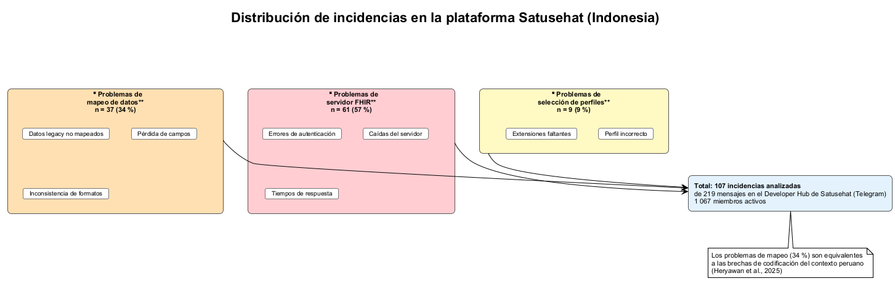

*Nota.* Elaboración propia a partir de Heryawan et al. (2025).

**AMAR ET AL. (2024)**
**Aporte:** Ofrecen taxonomía de seis enfoques para interoperabilidad semántica con FHIR, aportando una visión consolidada de las tendencias en integración semántica de datos clínicos.
**Problema:** Ausencia de consolidación sobre qué enfoques semánticos se utilizan en implementaciones FHIR y con qué peso relativo en la literatura.
**Objetivo:** Mapear tendencias metodológicas y tecnológicas en integración semántica de datos clínicos basados en FHIR.
**Metodología:** Revisión de mapeo sistemático de estudios publicados entre 2012 y 2022, con búsqueda en 10 bases de datos (*JMIR*).
**Instrumentos de evaluación:** Extracción estandarizada de datos y clasificación por categorías de enfoque semántico; n = 70 estudios incluidos.
**Métricas o indicadores de desempeño:** Distribución porcentual de enfoques semánticos por categoría y frecuencia de recursos FHIR utilizados.
**Resultados:** n = 70 estudios; seis categorías identificadas: mapeo (24,6 %), RDF/OWL (19,0 %), NLP/ML (15,9 %), servicios de terminología (14,3 %), anotación (14,3 %) y ontologías (11,9 %). FHIR R4B cuenta con 143 recursos organizados en 5 categorías.
**Limitaciones:** Cobertura solo hasta 2022; la evolución posterior de FHIR R5 y nuevas guías de implementación no están representadas.
**Crítica o aporte a la tesis:** La taxonomía de enfoques semánticos informa la selección de estrategias de codificación para la capa FHIR piloto de esta tesis, particularmente el mapeo terminológico (CIE-10, CPMS) como enfoque dominante.

**TABARI ET AL. (2024)**
**Aporte:** Sistematizan los modelos de datos FHIR y la priorización de recursos utilizados en implementaciones EHR, clasificando las arquitecturas de modelado en dos familias.
**Problema:** Dispersión de enfoques de modelado FHIR que dificulta el diseño coherente en proyectos de interoperabilidad clínica.
**Objetivo:** Describir estructuras de modelado FHIR usadas para integración, transmisión y análisis de datos clínicos.
**Metodología:** Scoping review conforme al protocolo PRISMA-ScR, con búsqueda en PubMed, Scopus, Web of Science, IEEE, ACM y Google Scholar (*JMIR Medical Informatics*).
**Instrumentos de evaluación:** Matriz de extracción comparativa por tipo de modelo y recurso FHIR utilizado; síntesis por dominio clínico (enfermedades crónicas, COVID-19, oncología, cuidados agudos, notas médicas).
**Métricas o indicadores de desempeño:** Frecuencia de uso de recursos FHIR y distribución de modelos por dominio clínico.
**Resultados:** Identifican dos familias de modelos: dinámicos (basados en pipelines de transformación) y estáticos (estructuras predefinidas). Los recursos más utilizados son Observation, Condition y Patient.
**Limitaciones:** Revisión de alcance que no evalúa calidad metodológica de los estudios incluidos; se limita a describir tendencias sin medir efectividad comparativa.
**Crítica o aporte a la tesis:** La identificación de Observation, Condition y Patient como los recursos más adoptados orienta directamente la selección de recursos para la capa de integración FHIR piloto de esta tesis.

**BOSSENKO ET AL. (2024)**
**Aporte:** Desarrollan herramienta visual reutilizable para transformar documentos HL7 CDA hacia recursos HL7 FHIR utilizando el FHIR Mapping Language, permitiendo que expertos de dominio con mínimas habilidades técnicas especifiquen reglas de transformación.
**Problema:** Complejidad del mapeo CDA-FHIR para equipos clínicos y técnicos en despliegues nacionales a escala.
**Objetivo:** Facilitar la transición nacional de interoperabilidad documental (CDA) a APIs FHIR con menor fricción técnica.
**Metodología:** Design Science Research con desarrollo y validación aplicada en la transición del sistema nacional de Estonia (ENHIS) hacia el ecosistema del European Health Data Space (*Frontiers in Digital Health*).
**Instrumentos de evaluación:** Evaluación por expertos de dominio del ENHIS sobre usabilidad, valor operativo y capacidad de reutilización de los componentes visuales de transformación.
**Métricas o indicadores de desempeño:** Valoración cualitativa de usabilidad y utilidad por parte de expertos clínicos y técnicos del sistema nacional estonio.
**Resultados:** Validación positiva de usabilidad y utilidad para transformación semántica reutilizable; los componentes visuales permiten que personal no programador defina reglas de mapeo CDA→FHIR.
**Limitaciones:** Evaluación basada en juicio experto cualitativo; no se reportan métricas cuantitativas de rendimiento o cobertura de los mapeos generados.
**Crítica o aporte a la tesis:** La metodología Design Science y la transición CDA→FHIR guiada por expertos de dominio es relevante para el contexto MINSA, donde herramientas accesibles de mapeo podrían facilitar la adopción de FHIR sin requerir perfiles altamente técnicos.

**JAYATHISSA Y HEWAPATHRANA (2024)**
**Aporte:** Presentan caso técnico de implementación de servidor HAPI-FHIR para interoperabilidad en atención primaria en Sri Lanka, un contexto de recursos limitados comparable a países en desarrollo.
**Problema:** Sistemas de información de salud primaria no integrados, debilidades de autenticación y baja estandarización del intercambio clínico entre establecimientos.
**Objetivo:** Mejorar la interoperabilidad entre sistemas primarios integrando identidad de pacientes (Master Patient Index), seguridad y flujo de datos estandarizado.
**Metodología:** Revisión técnica con implementación de caso de uso basada en el método ADR (Action Design Research) e integración progresiva en el sistema de salud primaria de Sri Lanka (*European Modern Studies Journal*).
**Instrumentos de evaluación:** Pruebas funcionales con datasets sintéticos del HHIMS y validación de intercambio entre componentes; integración de MPI para matching probabilístico de pacientes.
**Métricas o indicadores de desempeño:** Factibilidad técnica de integración, capacidad de intercambio entre sistemas primarios y secundarios, y escalabilidad del despliegue.
**Resultados:** Factibilidad técnica confirmada para integración FHIR en primer nivel de atención con enfoque escalable; demuestran viabilidad del MPI para interconectar sistemas heterogéneos a nivel de clúster de atención.
**Limitaciones:** Implementación circunscrita a un caso técnico de revisión; no reporta métricas cuantitativas de rendimiento en producción.
**Crítica o aporte a la tesis:** El escenario de atención primaria con recursos limitados es directamente comparable al primer nivel del MINSA. La combinación HAPI-FHIR con MPI y despliegue progresivo informa la estrategia de implementación piloto de esta tesis.

**TORAB-MIANDOAB ET AL. (2023)**
**Aporte:** Consolidan los requisitos de interoperabilidad para sistemas de salud heterogéneos en múltiples países, identificando los estándares y tecnologías más citados como críticos.
**Problema:** Falta de interoperabilidad entre sistemas propietarios y heterogéneos con impacto directo en la calidad asistencial y coordinación clínica.
**Objetivo:** Identificar tecnologías y estándares críticos para habilitar HCE interoperable de forma sostenible.
**Metodología:** Revisión sistemática conforme al protocolo PRISMA, con búsqueda en seis bases de datos: PubMed, Web of Science, Scopus, MEDLINE, Cochrane Library y Embase (*BMC Medical Informatics and Decision Making*).
**Instrumentos de evaluación:** Cribado de 302 artículos con selección final de n = 36 estudios; síntesis temática de requisitos técnicos y semánticos categorizados por estándar, protocolo y tecnología.
**Métricas o indicadores de desempeño:** Frecuencia de aparición de estándares y tecnologías como requisitos de interoperabilidad en los artículos seleccionados.
**Resultados:** n = 36 estudios; HL7 FHIR, CDA, HIPAA, SNOMED-CT, SOA, RIM, XML, API, JAVA y SQL aparecen como requisitos más frecuentes. FHIR y CDA se posicionan como estándares prioritarios para interoperabilidad estructural y semántica.
**Limitaciones:** La revisión no evalúa resultados clínicos de las implementaciones; se centra en requisitos técnicos declarados sin medir efectividad operativa.
**Crítica o aporte a la tesis:** Confirma la pertinencia de HL7 FHIR y SNOMED-CT como estándares base para la capa de integración propuesta y valida la necesidad de combinar interoperabilidad técnica con semántica.

**HOLMGREN ET AL. (2023)**
**Aporte:** Comparan políticas de intercambio de información de salud en cinco países para extraer factores de éxito en HIE, aportando un marco comparativo de gobernanza.
**Problema:** Variabilidad regulatoria y organizacional entre países que limita el escalamiento homogéneo del intercambio clínico.
**Objetivo:** Entender cómo el diseño de política pública condiciona la adopción de interoperabilidad a escala nacional.
**Metodología:** Revisión narrativa comparada de marcos de política sanitaria en Estados Unidos, Reino Unido, Alemania, Israel y Portugal, con búsqueda en MEDLINE/PubMed y Google Scholar (*IMIA Yearbook of Medical Informatics*).
**Instrumentos de evaluación:** Análisis transversal de diseño institucional, adopción de EHR, nivel de centralización, madurez de intercambio e incentivación, clasificando cada dimensión como baja, moderada o alta.
**Métricas o indicadores de desempeño:** Grado de adopción de EHR, nivel de centralización de la política HIE, madurez del intercambio y estrategia de incentivación gubernamental.
**Resultados:** n = 5 países analizados; la priorización gubernamental centralizada (Israel, Reino Unido) se asocia con mayor avance interoperable. La fragmentación institucional (EE. UU.) genera heterogeneidad en adopción pese a altas tasas de uso de EHR.
**Limitaciones:** Revisión narrativa sin metaanálisis; la selección de cinco países puede no representar la diversidad de contextos de países en desarrollo.
**Crítica o aporte a la tesis:** La importancia de la priorización gubernamental respalda la relevancia del marco normativo peruano (RNIEDS, PIDESALUD) y refuerza que las brechas identificadas en esta tesis tienen componente institucional además de técnico.

**RICHWINE ET AL. (2025)**
**Aporte:** Cuantifican el valor de las organizaciones de intercambio de información sanitaria (HIO) para la interoperabilidad hospitalaria a escala nacional en Estados Unidos.
**Problema:** Dificultad para demostrar el impacto operativo de la gobernanza del intercambio interinstitucional de datos clínicos.
**Objetivo:** Estimar la contribución de las HIO en intercambio clínico, reporte de salud pública e intercambio de datos sobre necesidades sociales en hospitales.
**Metodología:** Estudio observacional con análisis comparativo de hospitales participantes y no participantes en HIOs, mediante vinculación de bases de datos nacionales (*Health Affairs Scholar*).
**Instrumentos de evaluación:** Dataset vinculado del AHA IT Supplement 2023 (tasa de respuesta 58 %, N = 2 200 hospitales no federales de cuidados agudos) y HIO Survey 2023 (tasa de respuesta 86 %, N = 77 HIOs en 47 estados). Variables: intercambio clínico electrónico, reporte de salud pública, intercambio de datos HRSN y participación en TEFCA.
**Métricas o indicadores de desempeño:** Tasas de intercambio de información clínica, reporte de salud pública, intercambio de datos sobre necesidades sociales y participación en TEFCA.
**Resultados:** La participación en una HIO se asocia significativamente con mayor intercambio clínico electrónico, mayor reporte de salud pública y mayor intercambio de datos sobre necesidades sociales.
**Limitaciones:** Estudio observacional que no permite inferir causalidad; datos de autoreporte hospitalario, lo que puede introducir sesgo.
**Crítica o aporte a la tesis:** El enfoque cuantitativo de vinculación de bases de datos y medición de indicadores de intercambio proveen un modelo metodológico para la evaluación pre/post de esta tesis. La evidencia sobre gobernanza institucional refuerza la importancia de RNIEDS y PIDESALUD.

**RAAB ET AL. (2023)**
**Aporte:** Proponen un enfoque federado de espacios de datos de salud personal para el European Health Data Space (EHDS), poniendo el control del dato en el ciudadano.
**Problema:** Riesgos de concentración de datos sensibles en silos centralizados y baja portabilidad efectiva de registros clínicos entre sistemas heterogéneos en Europa.
**Objetivo:** Diseñar una arquitectura interoperable que reduzca la dependencia de repositorios centralizados, almacenando datos en dispositivos personales.
**Metodología:** Desarrollo conceptual y técnico de arquitectura para espacios de datos de salud federados, con enfoque privacy-by-design (*The Lancet Digital Health*).
**Instrumentos de evaluación:** Evaluación de factibilidad arquitectónica y análisis de criterios de gobernanza de datos personales, alineados con la regulación europea de protección de datos.
**Métricas o indicadores de desempeño:** Criterios cualitativos de control de acceso, portabilidad del dato y gobernanza descentralizada.
**Resultados:** Definen lineamientos para interoperabilidad federada con mejor control de acceso ciudadano y mecanismos de compartición basados en consentimiento explícito.
**Limitaciones:** Propuesta conceptual sin implementación técnica ni evaluación empírica; la viabilidad operativa a escala continental queda pendiente.
**Crítica o aporte a la tesis:** El principio de privacidad por diseño y la descentralización del dato son relevantes para el contexto peruano, donde la protección de datos de poblaciones vulnerables del MINSA requiere mecanismos robustos de consentimiento.

**MONSEN ET AL. (2023)**
**Aporte:** Integran terminologías estandarizadas de enfermería con recursos FHIR para aumentar la reutilización del dato clínico en contextos analíticos y asistenciales.
**Problema:** Subutilización de datos clínicos por baja normalización terminológica en implementaciones FHIR, particularmente en datos de enfermería.
**Objetivo:** Mejorar la interoperabilidad semántica de flujos clínicos y analíticos mediante integración de vocabularios estandarizados de enfermería en FHIR.
**Metodología:** Estudio aplicado de integración terminológica en recursos FHIR, con mapeo de vocabularios de enfermería a recursos estándar.
**Instrumentos de evaluación:** Verificación de consistencia semántica de los recursos generados y pruebas de reutilización para analítica clínica secundaria.
**Métricas o indicadores de desempeño:** Grado de consistencia semántica y proporción de datos reutilizables en flujos analíticos.
**Resultados:** Demuestran mejora en representación estandarizada de datos de enfermería y viabilidad del uso secundario de información clínica codificada en FHIR.
**Limitaciones:** Alcance centrado en terminologías de enfermería; la generalización a otros dominios clínicos requiere validación adicional.
**Crítica o aporte a la tesis:** Refuerza la importancia de la normalización terminológica para la *codificación* como dimensión de calidad, y valida que la integración de vocabularios estandarizados mejora la reutilización del dato clínico.

**VORISEK ET AL. (2022)**
**Aporte:** Ofrecen un panorama cuantitativo robusto de los usos de FHIR en investigación en salud, incluyendo la distribución de terminologías complementarias.
**Problema:** Escasa consolidación cuantitativa sobre para qué y cómo se utiliza FHIR en investigación clínica aplicada.
**Objetivo:** Medir las áreas de aplicación, las terminologías complementarias y la madurez de adopción científica de FHIR.
**Metodología:** Revisión sistemática de literatura 2011–2022, con búsqueda en cinco bases: PubMed, Embase, Web of Science, IEEE Xplore y Cochrane Library (*JMIR Medical Informatics*).
**Instrumentos de evaluación:** Extracción estructurada de variables de uso, dominio clínico y terminologías asociadas; de 998 artículos cribados se incluyeron n = 49 estudios.
**Métricas o indicadores de desempeño:** Distribución de usos por función y dominio, frecuencia de terminologías complementarias y tendencia temporal de publicaciones.
**Resultados:** n = 49 estudios; 73 % en investigación clínica. Usos principales: estandarización (41 %), captura de datos (29 %), reclutamiento (14 %), análisis (12 %) y consentimiento (4 %). Terminologías más usadas: LOINC (37 %), SNOMED-CT (29 %), ICD-10 (18 %) y OMOP (12 %). Alemania y EE. UU. lideran publicaciones.
**Limitaciones:** Intervalo de cinco años entre publicación del estándar FHIR y primera publicación científica relevante; investigación en países de mediano/bajo ingreso subrepresentada.
**Crítica o aporte a la tesis:** La distribución de terminologías (LOINC 37 %, SNOMED-CT 29 %, ICD-10 18 %) proporciona un referente directo para evaluar *codificación* en los centros MINSA, donde CIE-10 y CPMS son los estándares obligatorios.

**GAZZARATA ET AL. (2024)**
**Aporte:** Vinculan FHIR con la continuidad asistencial en ecosistemas de enfermedades crónicas, evaluando su rol en la coordinación entre niveles de atención.
**Problema:** Discontinuidad clínica por fragmentación de información en trayectorias de atención crónica entre diferentes niveles y proveedores.
**Objetivo:** Evaluar el rol de FHIR en la integración longitudinal de datos clínicos y la coordinación interinstitucional en atención de enfermedades crónicas.
**Metodología:** Scoping review centrada en aplicaciones FHIR para gestión clínica crónica, con síntesis por dominios de uso.
**Instrumentos de evaluación:** Síntesis estructurada por dominios de uso clínico, capacidades técnicas de FHIR y modelos de gobernanza aplicados.
**Métricas o indicadores de desempeño:** Grado de articulación de red, cobertura de continuidad asistencial y capacidades técnicas reportadas.
**Resultados:** Evidencian mejora de continuidad asistencial y articulación de red mediante FHIR; no se identifica un KPI universal único, lo que sugiere necesidad de métricas contextualizadas.
**Limitaciones:** Ausencia de indicadores cuantitativos estandarizados; resultados predominantemente cualitativos.
**Crítica o aporte a la tesis:** La vinculación entre FHIR y continuidad asistencial refuerza la relevancia de la dimensión de *continuidad y trazabilidad* como variable dependiente de esta tesis y evidencia la necesidad de métricas operativas contextualizadas.

**PEDRERA-JIMÉNEZ ET AL. (2023)**
**Aporte:** Proponen enfoque agnóstico de estándares donde openEHR, ISO 13606 y FHIR se combinan como componentes complementarios en espacios de datos clínicos de nueva generación.
**Problema:** Decisiones de arquitectura basadas en una falsa dicotomía entre estándares clínicos que en realidad son complementarios.
**Objetivo:** Definir criterios de selección y coexistencia de estándares en espacios de datos de nueva generación.
**Metodología:** Análisis técnico-conceptual comparativo de las capacidades y capas funcionales de openEHR, ISO 13606 y FHIR.
**Instrumentos de evaluación:** Matriz de compatibilidad funcional evaluando capacidades de modelado clínico, intercambio de datos y reutilización para cada estándar.
**Métricas o indicadores de desempeño:** Cobertura funcional de cada estándar por capa (modelado, almacenamiento, intercambio, reutilización).
**Resultados:** Recomiendan arquitectura por capas: openEHR para modelado y persistencia clínica, FHIR para intercambio y APIs, e ISO 13606 como puente. Cada estándar aporta valor diferencial y complementario.
**Limitaciones:** Análisis conceptual sin implementación práctica; la factibilidad de coexistencia depende de la capacidad técnica institucional.
**Crítica o aporte a la tesis:** Respalda la compatibilidad de FHIR con otros estándares usados en precedentes nacionales (Porras Gamarra, 2024, con openEHR) y orienta el diseño de la capa piloto como componente de una arquitectura multicapa.

**CHATTERJEE ET AL. (2022)**
**Aporte:** Integran HL7 FHIR con SNOMED-CT para lograr interoperabilidad estructural y semántica simultánea en el intercambio de datos personales de salud.
**Problema:** Intercambio clínico con pérdida de significado semántico al transferir datos entre sistemas heterogéneos con codificaciones diferentes.
**Objetivo:** Validar la transferencia bidireccional de datos personales de salud sin pérdida semántica.
**Metodología:** Prueba de concepto con mapeo semántico FHIR-SNOMED-CT y flujo bidireccional entre componentes de un sistema de registro personal de salud.
**Instrumentos de evaluación:** Pruebas de consistencia de conceptos codificados, verificación de integridad de datos transmitidos y comprobación de preservación semántica en ida y vuelta.
**Métricas o indicadores de desempeño:** Tasa de preservación semántica en intercambio bidireccional e integridad de datos transmitidos.
**Resultados:** Logran intercambio bidireccional sin pérdida de datos y con consistencia semántica verificada entre componentes FHIR y SNOMED-CT.
**Limitaciones:** Prueba de concepto con alcance acotado; sin métricas de rendimiento a escala ni evaluación con datasets clínicos reales de gran volumen.
**Crítica o aporte a la tesis:** Demuestra que la combinación FHIR + terminologías estándar es condición necesaria para preservar la *consistencia* del dato clínico, dimensión central de la evaluación pre/post de esta tesis.

**GAUDET-BLAVIGNAC ET AL. (2021)**
**Aporte:** Diseñan una estrategia nacional de tres pilares para habilitar el uso secundario interoperable de datos de salud en la Swiss Personalized Health Network.
**Problema:** Baja reutilización de datos clínicos por heterogeneidad semántica entre hospitales y barreras organizativas para la compartición multicéntrica.
**Objetivo:** Habilitar investigación multicéntrica con datos clínicos interoperables en una red nacional suiza.
**Metodología:** Estudio metodológico en el contexto de la Swiss Personalized Health Network (SPHN), con desarrollo de estrategia de tres pilares: gobernanza, normalización semántica y evaluación operativa.
**Instrumentos de evaluación:** Diseño de marco de gobernanza, definición de estándares de normalización semántica y evaluación de factibilidad operativa en hospitales participantes.
**Métricas o indicadores de desempeño:** Factibilidad operativa de la estrategia y grado de normalización semántica logrado en la red.
**Resultados:** Propuesta operativa validada para escalar interoperabilidad orientada al uso secundario; sin estrategia semántica coordinada, los registros presentan altas tasas de campos vacíos o mal estructurados.
**Limitaciones:** Contexto suizo con alta madurez digital e inversión; la transferibilidad a países con menor infraestructura requiere adaptación.
**Crítica o aporte a la tesis:** La advertencia sobre campos vacíos sin estrategia semántica fundamenta la hipótesis de esta tesis sobre brechas de *completitud* en centros MINSA y refuerza la necesidad de combinar estandarización técnica con gobernanza institucional.

**MUKHIYA ET AL. (2021)**
**Aporte:** Combinan FHIR con GraphQL para consultas clínicas flexibles sobre EHR heterogéneos, reduciendo el acoplamiento entre sistemas.
**Problema:** Rigidez en la integración de datos clínicos cuando se depende de conectores punto a punto entre sistemas.
**Objetivo:** Reducir el acoplamiento entre sistemas y facilitar la integración incremental mediante una capa API basada en FHIR y GraphQL.
**Metodología:** Desarrollo de aproximación arquitectónica con implementación de capa GraphQL sobre recursos FHIR y validación de interoperabilidad funcional.
**Instrumentos de evaluación:** Pruebas de consulta multi-recurso, compatibilidad de intercambio entre sistemas y consistencia de respuestas devueltas.
**Métricas o indicadores de desempeño:** Flexibilidad de consulta, grado de acoplamiento entre sistemas y consistencia de respuestas.
**Resultados:** Demuestran viabilidad de integración flexible con menor dependencia entre plataformas; una sola consulta GraphQL agrega datos de múltiples recursos FHIR reduciendo llamadas al servidor.
**Limitaciones:** Prototipo técnico sin evaluación en entorno clínico de producción; la adopción de GraphQL requiere capacitación adicional.
**Crítica o aporte a la tesis:** La combinación FHIR + GraphQL es una alternativa para optimizar consultas clínicas complejas, aunque la prioridad de esta tesis es la conformidad con FHIR RESTful API estándar.

**LIU ET AL. (2023)**
**Aporte:** Implementan un sistema EMR intercambiable en formato FHIR con enfoque de rendimiento y visualización dinámica, sustituyendo el gateway del centro de intercambio de registros médicos de Taiwán.
**Problema:** Costos elevados y latencias significativas en la integración de datos clínicos cuando se depende de gateways tradicionales basados en CDA R2.
**Objetivo:** Validar que una arquitectura basada en servidor FHIR mejore los tiempos y costos de transformación de datos respecto al sistema CDA R2 existente.
**Metodología:** Implementación experimental con pruebas de carga y comparación de arquitectura FHIR vs. CDA R2 en el contexto del Electronic Medical Record Exchange Center de Taiwán (*Healthcare*, MDPI).
**Instrumentos de evaluación:** Pruebas de rendimiento con Apache JMeter para evaluar carga y tiempo de respuesta; transmisión segura mediante HTTPS/TLS. Métricas de tiempo y costo de conversión de formato.
**Métricas o indicadores de desempeño:** Tiempo de respuesta, throughput (transacciones/segundo), tiempo de conversión de formato y costo operativo de integración.
**Resultados:** Reducción significativa en tiempos y costos de transformación de datos clínicos al reemplazar el gateway CDA por un servidor FHIR; la transmisión HTTPS/TLS preserva la integridad de los datos.
**Limitaciones:** Implementación en el contexto específico de Taiwán; los resultados pueden variar en ecosistemas con diferente madurez de infraestructura digital.
**Crítica o aporte a la tesis:** Las pruebas con JMeter proveen una metodología de evaluación de rendimiento replicable para la capa FHIR piloto de esta tesis. La demostración de reducción de costos respalda la viabilidad económica de adoptar FHIR en centros MINSA.

**ANAND Y SADHNA (2023)**
**Aporte:** Analizan bibliométricamente la convergencia entre FHIR y blockchain en interoperabilidad EHR, identificando tendencias y líneas emergentes de investigación.
**Problema:** Dispersión de evidencia sobre la madurez y evolución de los enfoques combinados blockchain + FHIR para intercambio clínico seguro.
**Objetivo:** Identificar tendencias, vacíos y líneas emergentes de investigación en interoperabilidad segura basada en FHIR y blockchain.
**Metodología:** Estudio bibliométrico con análisis temático de publicaciones 2013-2022 en la base Scopus, utilizando el software Bibliometrix de R-Studio (*Perspectives in Clinical Research*).
**Instrumentos de evaluación:** Dos cadenas de búsqueda: String A (EHR + FHIR, 302 documentos) y String B (EHR + Blockchain, 758 documentos). Indicadores bibliométricos: producción anual, colaboración por país, evolución temática y mapas de coocurrencia.
**Métricas o indicadores de desempeño:** Producción científica anual, citas promedio por documento (6,6 para FHIR y 15,4 para blockchain) y evolución temática de palabras clave.
**Resultados:** Confirman crecimiento sostenido de ambos campos. La interoperabilidad de datos se introduce como tema desde 2020. El mapeo temático posiciona la “interoperabilidad” como un tema bien desarrollado. Blockchain con EHR muestra mayor producción y citación que FHIR con EHR.
**Limitaciones:** Análisis limitado a Scopus; la exclusión de PubMed e IEEE puede subestimar publicaciones en informática biomédica.
**Crítica o aporte a la tesis:** El hallazgo de que la interoperabilidad de datos es un dominio relativamente nuevo (desde 2020) refuerza la oportunidad de investigación que aborda esta tesis. La convergencia FHIR-blockchain es relevante para las propuestas de *trazabilidad* por blockchain en los antecedentes nacionales de Mauricio et al. (2024) y Bran et al. (2024).

**SURISETTY (2026)**
**Aporte:** Propone un blueprint de interoperabilidad clínica de extremo a extremo que integra HL7, FHIR, CCD y EHR en una secuencia práctica de implementación por fases.
**Problema:** Brecha entre las recomendaciones conceptuales de alto nivel sobre interoperabilidad y la ausencia de guías operativas de implementación paso a paso.
**Objetivo:** Integrar lineamientos técnicos en una secuencia práctica de implementación por fases que cubra los cuatro niveles de interoperabilidad.
**Metodología:** Propuesta aplicada de arquitectura de referencia y flujo de integración integral, cubriendo ingestión, transformación, normalización semántica, seguridad y consentimiento (*International Journal of Multidisciplinary Science and Engineering in Health Research*).
**Instrumentos de evaluación:** Definición de flujo técnico, componentes de arquitectura de referencia y hitos operativos de despliegue. Cobertura de los cuatro niveles: fundacional, estructural, semántico y organizacional.
**Métricas o indicadores de desempeño:** Cobertura de los cuatro niveles de interoperabilidad y completitud del flujo de implementación propuesto.
**Resultados:** Ofrece hoja de ruta replicable para proyectos de interoperabilidad clínica por etapas, incluyendo rutas de migración de HL7 v2 a FHIR, normalización semántica y marcos regulatorios (HIPAA, HITECH).
**Limitaciones:** Propuesta teórica-aplicada sin validación empírica cuantitativa; la replicabilidad depende de la infraestructura disponible en cada contexto.
**Crítica o aporte a la tesis:** La hoja de ruta por fases es un referente directo para la estrategia trifásica (diagnóstico, implementación piloto, evaluación) de esta tesis. La cobertura de los cuatro niveles de interoperabilidad alinea los requisitos técnicos con el marco conceptual del estudio.

**FERNANDEZ ET AL. (2025)**
**Aporte:** Aportan evidencia aplicada de interoperabilidad en un sistema de salud universal, con la red pública brasileña como referente para América Latina.
**Problema:** Fragmentación inter-nivel que limita el seguimiento clínico y la gestión integral del paciente entre atención primaria y hospitalaria.
**Objetivo:** Analizar la integración entre atención primaria y hospitalaria para la continuidad clínica poblacional en el sistema de salud de Brasil.
**Metodología:** Análisis de la experiencia nacional brasileña y lecciones de implementación de interoperabilidad en la red pública de salud.
**Instrumentos de evaluación:** Evaluación comparativa de flujos de información y coordinación asistencial entre niveles de atención.
**Métricas o indicadores de desempeño:** Grado de coordinación asistencial y efectividad de los flujos de información entre niveles del sistema.
**Resultados:** Identifican que la combinación de estándares técnicos + procesos organizacionales + gobernanza sostenida es condición necesaria para el impacto de la interoperabilidad en la continuidad del cuidado.
**Limitaciones:** Estudio de un contexto nacional específico (Brasil); la transferibilidad a Perú requiere considerar diferencias en estructura del sistema y madurez digital.
**Crítica o aporte a la tesis:** El hallazgo de que estándares solos no son suficientes sin gobernanza y procesos sostenidos respalda el enfoque integral de esta tesis, que combina componente técnico (FHIR) con evaluación de brechas institucionales y lineamientos de escalabilidad.

### Nacionales

**MAURICIO ET AL. (2024)**
**Aporte:** Proponen un sistema peruano de interoperabilidad de EHR basado en HL7 FHIR y blockchain (Ethereum), incluyendo homologación de registros heterogéneos a recursos FHIR y almacenamiento descentralizado con IPFS.
**Problema:** En Perú no existe integración automática de historias clínicas electrónicas entre establecimientos de salud; cada centro gestiona datos de forma aislada con formatos diferentes.
**Objetivo:** Permitir el intercambio de EHR entre clínicas heterogéneas garantizando seguridad y privacidad de los datos mediante blockchain.
**Metodología:** Diseño de arquitectura de interoperabilidad con homologación a recursos FHIR, blockchain (Ethereum) y simulación de caso entre establecimientos (*International Journal of Online and Biomedical Engineering*).
**Instrumentos de evaluación:** Encuesta de adopción a n = 30 pacientes y encuesta de usabilidad a n = 10 médicos de un hospital público peruano. Variables evaluadas: percepción de adopción, usabilidad del sistema web y satisfacción con la interoperabilidad lograda. Fuente de datos: simulación con datos de caso clínico.
**Métricas o indicadores de desempeño:** Nivel de adopción percibida y nivel de usabilidad percibida (escalas tipo Likert).
**Resultados:** Niveles muy altos de adopción y usabilidad reportados tanto por pacientes como por médicos; factibilidad demostrada sin necesidad de reemplazar sistemas legados existentes.
**Limitaciones:** Validación basada en simulación de caso, no en producción real; muestra pequeña (30 pacientes, 10 médicos). No se reportan métricas cuantitativas de integridad de datos ni cobertura de campos clínicos.
**Crítica o aporte a la tesis:** El estudio aporta evidencia sobre *trazabilidad* (blockchain genera registro inmutable de transacciones) y *codificación* (la homologación FHIR estandariza la representación), aunque no mide el efecto sobre *completitud* ni *duplicidad*, brechas que esta tesis sí se propone diagnosticar. Su diseño sin reemplazo de sistemas legados es relevante para la estrategia de implementación gradual en centros MINSA.

**PORRAS GAMARRA (2024)**
**Aporte:** Documenta implementación real de interoperabilidad HL7 FHIR + openEHR en el proyecto M-Connecta (Cataluña), aportando experiencia técnica transferible al contexto peruano.
**Problema:** Brecha tecnológica entre los estándares de interoperabilidad avanzados disponibles internacionalmente y la realidad peruana fragmentada, donde los sistemas de HCE carecen de integración efectiva.
**Objetivo:** Validar el intercambio clínico efectivo y la persistencia semántica de datos mediante estándares internacionales HL7 FHIR y openEHR.
**Metodología:** Trabajo de suficiencia profesional con análisis de implementación del proyecto M-Connecta, incluyendo despliegue de mensajería FHIR y persistencia con arquetipos openEHR (UNFV, Lima).
**Instrumentos de evaluación:** Verificación funcional de mensajería FHIR entre sistemas, pruebas de persistencia con arquetipos openEHR y validación de la integridad del intercambio clínico. Experiencia práctica del autor en empresas como IN2 Ingeniería y Accenture España.
**Métricas o indicadores de desempeño:** Factibilidad de intercambio clínico mediante FHIR y grado de persistencia semántica con arquetipos openEHR.
**Resultados:** Evidencia viabilidad técnica de combinar FHIR (intercambio) con openEHR (persistencia semántica) y recomienda la adopción de FHIR en las HCE peruanas como paso fundamental hacia la interoperabilidad.
**Limitaciones:** Implementación documentada en contexto europeo (Cataluña); la transferencia directa al ecosistema peruano requiere adaptación a la infraestructura local y al marco normativo MINSA.
**Crítica o aporte a la tesis:** Aborda directamente *completitud* (arquetipos openEHR estructuran el contenido completo del registro) y *codificación* (FHIR normaliza la representación semántica), sentando precedente técnico para las brechas que esta tesis diagnostica. Su recomendación de adopción de FHIR en Perú refuerza la pertinencia de esta investigación.

**ARRUÉ PAJARES Y VARGAS RIOJA (2022)**
**Aporte:** Implementan un HIS interoperable basado en HL7 para centros de salud de categoría II-1 o superior en Perú, con integración de módulos clínicos y administrativos.
**Problema:** Sistemas de salud peruanos fraccionados (MINSA, EsSalud, sector privado) y sin integración efectiva entre sus componentes, agravado por la pandemia de COVID-19.
**Objetivo:** Integrar módulos administrativos y clínicos (HCE, farmacia, laboratorio, radiología) para mejorar el flujo hospitalario y habilitar el intercambio interinstitucional.
**Metodología:** Desarrollo de plataforma web HIS con protocolo HL7 mediante metodología ágil (Scrum), con arquitectura de servicios web interoperables (PUCP, Lima).
**Instrumentos de evaluación:** Pruebas de integración entre módulos (HCE, farmacia, laboratorio, radiología, citas), validación de requisitos de usabilidad y verificación de interoperabilidad. Herramientas: SonarQube para análisis de código, Spring Boot y Angular.
**Métricas o indicadores de desempeño:** Factibilidad de integración entre módulos, conformidad con protocolo HL7 y cumplimiento de requisitos de usabilidad.
**Resultados:** Demuestran factibilidad de interoperabilidad operativa en contexto nacional con HL7; la integración entre módulos permite flujo unificado de datos clínicos y administrativos.
**Limitaciones:** Implementación basada en HL7 v2 (no FHIR); no incluye validación con datos clínicos reales en un establecimiento del MINSA. El alcance se limita a un prototipo funcional.
**Crítica o aporte a la tesis:** El estudio incide en *duplicidad* (la integración entre módulos reduce registros redundantes) y *completitud* (el flujo unificado asegura transferencia íntegra de información). La evolución de HL7 v2 a FHIR que propone esta tesis representa el siguiente paso lógico en esta línea de trabajo.

**BAYONA CASTAÑEDA (2019)**
**Aporte:** Presenta un diagnóstico estructural de la historia clínica electrónica en el sistema de salud peruano, analizando la evolución normativa y las barreras de implementación del RENHICE.
**Problema:** Fragmentación entre MINSA y EsSalud, baja conectividad entre establecimientos e implementación desigual de plataformas de HCE a nivel nacional.
**Objetivo:** Analizar la evolución normativa y las barreras de implementación de la HCE y del Registro Nacional de Historias Clínicas Electrónicas (RENHICE) en Perú.
**Metodología:** Trabajo de fin de máster con revisión documental y análisis del ecosistema nacional, incluyendo visitas al Hospital Santa Rosa (Piura) y Hospital II de Tarapoto (UPV, Valencia).
**Instrumentos de evaluación:** Análisis normativo-técnico de la Ley N° 30024, del RENHICE y de experiencias institucionales. Fuentes: documentación regulatoria del MINSA, entrevistas con directores hospitalarios y personal técnico.
**Métricas o indicadores de desempeño:** Grado de implementación del RENHICE, conectividad entre establecimientos y número de historias clínicas por paciente.
**Resultados:** Identifica persistencia de múltiples historias clínicas por paciente en distintas instituciones y bajo avance interoperable. Documenta inestabilidad política como barrera y fragmentación entre subsistemas (MINSA, EsSalud, FF. AA., sector privado).
**Limitaciones:** Estudio descriptivo-analítico sin componente de implementación tecnológica; los datos corresponden al periodo 2018-2019, previo a las normativas RNIEDS y PIDESALUD.
**Crítica o aporte a la tesis:** Conecta directamente con la brecha de *duplicidad* (múltiples HCE por paciente en distintas instituciones) y de *trazabilidad* (imposibilidad de seguir la continuidad del registro entre MINSA y EsSalud), confirmando que las brechas persisten a nivel del ecosistema nacional y justificando la necesidad de diagnóstico actualizado que esta tesis propone.

**ESPARZA MORGAN (2025)**
**Aporte:** Relaciona la madurez de uso de la HCE única con la mejora de indicadores de gestión de calidad en un hospital de EsSalud.
**Problema:** Desempeño de calidad hospitalaria afectado por una gestión clínica no plenamente digitalizada ni estandarizada.
**Objetivo:** Medir la influencia de la HCE en las dimensiones de planificación, organización y garantía de servicios de gestión de calidad hospitalaria.
**Metodología:** Estudio correlacional aplicado en entorno hospitalario peruano (EsSalud).
**Instrumentos de evaluación:** Indicadores de calidad de gestión (planificación, organización, garantía) y medición de madurez de uso de HCE mediante indicadores cuantitativos.
**Métricas o indicadores de desempeño:** Coeficientes de correlación entre madurez de HCE y dimensiones de calidad de gestión.
**Resultados:** Reporta correlaciones positivas estadísticamente significativas; mayor madurez de uso de HCE se asocia con mejor desempeño en planificación, organización y garantía de calidad.
**Limitaciones:** Estudio en un solo hospital de EsSalud; la generalización a centros del MINSA requiere validación. No aísla el efecto de la interoperabilidad de otros factores de digitalización.
**Crítica o aporte a la tesis:** Aporta evidencia indirecta sobre *completitud* (la HCE única consolida el registro clínico) y refuerza que cerrar brechas de digitalización impacta los indicadores de calidad que esta tesis se propone medir.

**ARIAS GERONIMO (2025)**
**Aporte:** Evidencia el vínculo entre confiabilidad de la HCE y calidad de los servicios preventivos en una microred de salud pública de primer nivel.
**Problema:** Inconsistencias de datos y baja disponibilidad del sistema afectan la continuidad y calidad percibida del servicio preventivo.
**Objetivo:** Determinar la relación entre la calidad del registro electrónico de salud y la prestación efectiva de servicios preventivos en una microred del primer nivel de atención.
**Metodología:** Estudio correlacional aplicado en una red pública de primer nivel de atención en Perú.
**Instrumentos de evaluación:** Medición de confiabilidad del registro electrónico (dimensiones: precisión de datos, disponibilidad del sistema, usabilidad) y evaluación del desempeño en servicios preventivos.
**Métricas o indicadores de desempeño:** Coeficiente de correlación entre confiabilidad de HCE y desempeño en prestación preventiva; análisis por dimensiones de confiabilidad.
**Resultados:** Asociación positiva moderada y estadísticamente significativa entre confiabilidad de la HCE y calidad de la prestación preventiva.
**Limitaciones:** Estudio en una sola microred; la correlación no implica causalidad directa. No evalúa interoperabilidad entre establecimientos.
**Crítica o aporte a la tesis:** Las dimensiones evaluadas —precisión, disponibilidad, usabilidad— se alinean con las brechas de *completitud* (datos precisos y completos) y *codificación* (estandarización que posibilita confiabilidad), reforzando la pertinencia de diagnosticar estas brechas en establecimientos del primer nivel de atención del MINSA.

**SÁNCHEZ CALLE (2024)**
**Aporte:** Formula una arquitectura y requisitos formales para HCE ocupacional con base en las normas internacionales ISO 18308 e ISO 13606.
**Problema:** Ausencia de requerimientos técnicos estandarizados para el intercambio de información clínica ocupacional en el contexto peruano.
**Objetivo:** Definir especificaciones formales para la interoperabilidad y sostenibilidad de una HCE ocupacional.
**Metodología:** Desarrollo de propuesta arquitectónica basada en normas internacionales ISO 18308 (requisitos para arquitectura de HCE) e ISO 13606 (comunicación de HCE).
**Instrumentos de evaluación:** Trazabilidad de requisitos normativos y evaluación de consistencia del diseño arquitectónico conforme a los estándares ISO aplicados.
**Métricas o indicadores de desempeño:** Grado de cobertura de requisitos ISO y consistencia de la arquitectura propuesta.
**Resultados:** Entrega un marco técnico aplicable para el diseño interoperable y gobernable de HCE ocupacional, con requisitos formales alineados a estándares internacionales.
**Limitaciones:** Propuesta arquitectónica sin implementación ni validación empírica; no evalúa el impacto operativo en un entorno real.
**Crítica o aporte a la tesis:** Aborda las brechas de *codificación* (ISO 13606 normaliza la estructura del registro) y *completitud* (requisitos formales aseguran integralidad de campos clínicos), aunque no evalúa su impacto en *duplicidad* ni *trazabilidad*, dimensiones que esta tesis sí diagnostica.

**FERNÁNDEZ INFANZÓN Y HUARAC CUIZANO (2021)**
**Aporte:** Proponen un plan de negocio para integrar IPRESS a una plataforma interoperable de HCE usando blockchain y biometría como habilitadores tecnológicos.
**Problema:** Barreras de confianza, trazabilidad y coordinación institucional entre prestadores públicos y privados para el intercambio clínico.
**Objetivo:** Viabilizar la articulación entre prestadores de salud públicos y privados mediante una plataforma interoperable con blockchain y verificación biométrica.
**Metodología:** Diseño de plan de negocio con enfoque tecnológico y estrategia de adopción multiactor, incluyendo análisis de stakeholders del sector salud peruano.
**Instrumentos de evaluación:** Evaluación de viabilidad técnica y económica, propuesta de modelo operativo y análisis de grupos de interés (MINSA, EsSalud, sector privado, SIS).
**Métricas o indicadores de desempeño:** Viabilidad económica, cobertura de stakeholders y factibilidad del modelo operativo propuesto.
**Resultados:** Definen esquema de implementación gradual para interoperabilidad institucional en IPRESS, combinando identificación biométrica única con registro blockchain de transacciones.
**Limitaciones:** Permanece en nivel de plan de negocio sin implementación técnica ni validación operativa en establecimientos reales.
**Crítica o aporte a la tesis:** Apunta a reducir *duplicidad* (identificación única del paciente con biometría) y a mejorar *trazabilidad* (blockchain como registro inmutable), aunque sin validación operativa, dimensiones que esta tesis sí evaluará empíricamente.

**BRAN ET AL. (2024)**
**Aporte:** Integran blockchain, IPFS y HL7 para fortalecer la inmutabilidad, auditabilidad y confianza del intercambio de historias clínicas electrónicas.
**Problema:** Riesgos de manipulación de datos, baja trazabilidad de transacciones y confianza limitada entre los actores de ecosistemas interoperables.
**Objetivo:** Mejorar la inmutabilidad, auditabilidad y confianza sobre el flujo de datos clínicos compartidos entre establecimientos.
**Metodología:** Diseño de arquitectura híbrida que combina HL7 con blockchain e IPFS (InterPlanetary File System) y evaluación funcional de interoperabilidad segura.
**Instrumentos de evaluación:** Pruebas de integridad de datos, trazabilidad de transacciones en la cadena de bloques y consistencia del intercambio entre componentes del sistema.
**Métricas o indicadores de desempeño:** Integridad de datos intercambiados, trazabilidad completa de cada transacción y consistencia del intercambio.
**Resultados:** Evidencian mejora en auditabilidad e integridad al combinar HL7 con blockchain/IPFS; cada transacción clínica queda registrada de forma inmutable en la cadena de bloques.
**Limitaciones:** Evaluación funcional sin despliegue en entorno hospitalario real; la escalabilidad de blockchain en producción con alto volumen de transacciones no se evalúa.
**Crítica o aporte a la tesis:** Apunta centralmente a la brecha de *trazabilidad* (registro inmutable de cada transacción clínica) y de *duplicidad* (IPFS evita copias redundantes), brechas que esta tesis diagnostica con métricas operativas en centros MINSA.

**MORALES-CAMARGO Y MENESES-CLAUDIO (2023)**
**Aporte:** Sintetizan el impacto del registro médico electrónico (EMR) en la atención y gestión sanitaria a partir de una revisión de la literatura reciente.
**Problema:** Adopción desigual de EMR entre establecimientos de salud y brechas persistentes de estandarización y capacitación del personal.
**Objetivo:** Evaluar los beneficios y barreras de implementación de EMR en la evidencia publicada entre 2013 y 2023.
**Metodología:** Revisión sistemática de la literatura del periodo 2013-2023.
**Instrumentos de evaluación:** Búsqueda estructurada en bases de datos y análisis comparativo de resultados reportados sobre impacto de EMR en atención clínica.
**Métricas o indicadores de desempeño:** Beneficios reportados (acceso a información, soporte a decisión clínica, eficiencia) y barreras identificadas (adopción, estandarización, capacitación).
**Resultados:** Reportan mejoras consistentes en acceso a información, soporte a la decisión clínica y eficiencia operativa; sin embargo, las barreras de adopción —capacitación insuficiente, resistencia al cambio, heterogeneidad de formatos— persisten en múltiples contextos.
**Limitaciones:** La revisión no incluye estudios peruanos específicos; la generalización al contexto del MINSA requiere contextualización.
**Crítica o aporte a la tesis:** Confirma que las barreras de estandarización inciden en *codificación* (heterogeneidad de formatos) y que la adopción desigual perpetúa brechas de *completitud* (campos clínicos incompletos), hallazgos convergentes con el contexto peruano que esta tesis busca diagnosticar operativamente.

La Tabla 4 presenta una síntesis comparativa de los antecedentes internacionales revisados, organizados por autor, tipo de estudio, estándar principal utilizado, principales métricas y el aporte específico a la presente investigación.

: Síntesis comparativa de antecedentes internacionales {#tbl:sintesis-internacionales}

| Autor(es) y año | Tipo de estudio | Estándar / Tecnología | Métricas o resultados principales | Aporte a esta tesis |
|:--------------------------|:----------------------------|:--------------------------|:------------------------------------------|:---------------------------|
| Adelusi et al. (2025) | Framework federado (simulación) | HL7 FHIR | >95 % precisión; −38 % latencia | Referente de métricas para evaluación pre/post |
| Heryawan et al. (2025) | Análisis de contenido cualitativo | HL7 FHIR (Satusehat) | 107 incidencias: servidor 57 %, mapeo 34 %, perfiles 9 % | Barreras técnicas en despliegue nacional |
| Amar et al. (2024) | Mapeo sistemático (n = 70) | FHIR semántico | 6 categorías: mapeo 24,6 %, RDF/OWL 19 %, NLP/ML 15,9 % | Taxonomía de enfoques semánticos |
| Tabari et al. (2024) | Scoping review (n = 31) | FHIR | Recursos más usados: Observation, Condition, Patient | Selección de recursos para capa piloto |
| Bossenko et al. (2024) | Design Science Research | CDA → FHIR | Usabilidad validada por expertos del ENHIS (Estonia) | Transformación accesible CDA→FHIR |
| Jayathissa y Hewapathrana (2024) | Caso técnico (ADR) | HAPI-FHIR + MPI | Factibilidad en atención primaria (Sri Lanka) | Implementación piloto en contexto limitado |
| Torab-Miandoab et al. (2023) | Revisión sistemática (n = 36) | HL7 FHIR, CDA, SNOMED-CT | FHIR y CDA como estándares prioritarios | Pertinencia de FHIR + SNOMED-CT |
| Holmgren et al. (2023) | Revisión comparada (5 países) | Políticas HIE | Centralización → mayor avance interoperable | Importancia de gobernanza institucional |
| Richwine et al. (2025) | Observacional (N = 2 200) | HIOs / FHIR | 75 % hospitales en HIO; 17 % con FHIR | Modelo metodológico de medición |
| Raab et al. (2023) | Propuesta conceptual | EHDS federado | Lineamientos de privacidad por diseño | Gobernanza descentralizada del dato |
| Monsen et al. (2023) | Estudio aplicado | FHIR + terminologías de enfermería | Mejora en reutilización de datos codificados | Normalización terminológica |
| Vorisek et al. (2022) | Revisión sistemática (n = 49) | HL7 FHIR | LOINC 37 %, SNOMED-CT 29 %, ICD-10 18 % | Referente de terminologías para codificación |
| Gazzarata et al. (2024) | Scoping review | FHIR | Mejora de continuidad asistencial en crónicos | Continuidad como dimensión de calidad |
| Pedrera-Jiménez et al. (2023) | Análisis técnico-conceptual | openEHR + FHIR + ISO 13606 | Coexistencia complementaria por capas | Compatibilidad con arquitectura multicapa |
| Chatterjee et al. (2022) | Prueba de concepto | FHIR + SNOMED-CT | Intercambio bidireccional sin pérdida semántica | Consistencia del dato clínico |
| Gaudet-Blavignac et al. (2021) | Estudio metodológico | SPHN (3 pilares) | Campos vacíos sin estrategia semántica coordinada | Importancia de completitud |
| Mukhiya et al. (2021) | Prototipo arquitectónico | FHIR + GraphQL | Reducción de acoplamiento entre sistemas | Integración flexible |
| Liu et al. (2023) | Implementación experimental | FHIR vs. CDA R2 | Reducción significativa de tiempos y costos | Metodología de evaluación de rendimiento |
| Anand y Sadhna (2023) | Bibliométrico | FHIR + Blockchain | 302 docs FHIR; 758 blockchain; citación 6,6 vs. 15,4 | Tendencias emergentes |
| Surisetty (2026) | Propuesta aplicada | HL7, FHIR, CCD | Hoja de ruta por fases; 4 niveles de interoperabilidad | Blueprint de referencia |
| Fernandez et al. (2025) | Análisis de experiencia nacional | Sistema de salud de Brasil | Estándares + procesos + gobernanza = interoperabilidad | Gobernanza sostenida |

*Nota.* Elaboración propia a partir de los antecedentes internacionales revisados.

La Tabla 5 presenta la síntesis comparativa de los antecedentes nacionales, destacando las dimensiones de calidad abordadas por cada estudio.

: Síntesis comparativa de antecedentes nacionales {#tbl:sintesis-nacionales}

| Autor(es) y año | Tipo de estudio | Estándar / Tecnología | Resultados principales | Brechas de calidad abordadas |
|:--------------------------------------|:-------------------------------|:---------------------------|:----------------------------------------------|:------------------------------|
| Mauricio et al. (2024) | Arquitectura con blockchain | HL7 FHIR + Ethereum + IPFS | Alta adopción y usabilidad percibida (n = 30 + 10) | Trazabilidad, codificación |
| Porras Gamarra (2024) | Suficiencia profesional | HL7 FHIR + openEHR | Viabilidad de FHIR + openEHR en Cataluña → recomendación para Perú | Completitud, codificación |
| Arrué Pajares y Vargas Rioja (2022) | Desarrollo ágil (Scrum) | HL7 v2 | Factibilidad de interoperabilidad en centros II-1 | Duplicidad, completitud |
| Bayona Castañeda (2019) | Diagnóstico estructural | Marco normativo (RENHICE) | Múltiples HC por paciente; fragmentación MINSA-EsSalud | Duplicidad, trazabilidad |
| Esparza Morgan (2025) | Correlacional | HCE única | Correlación positiva HCE–calidad de gestión | Completitud |
| Arias Geronimo (2025) | Correlacional | HCE (primer nivel) | Confiabilidad de HCE → calidad de prestaciones preventivas | Completitud, codificación |
| Sánchez Calle (2024) | Propuesta arquitectónica | ISO 18308 + ISO 13606 | Marco técnico para HCE ocupacional interoperable | Codificación, completitud |
| Fernández Infanzón y Huarac Cuizano (2021) | Plan de negocio | Blockchain + biometría | Esquema de implementación gradual entre IPRESS | Duplicidad, trazabilidad |
| Bran et al. (2024) | Arquitectura híbrida | HL7 + Blockchain + IPFS | Mejora en auditabilidad e integridad | Trazabilidad, duplicidad |
| Morales-Camargo y Meneses-Claudio (2023) | Revisión sistemática | EMR | Mejoras en acceso y soporte; barreras de adopción persistentes | Codificación, completitud |

*Nota.* Elaboración propia a partir de los antecedentes nacionales revisados.

### Síntesis crítica de antecedentes

La revisión internacional y nacional muestra convergencia en cuatro hallazgos articulados con las dimensiones de calidad que esta tesis propone evaluar.

**Primero, FHIR como estándar articulador del intercambio y su vínculo con la *consistencia* del dato clínico.** Existe consenso sobre FHIR como eje técnico del intercambio (Vorisek et al., 2022; Torab-Miandoab et al., 2023; Tabari et al., 2024), pero su efectividad depende de perfiles, terminologías y reglas de implementación consistentes (Kramer y Moesel, 2023; Chatterjee et al., 2022; Monsen et al., 2023). Cuando los perfiles FHIR no son uniformes, los datos intercambiados pierden consistencia semántica entre emisor y receptor —dimensión que esta tesis medirá como indicador operativo—.

**Segundo, gobernanza institucional y su relación con la *disponibilidad* del intercambio.** La interoperabilidad sostenible requiere gobernanza explícita, arreglos institucionales y federación de datos (Holmgren et al., 2023; Richwine et al., 2025; Raab et al., 2023). Gaudet-Blavignac et al. (2021) demuestran que sin una estrategia semántica coordinada a escala nacional, los datos clínicos no están disponibles para uso secundario. La disponibilidad del intercambio —porcentaje de transacciones FHIR exitosas sobre el total esperado— es un indicador clave que la presente investigación evaluará antes y después de la intervención.

**Tercero, brechas nacionales en *integridad* y *completitud* del registro clínico.** En Perú, la evidencia confirma avances en propuestas y pilotos, pero con heterogeneidad de madurez digital y adopción operativa (Bayona Castañeda, 2019; Mauricio et al., 2024; Porras Gamarra, 2024; Arrué Pajares y Vargas Rioja, 2022). Esparza Morgan (2025) y Arias Geronimo (2025) aportan evidencia correlacional de que la madurez y confiabilidad de la HCE inciden en la calidad del servicio, pero ninguno mide directamente la integridad de los datos intercambiados ni la completitud de los campos clínicos obligatorios. Morales-Camargo y Meneses-Claudio (2023) confirman que la adopción desigual de EMR perpetúa campos clínicos incompletos, hallazgo convergente con el contexto peruano que esta tesis busca diagnosticar.

**Cuarto, trazabilidad y *continuidad* del dato a lo largo del circuito clínico.** Las propuestas de blockchain aplicadas a la interoperabilidad (Bran et al., 2024; Fernández Infanzón y Huarac Cuizano, 2021; Mauricio et al., 2024) abordan la trazabilidad transaccional, pero no evalúan la continuidad del dato clínico desde el registro inicial hasta su recuperación por otro establecimiento. La continuidad —entendida como la preservación del registro a lo largo del circuito de atención— constituye un indicador que diferencia esta tesis de las propuestas nacionales existentes.

En términos de brecha de investigación, aún son escasos los estudios nacionales que integren en un mismo diseño: (a) diagnóstico estructurado de brechas de completitud, codificación, duplicidad y trazabilidad; (b) implementación técnica alineada a HL7 FHIR; y (c) evaluación pre-post con indicadores de integridad, consistencia, disponibilidad y continuidad del intercambio clínico. Esta brecha justifica el enfoque trifásico de la presente tesis y orienta su aporte incremental frente al estado del arte.

La Tabla 6 presenta la correspondencia entre los antecedentes revisados y las cuatro dimensiones de calidad del intercambio de información clínica que constituyen la variable dependiente de esta investigación, evidenciando las brechas de cobertura que justifican el presente estudio.

: Correspondencia entre antecedentes y dimensiones de calidad del intercambio evaluadas {#tbl:correspondencia-dimensiones}

| Antecedente | Integridad (completitud) | Consistencia (codificación) | Disponibilidad (intercambio) | Continuidad (trazabilidad) |
|:--------------------------------------|:---:|:---:|:---:|:---:|
| **Internacionales** | | | | |
| Adelusi et al. (2025) | ✓ | ✓ | ✓ | ✓ |
| Heryawan et al. (2025) | | ✓ | ✓ | |
| Amar et al. (2024) | | ✓ | | |
| Tabari et al. (2024) | ✓ | | | |
| Torab-Miandoab et al. (2023) | | ✓ | | |
| Holmgren et al. (2023) | | | ✓ | |
| Richwine et al. (2025) | | | ✓ | |
| Vorisek et al. (2022) | | ✓ | | |
| Chatterjee et al. (2022) | | ✓ | | |
| Gaudet-Blavignac et al. (2021) | ✓ | | | |
| Gazzarata et al. (2024) | | | | ✓ |
| Liu et al. (2023) | | | ✓ | |
| Fernandez et al. (2025) | | | ✓ | ✓ |
| **Nacionales** | | | | |
| Mauricio et al. (2024) | | ✓ | | ✓ |
| Porras Gamarra (2024) | ✓ | ✓ | | |
| Arrué Pajares y Vargas Rioja (2022) | ✓ | | | |
| Bayona Castañeda (2019) | | | | ✓ |
| Esparza Morgan (2025) | ✓ | | | |
| Arias Geronimo (2025) | ✓ | ✓ | | |
| Bran et al. (2024) | ✓ | | | ✓ |
| Morales-Camargo y Meneses-Claudio (2023) | ✓ | ✓ | | |
| **Presente investigación** | **✓** | **✓** | **✓** | **✓** |

*Nota.* Elaboración propia. El símbolo ✓ indica que el estudio aborda la dimensión, directa o indirectamente. La presente investigación es la primera que integra las cuatro dimensiones en un diseño de evaluación pre-post.

A nivel regulatorio, Perú cuenta con el marco normativo específico emitido por el MINSA: la RM N° 1104-2018-MINSA que establece la Infraestructura de Estándares de Datos en Salud (IEDS), la RM N° 464-2019-MINSA que define la Red Nacional de Interoperabilidad en Datos de Salud (RNIEDS), y la RM N° 1193-2019-MINSA que regula la Plataforma de Interoperabilidad de Datos Estándares de Salud (PIDESALUD). Sin embargo, la implementación operativa de estas normativas permanece incompleta y heterogénea entre establecimientos, como lo muestran los diagnósticos nacionales recientes (Bayona Castañeda, 2019; Mauricio et al., 2024; Esparza Morgan, 2025; Arias Geronimo, 2025).

## Bases teóricas

Las bases teóricas del estudio se sustentan en la interoperabilidad en salud, la arquitectura de intercambio de información clínica y la estandarización semántica. La propuesta integra estándares de mensajería e intercambio (HL7/FHIR), estructuración documental clínica (CDA/CCD), codificación clínica (CIE-10, CPMS) y criterios de evaluación de calidad de datos clínicos en entornos de atención pública.

### Desarrollo histórico

La interoperabilidad en salud ha evolucionado progresivamente durante las últimas décadas, desde la digitalización de registros médicos en papel hasta los sistemas de intercambio electrónico basados en estándares. Según Surisetty (2026), las iniciativas de interoperabilidad clínica comenzaron con la mensajería HL7 v2, avanzaron a través de estándares centrados en documentos como CDA y CCD, y más recientemente han migrado hacia la interoperabilidad basada en APIs con HL7 FHIR. Amar et al. (2024) documentan que FHIR fue desarrollado por la organización Health Level Seven International (HL7) con el objetivo de evolucionar los estándares de mensajería para lograr la interoperabilidad semántica, combinando las mejores características de HL7 versión 2, versión 3 y CDA, al tiempo que aprovecha las últimas tecnologías web.

Vorisek et al. (2022) observaron un crecimiento significativo en la adopción de FHIR en años recientes, y un intervalo de cinco años entre la publicación del estándar FHIR y la primera publicación científica de interés al respecto, con Alemania y Estados Unidos liderando el número de publicaciones. En el contexto europeo, Raab et al. (2023) describen cómo la Comisión Europea ha propuesto el European Health Data Space (EHDS) para empoderar a los ciudadanos a acceder a sus datos de salud y compartirlos con médicos. En América Latina, el desarrollo ha sido más reciente; en Perú, Bayona Castañeda (2019) documentó que la implementación de la HCE ha estado marcada por la fragmentación del sistema de salud, la inestabilidad política y la falta de integración entre MINSA y EsSalud, evidenciando que el objetivo de interoperabilidad del RENHICE se encontraba rezagado. Posteriormente, Arrué Pajares y Vargas Rioja (2022) implementaron un HIS interoperable basado en HL7 v2 para centros de categoría II-1, demostrando la viabilidad técnica del estándar en el contexto peruano. Más recientemente, Mauricio et al. (2024) señalan que el acceso al EHR ha aumentado, pero persisten brechas significativas de conectividad e integración entre establecimientos, y Porras Gamarra (2024) recomienda la adopción de FHIR en las HCE del país basándose en su experiencia de implementación de interoperabilidad HL7 FHIR y openEHR en Cataluña.

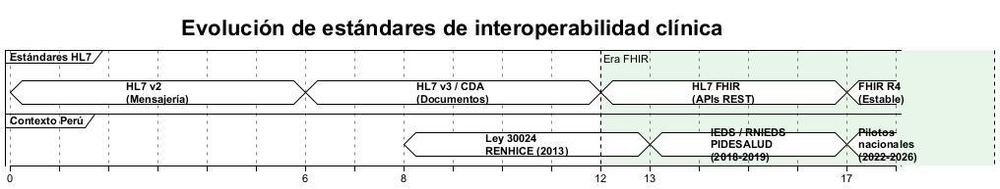

*Nota.* Elaboración propia basada en Surisetty (2026) y Amar et al. (2024).

La Tabla 7 presenta una comparación de los principales estándares de interoperabilidad clínica, sintetizando sus modelos de intercambio, fortalezas y limitaciones.

: Comparativa de estándares de interoperabilidad clínica {#tbl:comparativa-estandares}

| Estándar | Modelo de intercambio | Caso de uso principal | Fortalezas | Limitaciones |
|:---------|:----------------------|:----------------------|:-----------|:-------------|
| HL7 v2 | Basado en mensajes | Flujos clínicos en tiempo real (ADT, resultados de laboratorio) | Amplia adopción global; procesamiento rápido | Semántica limitada; variabilidad de implementación |
| HL7 CDA | Basado en documentos | Resúmenes clínicos, informes de alta | Documentos estructurados con contexto clínico | Complejo; formato estático (XML) |
| CCD | CDA restringido | Transiciones de cuidado entre proveedores | Resumen estandarizado y rico en datos para continuidad | No basado en API; acoplamiento alto |
| HL7 FHIR | Basado en recursos / API REST | Interoperabilidad moderna multiplataforma | Flexible, escalable, compatible con tecnologías web | Requiere gobernanza de perfiles y terminologías |
| openEHR | Basado en arquetipos | Modelado y persistencia clínica | Modelado semántico profundo; independencia de software | Menor adopción para intercambio; curva de aprendizaje |
| ISO 13606 | Basado en extractos | Comunicación de registros clínicos | Puente entre estándares; orientado a la privacidad | Adopción limitada fuera de Europa |

*Nota.* Elaboración propia a partir de Surisetty (2026), Pedrera-Jiménez et al. (2023) y Amar et al. (2024).

La siguiente figura presenta una taxonomía visual de los estándares de interoperabilidad clínica, organizados por su función en el ecosistema de intercambio: transporte de datos, estructura de contenido, codificación terminológica y seguridad.

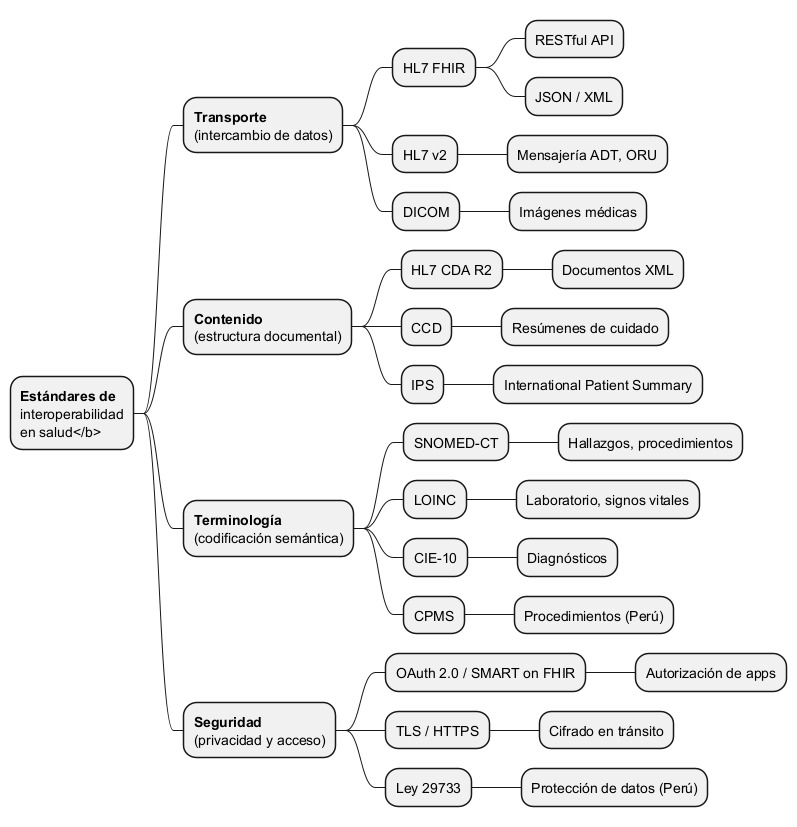

*Nota.* Elaboración propia a partir de Torab-Miandoab et al. (2023), Amar et al. (2024) y Surisetty (2026).

### Fundamentación teórica

La fundamentación teórica de esta investigación se organiza en torno a cuatro enfoques teóricos que proporcionan la base para analizar la interoperabilidad de datos clínicos en sistemas de salud pública y evaluar el impacto de una intervención tecnológica basada en estándares: la Teoría General de Sistemas, el Enfoque Sociotécnico, la Teoría de Difusión de Innovaciones y el Modelo de Calidad de Datos. Cada uno de estos marcos ofrece una perspectiva complementaria. La Teoría General de Sistemas fundamenta la concepción de la interoperabilidad como propiedad emergente de un sistema de salud articulado; el Enfoque Sociotécnico justifica por qué la implementación tecnológica debe integrarse con componentes organizacionales y humanos; la Teoría de Difusión de Innovaciones explica los patrones de adopción de FHIR y las barreras institucionales; y el Modelo de Calidad de Datos sustenta las dimensiones e indicadores de la variable dependiente.

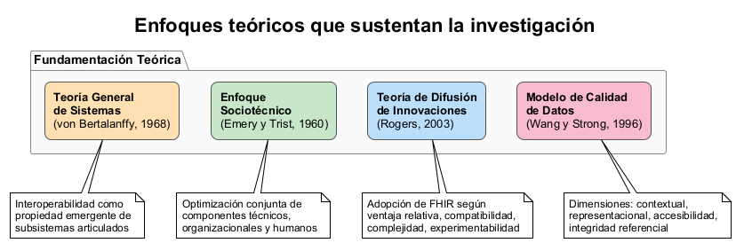

*Nota.* Elaboración propia.

#### Teoría General de Sistemas

La Teoría General de Sistemas (TGS), propuesta por Ludwig von Bertalanffy (1968), sostiene que los sistemas son conjuntos organizados de elementos interrelacionados que interactúan entre sí y con su entorno para lograr un propósito. Un principio central de la TGS es que las propiedades del todo no pueden deducirse de las propiedades de las partes aisladas: la interacción entre componentes genera propiedades emergentes. En el contexto de esta investigación, el sistema de salud peruano se concibe como un sistema complejo donde los establecimientos del MINSA, EsSalud y el sector privado constituyen subsistemas que deberían intercambiar información para lograr una atención integral. La interoperabilidad clínica es, desde esta perspectiva, una propiedad emergente que solo se manifiesta cuando los subsistemas (HIS, HCE, sistemas de laboratorio, farmacia) están efectivamente articulados. Bayona Castañeda (2019) documentó que la fragmentación MINSA-EsSalud impide esta articulación, lo que desde la TGS se interpreta como un sistema desarticulado cuyas partes operan como entidades aisladas. La TGS también introduce el concepto de retroalimentación: los resultados del sistema informan ajustes en los procesos y las entradas. El diseño pre-experimental O₁ → X → O₂ de esta tesis operacionaliza este principio: la medición de línea base (O₁) diagnostica el estado actual, la intervención FHIR (X) modifica los procesos de intercambio, y la medición post (O₂) evalúa si el sistema mejoró. Los cuatro niveles de interoperabilidad propuestos por HIMSS pueden interpretarse como capas sistémicas que deben funcionar coordinadamente para que la propiedad emergente del intercambio clínico efectivo se materialice.

**Niveles de interoperabilidad.** La Healthcare Information and Management Systems Society (HIMSS) propone cuatro niveles de interoperabilidad: (1) fundacional, que establece los requisitos de interconexión para que un sistema envíe datos a otro; (2) estructural, que define el formato y organización del intercambio de datos; (3) semántico, que asegura que los datos intercambiados sean interpretados con el mismo significado por los sistemas emisor y receptor; y (4) organizacional, que incluye políticas, aspectos sociales y legales que facilitan la comunicación segura y oportuna de datos (Amar et al., 2024). La OPS (2024) sintetiza que para lograr la interoperabilidad deben resolverse la interoperabilidad técnica (transferencia fiable) y la interoperabilidad semántica (comprensión mutua).

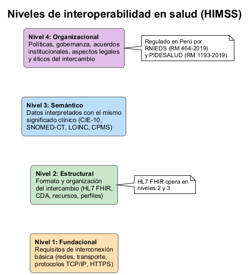

*Nota.* Elaboración propia basada en HIMSS (como se citó en Amar et al., 2024) y OPS (2024).

**HL7 FHIR.** FHIR adopta un enfoque modular donde la información granular se representa como entidades modulares independientes llamadas "Resources" (recursos). Pimenta et al. (2023) describen cada recurso como un "ladrillo Lego®" de información sanitaria: múltiples recursos FHIR se combinan para formar mensajes con datos del paciente o para construir un EHR completo. Estos recursos pueden utilizarse solos, extenderse o acoplarse con otros para cubrir la gran mayoría de casos de uso clínico, superando la impredecibilidad inherente del sector salud sin incrementar costos y complejidad progresivamente. Las APIs RESTful y los servicios web generan, gestionan y distribuyen estos recursos (Pimenta et al., 2023).

**Perfiles e Guías de Implementación FHIR.** FHIR puede adaptarse a diferentes casos de uso mediante la creación de perfiles (profiles), donde los tipos de recursos base se modifican. La descripción general de cómo usar FHIR para un caso de uso se proporciona mediante una Guía de Implementación (IG). Kramer y Moesel (2023) señalan que la comunidad FHIR ha creado cientos de IGs y miles de perfiles, utilizando varias versiones de FHIR, y que aplicaciones que siguen diferentes IGs pueden no ser capaces de interoperar. Estos autores propusieron el método FHIR Interoperability Table (FHIT) para evaluar la interoperabilidad entre clientes y servidores que soportan diferentes recursos, perfiles y versiones.

**Modelos de datos clínicos y FHIR.** Tabari et al. (2024) identificaron que los modelos de datos FHIR se clasifican en dinámicos (basados en pipelines de transformación) y estáticos (estructuras de datos predefinidas). Los casos de uso clínicos cubren enfermedades crónicas, COVID-19 e infecciosas, investigación oncológica, cuidados agudos/intensivos y notas médicas generales. La implementación de modelado FHIR para datos de EHR facilita la integración y transmisión de datos, avanzando en investigación traslacional y fenotipado.

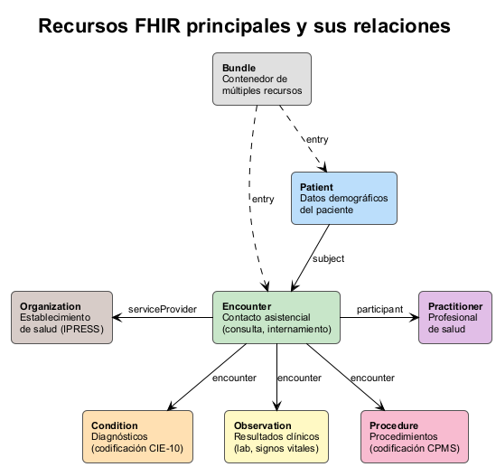

*Nota.* Elaboración propia basada en HL7 International (2019) y Pimenta et al. (2023).

La Tabla 8 sintetiza la distribución de usos de FHIR en investigación en salud y las terminologías complementarias más utilizadas, según la revisión sistemática de Vorisek et al. (2022) sobre 49 estudios.

: Distribución de usos de FHIR en investigación y terminologías complementarias {#tbl:usos-fhir}

| **Panel A: Áreas de aplicación de FHIR** | **% (n)** |
|:-----------------------------------------|:---------:|
| Estandarización de datos | 41 % (n = 20) |
| Captura de datos | 29 % (n = 14) |
| Reclutamiento de pacientes | 14 % (n = 7) |
| Análisis de datos | 12 % (n = 6) |
| Gestión de consentimiento | 4 % (n = 2) |
| **Panel B: Terminologías complementarias** | **% (n)** |
| LOINC | 37 % (n = 18) |
| SNOMED-CT | 29 % (n = 14) |
| ICD-10 | 18 % (n = 9) |
| OMOP CDM | 12 % (n = 6) |
| Otras | 43 % (n = 21) |

*Nota.* Adaptado de "Fast Healthcare Interoperability Resources (FHIR) for Health Research", por Vorisek et al., 2022, *JMIR Medical Informatics*, 10(7), e35724. La suma de terminologías supera 100 % porque un estudio puede utilizar más de una terminología.

La Tabla 9 complementa esta información con la distribución de enfoques de interoperabilidad semántica identificados por Amar et al. (2024) en su revisión de mapeo sistemático de 70 estudios.

: Enfoques de interoperabilidad semántica con FHIR {#tbl:enfoques-semanticos}

| Categoría de enfoque semántico | % (n/126 enfoques) |
|:-------------------------------|:-------------------:|
| Mapeo terminológico (*mapping*) | 24,6 % (31) |
| Representación RDF/OWL | 19,0 % (24) |
| Aprendizaje automático y NLP | 15,9 % (20) |
| Servicios terminológicos | 14,3 % (18) |
| Mecanismos de anotación | 14,3 % (18) |
| Basados en ontologías | 11,9 % (15) |

*Nota.* Adaptado de "Semantic Interoperability in Health: A Mapping Study of Approaches Related to the Fast Healthcare Interoperability Resources Standard", por Amar et al., 2024, *JMIR*, 26, e45209. La suma supera n = 70 estudios porque un estudio puede emplear más de un enfoque.

La siguiente figura visualiza la distribución de estos seis enfoques, permitiendo apreciar el predominio del mapeo terminológico y la diversidad de estrategias complementarias identificadas en la literatura.

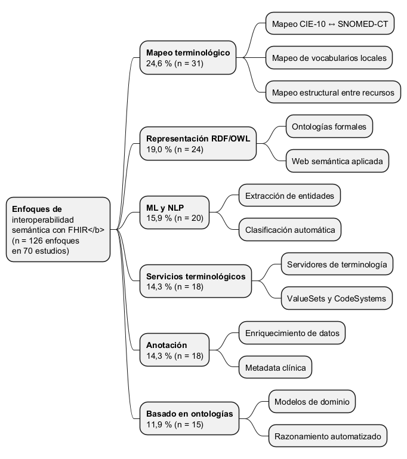

*Nota.* Elaboración propia a partir de Amar et al. (2024).

#### Enfoque Sociotécnico

El Enfoque Sociotécnico, originado en los estudios del Tavistock Institute (Emery y Trist, 1960) y aplicado a los sistemas de información por Bostrom y Heinen (1977), postula que los sistemas de información integran un componente técnico (hardware, software, estándares, redes) y un componente social (personas, procesos organizacionales, cultura institucional, estructuras de gobernanza). La optimización del sistema requiere el diseño conjunto de ambos componentes; intervenir solo el técnico o solo el social produce resultados subóptimos. Fernandez et al. (2025) identificaron que la combinación de estándares técnicos con procesos organizacionales y gobernanza sostenida es condición necesaria para el impacto de la interoperabilidad; esta triada corresponde exactamente a la integración sociotécnica. Holmgren et al. (2023) refuerzan que la priorización gubernamental y los arreglos institucionales son factores críticos que trascienden la infraestructura técnica. En la presente investigación, el Enfoque Sociotécnico se materializa en la consideración conjunta del componente técnico (estándares HL7 FHIR, servidor piloto), el organizacional (gobernanza RNIEDS/PIDESALUD, acuerdos institucionales, procesos de validación SIS) y el humano (capacitación del personal operativo, barreras de adopción). La Fase 1 de diagnóstico evalúa no solo infraestructura técnica sino también cumplimiento normativo y capacidad operativa, y la Fase 3 mide tanto indicadores técnicos (completitud, codificación) como indicadores de proceso (tiempo de validación administrativa).

**Intercambio de información en salud (HIE).** Las organizaciones de intercambio de información sanitaria (HIOs) promueven el intercambio seguro de información entre hospitales, proveedores, organizaciones comunitarias y autoridades de salud pública. Richwine et al. (2025) encontraron que la participación en una HIO se asocia significativamente con mayor intercambio clínico, reportes de salud pública e intercambio de datos sobre necesidades sociales. Sin embargo, las HIOs son solo una vía de intercambio entre varias alternativas disponibles. La Tabla 10 presenta una comparativa de las políticas de intercambio de información de salud en cinco países con distinto grado de madurez, basada en el análisis de Holmgren et al. (2023).

: Comparativa de políticas de intercambio de información de salud en cinco países {#tbl:politicas-hie}

| Dimensión | EE. UU. | Alemania | Reino Unido | Israel | Portugal |
|:-------------------------------|:----------|:----------|:------------|:---------|:----------|
| Adopción de EHR en org. agudas | Alta | Moderada | Alta | Alta | Alta |
| Madurez general de HIE | Moderada | Baja | Moderada-Alta | Alta | Moderada-Alta |
| Centralización del HIE | Baja | Alta | Alta | Moderada | Moderada-Alta |
| Incentivos para HIE | Moderados | Moderados | Moderados-Altos | Altos | Moderados-Altos |
| Factor de éxito clave | Inversión federal (HITECH) | Gobernanza centralizada | NHS nacional | Identidad única (HMOs) | Estrategia nacional |

*Nota.* Adaptado de "Health Information Exchange Policies of Five Countries: Implications for Health Information Exchange in the United States", por Holmgren et al., 2023, *IMIA Yearbook of Medical Informatics*, 32, pp. 208–215.

**Arquitecturas federadas.** Raab et al. (2023) proponen espacios de datos de salud personal federados, una arquitectura que almacena datos de salud en dispositivos personales en lugar de silos de datos centralizados, poniendo al ciudadano en el centro. Adelusi et al. (2025) demostraron que un framework federado basado en FHIR reduce significativamente el riesgo de brechas de datos al no transferir datos crudos. Este enfoque es particularmente relevante para redes de múltiples hospitales con plataformas EHR heterogéneas. La siguiente figura presenta cuatro modelos arquitectónicos para el intercambio de información en salud, desde enfoques centralizados hasta modelos completamente descentralizados.

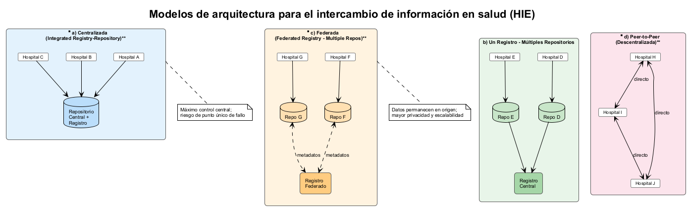

*Nota.* Elaboración propia a partir de Adelusi et al. (2025) y Lee et al. (2015).

**Blockchain en interoperabilidad de EHR.** Anand y Sadhna (2023), mediante análisis bibliométrico, establecen que la interoperabilidad de datos y el intercambio electrónico de datos se introdujeron en el campo de EHR en 2020, infiriendo que la interoperabilidad de datos es un dominio relativamente nuevo. El mapeo temático sugiere que la “interoperabilidad” de EHR está bien desarrollada y es importante para la estructura del campo de investigación. Mauricio et al. (2024) demostraron la viabilidad de combinar blockchain con FHIR para garantizar seguridad y privacidad en el intercambio de EHR en Perú.

#### Teoría de Difusión de Innovaciones

La Teoría de Difusión de Innovaciones de Everett Rogers (2003) explica cómo las nuevas tecnologías se difunden a través de los sistemas sociales, identificando cinco atributos que determinan la tasa de adopción: ventaja relativa, compatibilidad, complejidad, posibilidad de prueba (*trialability*) y observabilidad de resultados. HL7 FHIR constituye una innovación tecnológica cuya adopción en el sistema de salud peruano se encuentra en etapas tempranas. Liu et al. (2023) documentaron la ventaja relativa de FHIR sobre estándares previos (reducción de tiempos y costos de transformación); Mauricio et al. (2024) validaron su compatibilidad con sistemas legados (integración sin reemplazo); y Holmgren et al. (2023) y Morales-Camargo y Meneses-Claudio (2023) identificaron que la complejidad técnica y las barreras de capacitación ralentizan la adopción, lo que desde la teoría de Rogers se interpreta como un factor inhibidor que requiere estrategias de reducción de complejidad. La Fase 2 (piloto) de esta investigación operacionaliza la *trialability*, permitiendo evaluar resultados sin comprometer todo el sistema, estrategia coherente con la adopción incremental recomendada por Heryawan et al. (2025) y Jayathissa y Hewapathrana (2024). Vorisek et al. (2022) documentaron que la adopción científica de FHIR tardó cinco años desde la publicación del estándar, lo que confirma la progresividad del proceso de difusión descrito por Rogers.

**Enfoques híbridos y escalabilidad de implementación.** Pedrera-Jiménez et al. (2023) sostienen que OpenEHR, ISO 13606 y FHIR no deben tratarse como opciones excluyentes, sino como componentes complementarios de una arquitectura por capas. Surisetty (2026) y Liu et al. (2023) agregan que la escalabilidad técnica mejora cuando se definen rutas de transformación explícitas (documento-API) y se sustituyen componentes de alto acoplamiento por servicios FHIR nativos. En paralelo, Heryawan et al. (2025) y Jayathissa y Hewapathrana (2024) muestran que, en contextos de recursos limitados, el éxito depende de combinar decisiones arquitectónicas con capacidades operativas de despliegue progresivo. La siguiente figura ilustra una arquitectura por capas para la interoperabilidad clínica de extremo a extremo, desde los sistemas fuente hasta las aplicaciones consumidoras.

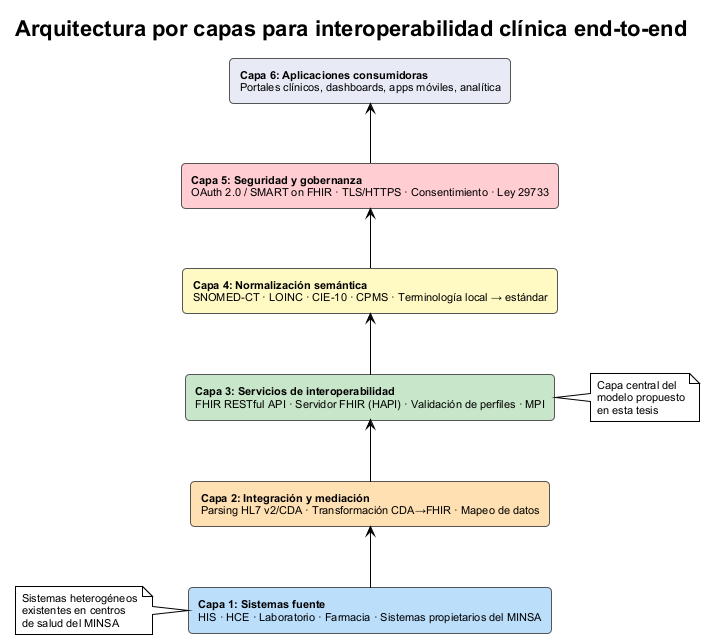

*Nota.* Elaboración propia a partir de Surisetty (2026).

#### Modelo de Calidad de Datos

Wang y Strong (1996) establecieron un marco seminal para la calidad de datos que identifica cuatro categorías: intrínseca (precisión, objetividad), contextual (relevancia, completitud, oportunidad), representacional (interpretabilidad, facilidad de comprensión) y de accesibilidad (disponibilidad, seguridad de acceso). Este modelo ha sido ampliado por DAMA International (2017), que define la calidad de datos como el grado en que los datos son adecuados para su uso previsto en operaciones, toma de decisiones y planificación, reconociendo dimensiones como completitud, consistencia, oportunidad, validez, unicidad e integridad. En esta investigación, el Modelo de Calidad de Datos fundamenta directamente la variable dependiente y sus cuatro dimensiones operativas: (a) *integridad*, alineada con la categoría contextual de Wang y Strong; (b) *consistencia*, correspondiente a la categoría representacional; (c) *disponibilidad*, vinculada a la categoría de accesibilidad; y (d) *continuidad*, que integra la integridad referencial propuesta por DAMA.

**Calidad de datos clínicos en entornos interoperables.** La calidad de los datos clínicos constituye un requisito previo y un resultado esperado de la interoperabilidad: un sistema puede ser técnicamente interoperable pero producir intercambios inútiles si los datos transmitidos son incompletos, inconsistentes o no trazables. Las dimensiones de calidad de datos en salud se agrupan comúnmente en cuatro categorías operativas que esta tesis adopta como indicadores de evaluación:

- *Integridad (completitud):* Proporción de campos clínicos obligatorios efectivamente registrados respecto al total esperado según los perfiles FHIR definidos. Gaudet-Blavignac et al. (2021) advierten que sin una estrategia semántica coordinada, los registros clínicos presentan tasas altas de campos vacíos o mal estructurados que invalidan su reutilización. En el contexto peruano, Arias Geronimo (2025) documentó que la precisión y disponibilidad de los datos en HCE del primer nivel influyen directamente en la calidad de prestaciones preventivas, y Morales-Camargo y Meneses-Claudio (2023) confirmaron que la adopción desigual de registros médicos electrónicos perpetúa campos clínicos incompletos.

- *Consistencia (codificación semántica):* Grado en que los datos clínicos intercambiados emplean las terminologías estándar obligatorias (CIE-10, CPMS, LOINC) de forma uniforme entre emisor y receptor. Chatterjee et al. (2022) demostraron que la compatibilidad de terminologías es crítica para la interoperabilidad semántica: cuando los sistemas producen el mismo dato codificado de manera heterogénea, el receptor pierde la capacidad de interpretación automática. Torab-Miandoab et al. (2023) y Kramer y Moesel (2023) refuerzan que la variabilidad de perfiles FHIR y versiones de guías de implementación es la principal fuente de inconsistencia en ecosistemas multi-institucionales.

- *Disponibilidad (del intercambio):* Porcentaje de transacciones FHIR exitosas respecto al total programado en un periodo determinado. Richwine et al. (2025) encontraron que la participación en una HIO incrementa significatiamente el intercambio clínico efectivo entre organizaciones, pero que la mera existencia de infraestructura no garantiza disponibilidad: esta depende de gobernanza operativa, acuerdos institucionales y estabilidad de la conectividad. En Perú, la OPS (2024) advierte que la madurez de los sistemas de información varía entre establecimientos del MINSA, produciendo una heterogeneidad que compromete la disponibilidad continua del intercambio.

- *Continuidad (trazabilidad longitudinal):* Capacidad de seguir el recorrido del dato clínico desde su registro en el establecimiento origen hasta su consulta en el destino, manteniendo la integridad referencial a lo largo del circuito de atención. Adelusi et al. (2025) validaron métricas de integridad de datos en frameworks federados FHIR, confirmando que la arquitectura de intercambio debe preservar la trazabilidad transaccional para que el dato sea confiable en cada punto de consumo. Bran et al. (2024) y Fernández Infanzón y Huarac Cuizano (2021) proponen complementar FHIR con blockchain para registros inmutables de acceso, aunque estas propuestas se encuentran en fase conceptual sin evaluación operativa.

Estas cuatro dimensiones convergen con los indicadores de la variable dependiente operacionalizados en el Capítulo III y con las brechas diagnósticas definidas en la formulación del problema (completitud, codificación, duplicidad, trazabilidad). La Tabla 11 integra estas dimensiones con sus indicadores operacionales, las fuentes teóricas que las sustentan y la evidencia empírica que las respalda. La presente investigación las emplea como criterios de comparación pre-post para evaluar el efecto de la capa de integración FHIR.

: Dimensiones de calidad de datos clínicos y su operacionalización en la investigación {#tbl:dimensiones-calidad}

| Dimensión | Categoría teórica (Wang y Strong, 1996) | Indicador operacional | Evidencia de respaldo |
|:------------------------------|:-------------------------------|:------------------------------------------|:-----------------------------------------|
| **Integridad (completitud)** | Contextual | % de campos obligatorios completos en recursos FHIR (must-support = true) | Gaudet-Blavignac et al. (2021): campos vacíos sin estrategia semántica; Arias Geronimo (2025): precisión de datos → calidad preventiva |
| **Consistencia (codificación)** | Representacional | % de diagnósticos y procedimientos con codificación estándar (CIE-10, CPMS) | Chatterjee et al. (2022): pérdida semántica por codificación heterogénea; Torab-Miandoab et al. (2023): variabilidad de perfiles |
| **Disponibilidad (intercambio)** | Accesibilidad | % de transacciones FHIR exitosas / total programado | Richwine et al. (2025): gobernanza y conectividad determinan disponibilidad; OPS (2024): heterogeneidad entre establecimientos |
| **Continuidad (trazabilidad)** | Integridad referencial (DAMA, 2017) | % de HCE con trazabilidad verificable entre establecimientos; % de registros con log completo | Adelusi et al. (2025): trazabilidad transaccional en frameworks federados; Bran et al. (2024): blockchain para inmutabilidad |

*Nota.* Elaboración propia a partir de Wang y Strong (1996), DAMA International (2017) y las fuentes citadas.

### Marco conceptual

El marco conceptual de esta investigación se construye a partir de la fundamentación teórica y organiza las variables, sus dimensiones e indicadores en una estructura que guía la recolección y el análisis de datos. El estudio establece que la implementación del modelo de interoperabilidad basado en HL7 FHIR (variable independiente) mejora la calidad del intercambio de información clínica (variable dependiente), cuyas brechas actuales constituyen el problema de investigación.

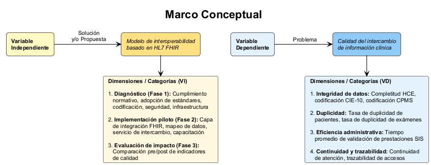

*Nota.* Elaboración propia.

#### Definición conceptual de la variable independiente: Modelo de interoperabilidad basado en HL7 FHIR

El modelo de interoperabilidad basado en HL7 FHIR se define como el conjunto integrado de componentes técnicos, normativos y operativos que, organizados en tres fases secuenciales (diagnóstico, implementación piloto y evaluación de impacto), buscan habilitar el intercambio estandarizado de datos clínicos entre sistemas de información en salud del MINSA. Desde la Teoría General de Sistemas, el modelo actúa como una intervención que articula subsistemas previamente desconectados; desde la Teoría de Difusión de Innovaciones, constituye la innovación tecnológica cuya adopción se evalúa; y desde el Enfoque Sociotécnico, integra componentes técnicos, organizacionales y humanos.

*Dimensiones de la variable independiente:*

- *Diagnóstico (Fase 1):* Evaluación del cumplimiento normativo (RNIEDS, PIDESALUD), adopción de estándares (HL7/FHIR), codificación clínica (CIE-10, CPMS), seguridad, trazabilidad e infraestructura de conectividad.
- *Implementación piloto (Fase 2):* Desarrollo de la capa de integración FHIR (recursos, perfiles, terminologías), mapeo de datos locales al modelo FHIR, implementación del servicio de intercambio y capacitación del personal operativo.
- *Evaluación de impacto (Fase 3):* Comparación pre/post de los indicadores de calidad del intercambio de información clínica.

#### Definición conceptual de la variable dependiente: Calidad del intercambio de información clínica

La calidad del intercambio de información clínica se define como el grado en que los datos clínicos intercambiados entre establecimientos del MINSA son completos, correctamente codificados, no duplicados y trazables a lo largo del circuito de atención, en concordancia con el Modelo de Calidad de Datos de Wang y Strong (1996) y DAMA International (2017). Esta variable se operacionaliza mediante cuatro dimensiones con ocho indicadores cuantitativos medidos antes y después de la intervención.

*Dimensiones de la variable dependiente:*

- *Integridad de datos:* Completitud de HCE (% campos obligatorios completos), codificación CIE-10 (% diagnósticos correctamente codificados) y codificación CPMS (% procedimientos correctamente codificados). Fundamentada en la categoría contextual de Wang y Strong (1996) y evidenciada por Gaudet-Blavignac et al. (2021), quienes advierten altas tasas de campos vacíos sin estrategia semántica coordinada; Arias Geronimo (2025), quien documenta el impacto de la precisión de datos en la prestación preventiva; y Morales-Camargo y Meneses-Claudio (2023), quienes confirman que la adopción desigual perpetúa campos incompletos.
- *Duplicidad:* Duplicidad de pacientes y de exámenes (tasas por 1 000 atenciones). Documentada como problema estructural del sistema peruano por Bayona Castañeda (2019), quien identificó la persistencia de múltiples historias clínicas por paciente en distintas instituciones.
- *Eficiencia administrativa:* Tiempo promedio de validación de prestaciones SIS (horas). Respaldada por la demostración de Liu et al. (2023) de reducción significativa de tiempos y costos al sustituir gateways por servidores FHIR.
- *Continuidad y trazabilidad:* Continuidad de atención (% HCE con trazabilidad verificable entre establecimientos) y trazabilidad de accesos (% registros con log completo). Validada por Adelusi et al. (2025) en frameworks federados FHIR, y complementada por las propuestas de blockchain de Bran et al. (2024) y Fernández Infanzón y Huarac Cuizano (2021).

#### Marco regulatorio peruano

El marco regulatorio que sustenta la dimensión normativa del modelo comprende la RM N° 1104-2018-MINSA (IEDS), la RM N° 464-2019-MINSA (RNIEDS), la RM N° 1193-2019-MINSA (PIDESALUD) y la Ley N° 30024 (RENHICE). Holmgren et al. (2023) identifican la priorización gubernamental como factor común en marcos de interoperabilidad exitosos. Bossenko et al. (2024) demuestran que la transformación de CDA a FHIR mediante herramientas visuales permite a expertos del dominio con mínimas habilidades técnicas especificar y validar reglas de transformación. En Perú, la brecha entre normativa vigente y operación efectiva —documentada por Bayona Castañeda (2019), Mauricio et al. (2024) y Esparza Morgan (2025)— justifica el componente diagnóstico de esta tesis. La Tabla 12 sintetiza el marco normativo peruano vigente para la interoperabilidad en salud.

: Marco normativo peruano para la interoperabilidad en salud {#tbl:marco-normativo}

| Norma | Año | Instrumento creado | Contenido principal |
|:-------------------------------|:----:|:---------------------|:------------------------------------------------------|
| Ley N° 30024 | 2013 | RENHICE | Crea el Registro Nacional de Historias Clínicas Electrónicas para garantizar acceso y disponibilidad a nivel nacional |
| DL N° 1306 | 2016 | — | Optimiza procesos vinculados al RENHICE |
| DS N° 009-2017-SA | 2017 | Reglamento de Ley N° 30024 | Establece disposiciones reglamentarias para la implementación del RENHICE |
| RM N° 1104-2018-MINSA | 2018 | IEDS | Define la Infraestructura de Estándares de Datos en Salud: estándares técnicos para representación, almacenamiento e intercambio |
| RM N° 464-2019-MINSA | 2019 | RNIEDS | Establece la Red Nacional de Interoperabilidad en Datos de Salud: arquitectura de conectividad e intercambio estandarizado |
| RM N° 1193-2019-MINSA | 2019 | PIDESALUD | Regula la Plataforma de Interoperabilidad de Datos Estándares de Salud: mecanismos técnicos para el intercambio entre establecimientos |
| Ley N° 29733 | 2011 | — | Ley de Protección de Datos Personales: establece requisitos de consentimiento y seguridad para datos clínicos |
| Ley N° 29344 | 2009 | AUS | Marco de Aseguramiento Universal en Salud: articula la cobertura financiera con la prestación de servicios |

*Nota.* Elaboración propia a partir de Bayona Castañeda (2019) y el marco normativo vigente del MINSA.

## Definición de términos básicos

- **API RESTful:** Interfaz de programación de aplicaciones que sigue los principios de la arquitectura REST (Representational State Transfer), permitiendo la comunicación entre sistemas mediante operaciones HTTP estándar (GET, POST, PUT, DELETE). En el contexto de FHIR, las APIs RESTful constituyen el mecanismo principal para crear, leer, actualizar y eliminar recursos clínicos de forma interoperable (Pimenta et al., 2023).

- **CDA (Clinical Document Architecture):** Estándar de HL7 que define la estructura y semántica de documentos clínicos para su intercambio electrónico. CDA utiliza XML para representar documentos como resúmenes de alta, notas de evolución y reportes de laboratorio, proporcionando interoperabilidad documental entre sistemas de información en salud (Bossenko et al., 2024).

- **CIE-10 (Clasificación Internacional de Enfermedades, 10.ª revisión):** Sistema de codificación desarrollado por la Organización Mundial de la Salud para clasificar diagnósticos y causas de mortalidad. En el contexto del MINSA, su uso correcto es obligatorio para la codificación de diagnósticos en historias clínicas electrónicas y constituye un indicador clave de calidad de datos (Vorisek et al., 2022).

- **CPMS (Catálogo de Procedimientos Médicos y Sanitarios):** Catálogo normativo utilizado en el sistema de salud peruano para la codificación estandarizada de procedimientos médicos y sanitarios realizados en los establecimientos del MINSA. Su correcta aplicación facilita la validación de prestaciones por parte del SIS.

- **e-Qhali:** Sistema de información de historia clínica electrónica propuesto por el MINSA como estándar para el primer y segundo nivel de atención de las IPRESS en Perú, basado en la arquitectura de interoperabilidad HL7 (Bayona Castañeda, 2019).

- **EHR (Electronic Health Record):** Registro electrónico de salud; repositorio digital longitudinal de la información de salud de un paciente, que puede ser compartido entre diferentes establecimientos y proveedores de atención. A diferencia del EMR (Electronic Medical Record), que es propio de una institución, el EHR está diseñado para ser interoperable (Mauricio et al., 2024).

- **FHIR (Fast Healthcare Interoperability Resources):** Estándar desarrollado por HL7 International para el intercambio electrónico de información de salud. FHIR adopta un enfoque modular basado en recursos independientes — unidades mínimas de información clínica como Patient, Observation y Condition — que se combinan para representar datos clínicos complejos. Utiliza tecnologías web modernas (REST, JSON, XML, OAuth) para facilitar la implementación. Para la presente investigación se utilizará la versión FHIR R4 (Release 4), por ser la versión estable con mayor adopción internacional y contar con perfiles predefinidos (US Core, International Patient Summary) que facilitan la implementación en contextos de interoperabilidad clínica (Pimenta et al., 2023; Tabari et al., 2024).

- **GraphQL:** Lenguaje de consulta y entorno de ejecución para APIs que permite al cliente solicitar exactamente los datos que necesita en una sola petición, a diferencia de REST, que expone recursos fijos. En el contexto de FHIR, la especificación incluye un binding oficial GraphQL que posibilita consultas clínicas complejas (multi-recurso) con menor número de llamadas al servidor, facilitando escenarios de integración donde se requiere agregar datos de Patient, Encounter y Observation en una misma transacción.

- **Guía de Implementación (Implementation Guide - IG):** Documento que describe cómo utilizar FHIR para un caso de uso específico, incluyendo perfiles, extensiones y reglas de validación. Diferentes IGs pueden definir restricciones distintas sobre los mismos recursos FHIR, lo que puede generar desafíos de interoperabilidad entre sistemas que siguen guías diferentes (Kramer y Moesel, 2023).

- **HAPI-FHIR:** Implementación de referencia de código abierto del estándar HL7 FHIR desarrollada en Java. Proporciona un servidor FHIR completo, un cliente FHIR y herramientas de validación de perfiles que facilitan la construcción de capas de integración clínica sin dependencias comerciales. Es ampliamente utilizada en proyectos piloto e investigación por su conformidad con las especificaciones FHIR R4 y su comunidad activa de desarrollo.

- **HIE (Health Information Exchange):** Intercambio de información de salud; proceso mediante el cual se comparte electrónicamente información clínica entre organizaciones de salud. Las HIOs (Health Information Organizations) son entidades que facilitan y gobiernan este intercambio a nivel regional o nacional (Richwine et al., 2025).

- **HIS (Hospital Information System):** Sistema de información hospitalario que gestiona los datos administrativos y clínicos de un centro de salud, incluyendo finanzas, recursos humanos, citas, hospitalización y servicios complementarios. Arrué Pajares y Vargas Rioja (2022) desarrollaron un HIS interoperable basado en HL7 para centros de categoría II-1 o superior en Perú.

- **HL7 (Health Level Seven International):** Organización internacional que desarrolla estándares para el intercambio, integración, compartición y recuperación de información electrónica de salud. Su nombre se refiere al nivel 7 (aplicación) del modelo OSI, donde opera la comunicación de datos clínicos (Amar et al., 2024).

- **IEDS (Infraestructura de Estándares de Datos en Salud):** Marco normativo peruano establecido por la RM N° 1104-2018-MINSA que define los estándares técnicos para la representación, almacenamiento e intercambio de datos de salud entre los establecimientos del sistema público peruano.

- **Interoperabilidad en salud:** Capacidad de diferentes sistemas de tecnología de la información para comunicar e intercambiar datos con exactitud, efectividad y consistencia, y para usar la información que ha sido intercambiada. HIMSS distingue cuatro niveles: fundacional, estructural, semántico y organizacional (Amar et al., 2024; OPS, 2024).

- **Interoperabilidad semántica:** Nivel de interoperabilidad que asegura que los datos intercambiados entre sistemas sean interpretados con el mismo significado clínico por el sistema emisor y el receptor, mediante el uso de terminologías y codificaciones estandarizadas como SNOMED-CT, LOINC y CIE-10 (Torab-Miandoab et al., 2023). Porras Gamarra (2024) demostró la viabilidad de combinar interoperabilidad sintáctica (HL7 FHIR) con semántica (openEHR) en un contexto real de salud.

- **LOINC (Logical Observation Identifiers Names and Codes):** Sistema de codificación universal desarrollado por el Regenstrief Institute para la identificación estandarizada de observaciones clínicas y de laboratorio. Complementa a SNOMED-CT y CIE-10 al codificar específicamente pruebas de laboratorio, signos vitales y cuestionarios clínicos, siendo uno de los vocabularios requeridos para lograr interoperabilidad semántica plena en ecosistemas FHIR (Torab-Miandoab et al., 2023).

- **OAuth 2.0 (Open Authorization 2.0):** Protocolo estándar de autorización que permite a aplicaciones de terceros acceder a recursos protegidos sin exponer las credenciales del usuario. En el ecosistema FHIR, OAuth 2.0 constituye el mecanismo de seguridad recomendado para controlar el acceso a APIs clínicas, implementado típicamente a través del perfil SMART on FHIR que define flujos de autorización específicos para aplicaciones de salud.

- **openEHR:** Estándar abierto de interoperabilidad semántica que utiliza arquetipos y plantillas para el modelado y persistencia de información clínica, permitiendo que los datos sean estructurados de forma independiente del software. Porras Gamarra (2024) lo complementó con HL7 FHIR en el proyecto M-Connecta.

- **RENHICE (Registro Nacional de Historias Clínicas Electrónicas):** Registro creado por la Ley N° 30024 del Perú que tiene como objetivo garantizar el acceso y disponibilidad de las historias clínicas electrónicas a nivel nacional, promoviendo la interoperabilidad entre las IPRESS públicas y privadas (Bayona Castañeda, 2019).

- **PIDESALUD (Plataforma de Interoperabilidad de Datos Estándares de Salud):** Plataforma normada por la RM N° 1193-2019-MINSA que establece los mecanismos técnicos para la interoperabilidad de datos de salud entre los establecimientos del MINSA y otras entidades del sector salud peruano.

- **Recurso FHIR:** Unidad modular básica de información en el estándar FHIR, descrita metafóricamente como un "ladrillo Lego®" de información sanitaria. Cada recurso representa un concepto clínico o administrativo discreto (Patient, Encounter, Observation, Condition, Procedure, entre otros) y puede utilizarse de forma independiente o combinada (Pimenta et al., 2023).

- **RNIEDS (Red Nacional de Interoperabilidad en Datos de Salud):** Red normada por la RM N° 464-2019-MINSA que define la arquitectura de conectividad e intercambio de datos estandarizados entre los sistemas de información de los establecimientos de salud del MINSA a nivel nacional.

- **SIS (Seguro Integral de Salud):** Organismo público del sector salud peruano que administra el aseguramiento en salud de la población en situación de vulnerabilidad, financiando prestaciones en los establecimientos del MINSA. La validación oportuna de atenciones por el SIS requiere registros clínicos completos y correctamente codificados.

- **SMART on FHIR (Substitutable Medical Applications, Reusable Technologies):** Plataforma de estándares abiertos que define cómo las aplicaciones clínicas se autentican, autorizan y conectan a servidores FHIR de forma segura y portátil. Combina OAuth 2.0, OpenID Connect y perfiles FHIR para permitir que una misma aplicación funcione sobre cualquier EHR compatible, promoviendo un ecosistema de aplicaciones clínicas intercambiables.

- **SNOMED-CT (Systematized Nomenclature of Medicine — Clinical Terms):** Terminología clínica integral y multilingüe mantenida por SNOMED International, que proporciona códigos, términos, sinónimos y definiciones para representar hallazgos clínicos, procedimientos, organismos y sustancias. Es la terminología de referencia para la interoperabilidad semántica de datos clínicos en ecosistemas FHIR, al permitir que conceptos médicos sean codificados de forma unívoca entre sistemas emisores y receptores (Torab-Miandoab et al., 2023).

### Definiciones operacionales de los indicadores de calidad del intercambio

Los siguientes términos se definen en su acepción operacional específica para esta investigación, en correspondencia con las dimensiones de la variable dependiente operacionalizada en el Capítulo III y con la fundamentación teórica sobre calidad de datos clínicos presentada en la sección 2.2.

- **Integridad del registro clínico (operacional):** Proporción de campos clínicos obligatorios —según los perfiles FHIR definidos en la Guía de Implementación del estudio— que se encuentran completos y con valores válidos en los recursos intercambiados (Patient, Condition, Observation). Se calcula como el porcentaje de recursos FHIR que contienen valores válidos en los campos marcados como obligatorios (must-support = true).

- **Consistencia en la codificación clínica (operacional):** Grado de concordancia entre la codificación empleada por los sistemas emisores y los estándares definidos en el marco normativo (CIE-10, CPMS). Se mide como el porcentaje de diagnósticos y procedimientos que cumplen con la codificación estándar vigente respecto al total de registros auditados.

- **Disponibilidad del intercambio (operacional):** Porcentaje de transacciones FHIR exitosas respecto al total de transacciones programadas durante el periodo de evaluación, calculado mediante el análisis de logs del servidor FHIR piloto.

- **Continuidad asistencial (operacional):** Capacidad de acceder al historial clínico completo de un paciente a lo largo de los diferentes niveles de atención dentro del circuito piloto, medida como el porcentaje de pacientes cuya información clínica está disponible en su totalidad en cada punto de atención visitado.

# Capítulo III: Hipótesis y variables

## Hipótesis

### Hipótesis general

La implementación de un modelo de interoperabilidad basado en HL7 FHIR mejora significativamente el intercambio de información clínica de pacientes atendidos en centros de salud del MINSA en Perú, evidenciado por la mejora de los indicadores de completitud, codificación, duplicidad, tiempo de validación, continuidad de atención y trazabilidad.

### Hipótesis específicas

- **HE1:** El diagnóstico sistemático del cumplimiento de estándares de interoperabilidad (RNIEDS, PIDESALUD, HL7, CIE-10, CPMS) permite identificar brechas críticas cuantificables en el intercambio de información clínica de los centros de salud del ámbito MINSA.

- **HE2:** La implementación de una capa piloto de integración basada en HL7 FHIR produce una mejora estadísticamente significativa en los indicadores de calidad del intercambio de información clínica (completitud, codificación CIE-10/CPMS, duplicidad de pacientes/exámenes, tiempo de validación administrativa de prestaciones) respecto a la línea base.

- **HE3:** El modelo de interoperabilidad implementado mejora la continuidad de la atención y la trazabilidad de accesos en las historias clínicas electrónicas entre establecimientos de salud.

- **HE4:** Los lineamientos técnicos y operativos derivados de la experiencia piloto son replicables para la escalabilidad del modelo en otros establecimientos de salud del MINSA.

## Operacionalización de variables

### Variable independiente: Modelo de interoperabilidad basado en HL7 FHIR

Se define como el conjunto integrado de componentes técnicos, normativos y operativos que, organizados en tres fases secuenciales (diagnóstico, implementación piloto y evaluación de impacto), buscan habilitar el intercambio estandarizado de datos clínicos entre sistemas de información en salud. En la **Fase 1 (Diagnóstico)**, se evalúa el nivel de cumplimiento de la arquitectura RNIEDS-PIDESALUD, el grado de adopción de estándares de intercambio (HL7/FHIR), el cumplimiento de codificación clínica (CIE-10, CPMS, catálogos IEDS), el estado de seguridad y trazabilidad, y la capacidad de infraestructura y conectividad. En la **Fase 2 (Implementación piloto)**, se desarrolla la capa de integración FHIR (recursos, perfiles, terminologías), el mapeo y transformación de datos locales al modelo FHIR, la implementación del servicio de intercambio piloto y la capacitación del personal operativo. En la **Fase 3 (Evaluación)**, se comparan los indicadores de calidad del intercambio de información clínica antes y después de la intervención.

### Variable dependiente: Calidad del intercambio de información clínica en establecimientos del MINSA

Se operacionaliza mediante ocho indicadores medidos antes y después de la implementación del modelo: (1) **completitud de HCE**, definida como el porcentaje de campos obligatorios completos en la historia clínica electrónica; (2) **codificación CIE-10**, porcentaje de diagnósticos correctamente codificados; (3) **codificación CPMS**, porcentaje de procedimientos correctamente codificados; (4) **duplicidad de pacientes**, tasa de registros duplicados por cada 1 000 atenciones; (5) **duplicidad de exámenes**, tasa de exámenes y procedimientos duplicados por cada 1 000 atenciones; (6) **tiempo de validación administrativa de prestaciones**, tiempo promedio en horas desde la atención hasta la validación administrativa de prestaciones financiadas por el SIS; (7) **continuidad de atención**, porcentaje de HCE con trazabilidad verificable entre establecimientos; y (8) **trazabilidad de accesos**, porcentaje de registros con log completo de acceso y modificación. Los indicadores se obtienen por auditoría de registros, muestras de atenciones, bases de datos HIS, registros administrativos de validación de prestaciones (SIS), cruce de registros entre establecimientos y logs del sistema.

## Matriz de operacionalización de variables

| Variable | Definición conceptual | Definición operacional | Dimensiones | Indicadores | Escala de valoración | Instrumentos |
|---|---|---|---|---|---|---|
| Variable independiente: Modelo de interoperabilidad basado en HL7 FHIR | Conjunto integrado de componentes técnicos, normativos y operativos que habilitan el intercambio estandarizado de datos clínicos. | Implementación de tres fases: diagnóstico de brechas, capa de integración FHIR piloto y evaluación pre/post. | Diagnóstico | Nivel de cumplimiento RNIEDS-PIDESALUD; adopción de HL7/FHIR; codificación CIE-10/CPMS. | Nominal (cumple/no cumple) y de razón (% de cumplimiento). | Lista de chequeo normativo-técnico; auditoría de registros; pruebas de integración. |
| Variable independiente: Modelo de interoperabilidad basado en HL7 FHIR | Conjunto integrado de componentes técnicos, normativos y operativos que habilitan el intercambio estandarizado de datos clínicos. | Implementación de tres fases: diagnóstico de brechas, capa de integración FHIR piloto y evaluación pre/post. | Implementación piloto | Recursos FHIR mapeados; tasa de éxito de intercambio; perfiles y terminologías aplicados. | Nominal (cumple/no cumple) y de razón (% de cumplimiento). | Lista de chequeo normativo-técnico; auditoría de registros; pruebas de integración. |
| Variable independiente: Modelo de interoperabilidad basado en HL7 FHIR | Conjunto integrado de componentes técnicos, normativos y operativos que habilitan el intercambio estandarizado de datos clínicos. | Implementación de tres fases: diagnóstico de brechas, capa de integración FHIR piloto y evaluación pre/post. | Evaluación de impacto | Comparación pre/post de los 8 indicadores de calidad de HCE. | Nominal (cumple/no cumple) y de razón (% de cumplimiento). | Lista de chequeo normativo-técnico; auditoría de registros; pruebas de integración. |
| Variable dependiente: Calidad del intercambio de información clínica en establecimientos del MINSA | Grado de integridad, codificación, trazabilidad y continuidad del intercambio de información clínica en establecimientos MINSA. | Medición pre y post intervención de 8 indicadores cuantitativos de calidad de HCE. | Integridad de datos | Completitud de HCE (% campos obligatorios); codificación CIE-10 (%); codificación CPMS (%). | De razón (%, tasa, horas). | Auditoría de registros; base de datos HIS; registros administrativos de validación (SIS); logs del sistema. |
| Variable dependiente: Calidad del intercambio de información clínica en establecimientos del MINSA | Grado de integridad, codificación, trazabilidad y continuidad del intercambio de información clínica en establecimientos MINSA. | Medición pre y post intervención de 8 indicadores cuantitativos de calidad de HCE. | Duplicidad | Duplicidad de pacientes (tasa/1000); duplicidad de exámenes (tasa/1000). | De razón (%, tasa, horas). | Auditoría de registros; base de datos HIS; registros administrativos de validación (SIS); logs del sistema. |
| Variable dependiente: Calidad del intercambio de información clínica en establecimientos del MINSA | Grado de integridad, codificación, trazabilidad y continuidad del intercambio de información clínica en establecimientos MINSA. | Medición pre y post intervención de 8 indicadores cuantitativos de calidad de HCE. | Eficiencia administrativa | Tiempo de validación administrativa de prestaciones (horas promedio). | De razón (%, tasa, horas). | Auditoría de registros; base de datos HIS; registros administrativos de validación (SIS); logs del sistema. |
| Variable dependiente: Calidad del intercambio de información clínica en establecimientos del MINSA | Grado de integridad, codificación, trazabilidad y continuidad del intercambio de información clínica en establecimientos MINSA. | Medición pre y post intervención de 8 indicadores cuantitativos de calidad de HCE. | Continuidad y trazabilidad | Continuidad de atención (% HCE con trazabilidad); trazabilidad de accesos (% registros con log completo). | De razón (%, tasa, horas). | Auditoría de registros; base de datos HIS; registros administrativos de validación (SIS); logs del sistema. |

: Tabla 1. Matriz de operacionalización de variables

# Capítulo IV: Metodología del estudio

## Enfoque, tipo y alcance de investigación

### Enfoque

La presente investigación adopta un enfoque mixto con predominancia cuantitativa y apoyo cualitativo. Según Hernández-Sampieri y Mendoza (2018), los métodos mixtos representan un conjunto de procesos sistemáticos que implican la recolección y el análisis de datos tanto cuantitativos como cualitativos, así como su integración y discusión conjunta, lo que permite lograr un mayor entendimiento del fenómeno bajo estudio. El componente cuantitativo predominante se justifica porque el estudio busca medir objetivamente los indicadores de calidad del intercambio de información clínica antes y después de la intervención, mientras que el componente cualitativo complementario permite capturar las barreras organizacionales y de implementación que los datos numéricos no reflejan. Este enfoque es consistente con los estudios de referencia: Adelusi et al. (2025) utilizaron métricas cuantitativas de rendimiento y Liu et al. (2023) emplearon pruebas de rendimiento con Apache JMeter, complementados con análisis cualitativos de la experiencia de implementación.

### Tipo y alcance

La investigación es de tipo aplicada, pues busca resolver un problema práctico específico — la deficiente interoperabilidad de historias clínicas en centros de salud del MINSA — mediante la implementación de un modelo basado en HL7 FHIR. Según Hernández-Sampieri y Mendoza (2018), la investigación aplicada se orienta a resolver problemas de la práctica a través de la aplicación del conocimiento. El alcance es explicativo-propositivo: explicativo porque busca establecer relaciones causales entre la implementación del modelo FHIR (variable independiente) y la mejora en la calidad del intercambio de información clínica (variable dependiente), y propositivo porque genera lineamientos de escalabilidad para otros establecimientos. Este alcance se alinea con estudios como el de Bossenko et al. (2024), que no solo implementaron sino que evaluaron el impacto de su herramienta de transformación CDA-FHIR.

## Diseño de la investigación

El diseño es pre-experimental del tipo pre-test/post-test con un solo grupo, representado esquemáticamente como: O₁ → X → O₂, donde O₁ es la medición de línea base (pre-test), X es la intervención (implementación de la capa de integración FHIR) y O₂ es la medición posterior (post-test). Este diseño fue seleccionado considerando las restricciones operativas del contexto MINSA, donde la asignación aleatoria de establecimientos a grupos de control no es viable. Según Hernández-Sampieri y Mendoza (2018), los diseños pre-experimentales son útiles como un primer acercamiento al problema de investigación en contextos donde no es posible aplicar diseños experimentales puros. El diseño contempla tres fases: (1) diagnóstico de brechas de interoperabilidad y levantamiento de línea base; (2) implementación piloto de la capa de integración basada en HL7 FHIR; y (3) evaluación de impacto mediante comparación de indicadores pre y post intervención. Este diseño por fases es coherente con las implementaciones graduales recomendadas por Heryawan et al. (2025) y Jayathissa y Hewapathrana (2024).

## Población y muestra

### Población

La población está constituida por los establecimientos de salud del MINSA en Perú, así como el conjunto de historias clínicas electrónicas y registros clínico-administrativos generados en dichos establecimientos. Según Hernández-Sampieri y Mendoza (2018), la población es el conjunto de todos los casos que concuerdan con determinadas especificaciones. En este caso, los criterios de inclusión son: (a) establecimientos del MINSA en Lima que atienden población usuaria del sistema público (incluida la cobertura SIS), (b) que cuenten con algún sistema de registro electrónico de salud, y (c) que operen en al menos dos niveles de complejidad diferentes.

### Muestra

La muestra se definirá mediante muestreo no probabilístico por conveniencia, considerando al menos 2 o 3 establecimientos de diferentes niveles de complejidad en Lima, según disponibilidad de acceso institucional y calidad de datos. Hernández-Sampieri y Mendoza (2018) señalan que en las muestras no probabilísticas, la elección de los elementos no depende de la probabilidad sino de las características de la investigación, lo cual es apropiado cuando las restricciones operativas limitan la aleatorización. Para la auditoría de registros clínicos, se seleccionará una muestra representativa de historias clínicas por establecimiento, cuyo tamaño se determinará mediante cálculo estadístico con un nivel de confianza del 95% y un margen de error del 5%.

## Técnicas e instrumentos de recolección de datos

### Técnicas e instrumentos

Se emplearán las siguientes técnicas e instrumentos, seleccionados en función de los objetivos y las fases del diseño de investigación:

- **Revisión documental normativa y técnica:** Análisis sistemático del marco regulatorio (RM N° 1104-2018-MINSA, RM N° 464-2019-MINSA, RM N° 1193-2019-MINSA) y de la documentación técnica de los sistemas de información en los establecimientos seleccionados. Según Hernández-Sampieri y Mendoza (2018), la revisión documental permite obtener datos secundarios de fuentes institucionales que complementan la información primaria.
- **Lista de chequeo de cumplimiento normativo-técnico:** Instrumento estructurado con ítems dicotómicos (cumple/no cumple) que evalúa el grado de adopción de los estándares de interoperabilidad (RNIEDS, PIDESALUD, HL7, CIE-10, CPMS) en cada establecimiento.
- **Ficha de auditoría de registros clínico-administrativos:** Instrumento que permite medir los ocho indicadores de calidad del intercambio de información clínica (completitud, codificación CIE-10, codificación CPMS, duplicidad de pacientes, duplicidad de exámenes, tiempo de validación administrativa de prestaciones, continuidad de atención y trazabilidad de accesos) en las mediciones pre y post intervención.
- **Entrevistas semiestructuradas:** Dirigidas a responsables de TI y áreas asistenciales de los establecimientos, con el objetivo de identificar barreras organizacionales, culturales y técnicas no capturables mediante los instrumentos cuantitativos.
- **Pruebas de integración técnica:** Conjunto de pruebas automatizadas para validar la interoperabilidad FHIR (envío/recepción de recursos, validación de perfiles, tiempos de respuesta), siguiendo el enfoque de pruebas de rendimiento empleado por Liu et al. (2023) y las métricas de Adelusi et al. (2025).

### Validez y confiabilidad

La **validez de contenido** de los instrumentos (lista de chequeo de cumplimiento normativo-técnico y ficha de auditoría de registros clínicos) se asegurará mediante juicio de expertos: al menos tres especialistas en informática en salud, interoperabilidad o gestión de HCE evaluarán la pertinencia, claridad y suficiencia de cada ítem utilizando el coeficiente de concordancia V de Aiken, requiriendo un valor ≥ 0.80 para su aceptación. La **validez de constructo** se sustenta en que los indicadores derivan de estándares reconocidos internacionalmente (HL7 FHIR, CIE-10, CPMS) y del marco normativo nacional (RM N° 1104-2018-MINSA, RM N° 464-2019-MINSA), lo cual garantiza la correspondencia entre los indicadores medidos y los conceptos teóricos de interoperabilidad y calidad del intercambio de información clínica. La **confiabilidad** de los indicadores cuantitativos se evaluará mediante consistencia interna: para los ítems dicotómicos de la lista de chequeo se utilizará el coeficiente KR-20, y para las escalas de los ítems de auditoría se empleará el coeficiente alfa de Cronbach, esperando valores ≥ 0.70 en ambos casos. Adicionalmente, se realizará una prueba piloto en un establecimiento no incluido en la muestra final para calibrar los instrumentos.

### Procedimiento de recolección de datos

La recolección de datos se ejecutará en tres etapas alineadas con las fases del diseño de investigación:

**Etapa 1 — Diagnóstico (pre-test).** Se aplicará la lista de chequeo de cumplimiento normativo-técnico en cada establecimiento seleccionado, complementada con revisión documental de normativas institucionales. Simultáneamente, se levantará la línea base de los ocho indicadores de calidad del intercambio de información clínica mediante auditoría de una muestra representativa de registros clínico-administrativos (historias clínicas, atenciones financiadas por SIS, logs de sistema). Se realizarán entrevistas semiestructuradas a responsables de TI y áreas asistenciales para identificar barreras organizacionales. Los datos cuantitativos se extraerán de las bases de datos HIS y registros administrativos de validación de prestaciones (SIS) con autorización institucional.

**Etapa 2 — Implementación piloto.** Se registrarán los parámetros de configuración de la capa de integración FHIR (recursos mapeados, perfiles utilizados, terminologías aplicadas) y los resultados de las pruebas de integración técnica (tasa de éxito en envío/recepción de recursos, errores de validación, tiempos de respuesta). Se documentarán las actividades de capacitación y las incidencias detectadas durante la operación piloto.

**Etapa 3 — Evaluación (post-test).** Transcurrido un período de operación suficiente (mínimo cuatro semanas), se repetirá la medición de los ocho indicadores sobre una muestra equivalente de registros, utilizando los mismos instrumentos y criterios de la línea base. Las mediciones pre y post se compilarán en una base de datos anonimizada para su análisis estadístico.

## Técnicas de análisis de datos

El análisis de datos se realizará en dos vertientes, de acuerdo con el enfoque mixto de la investigación:

**Análisis cuantitativo.** Los datos de los ocho indicadores de calidad del intercambio de información clínica se procesarán con estadística descriptiva (media, mediana, desviación estándar, porcentajes) e inferencial. Para la comparación pre-post intervención, se verificará la normalidad de las distribuciones mediante la prueba de Shapiro-Wilk. En caso de distribuciones normales, se aplicará la prueba t de Student para muestras relacionadas; en caso contrario, se utilizará la prueba no paramétrica de rangos con signo de Wilcoxon (Hernández-Sampieri y Mendoza, 2018). El nivel de significancia se fijará en α = 0.05. Se construirá un índice compuesto de cumplimiento de interoperabilidad que integre los resultados de la lista de chequeo normativo-técnico. Los datos se procesarán con software estadístico SPSS o R.

**Análisis cualitativo.** La información obtenida de las entrevistas semiestructuradas se analizará mediante categorización temática, identificando patrones recurrentes sobre barreras organizacionales, técnicas y culturales para la implementación de interoperabilidad FHIR. Los hallazgos cualitativos se triangularán con los resultados cuantitativos para fortalecer la validez de las conclusiones.

# Capítulo V: Aspectos administrativos

## Presupuesto

A continuación se detalla el presupuesto estimado para la ejecución de la investigación, organizado por categorías de gasto:

| N° | Descripción | Cantidad | Costo unitario (S/) | Costo total (S/) |
|---|---|---:|---:|---:|
|  | **Recursos humanos** |  |  |  |
| 1 | Asesor estadístico | 1 | 1500.00 | 1500.00 |
| 2 | Apoyo técnico en implementación FHIR | 1 | 2000.00 | 2000.00 |
| 3 | Juicio de expertos (validación de instrumentos) | 3 | 300.00 | 900.00 |
|  | **Recursos tecnológicos** |  |  |  |
| 4 | Servidor HAPI-FHIR en nube (6 meses) | 6 | 150.00 | 900.00 |
| 5 | Licencia de software estadístico (SPSS/R) | 1 | 500.00 | 500.00 |
| 6 | Herramientas de prueba de integración (JMeter, Postman) | 1 | 0.00 | 0.00 |
|  | **Recursos logísticos** |  |  |  |
| 7 | Movilidad y viáticos para visitas a establecimientos | 12 | 80.00 | 960.00 |
| 8 | Material de impresión y papelería | 1 | 200.00 | 200.00 |
| 9 | Empastado y encuadernación de tesis | 5 | 50.00 | 250.00 |
|  | **Otros gastos** |  |  |  |
| 10 | Imprevistos (10% del total) | 1 | 721.00 | 721.00 |
|  | **TOTAL** |  |  | **7931.00** |

: Tabla 2. Presupuesto estimado de la investigación

**Fuente de financiamiento:** Autofinanciado por el investigador.

## Cronograma de actividades

El siguiente cronograma presenta la distribución temporal de las actividades de la investigación a lo largo de seis meses:

| N° | Actividad | Mes 1 | Mes 2 | Mes 3 | Mes 4 | Mes 5 | Mes 6 |
|---:|---|:---:|:---:|:---:|:---:|:---:|:---:|
| 1 | Revisión y aprobación del proyecto de tesis | X |  |  |  |  |  |
| 2 | Gestión de permisos institucionales (MINSA) | X | X |  |  |  |  |
| 3 | Validación de instrumentos (juicio de expertos) | X |  |  |  |  |  |
| 4 | Fase 1: Diagnóstico de brechas y línea base (pre-test) |  | X | X |  |  |  |
| 5 | Fase 2: Diseño e implementación de capa FHIR piloto |  |  | X | X |  |  |
| 6 | Capacitación del personal operativo |  |  |  | X |  |  |
| 7 | Operación piloto (mínimo 4 semanas) |  |  |  | X | X |  |
| 8 | Fase 3: Evaluación de impacto (post-test) |  |  |  |  | X |  |
| 9 | Análisis estadístico e interpretación de resultados |  |  |  |  | X | X |
| 10 | Redacción del informe final de tesis |  |  |  |  |  | X |
| 11 | Sustentación de tesis |  |  |  |  |  | X |

: Tabla 3. Cronograma de actividades

\newpage

# Referencias

Adelusi, B. S., Osamika, D., Chinyeaka Kelvin-Agwu, M., Mustapha, A. Y., Forkuo, A. Y., & Ikhalea, N. (2025). A Federated Interoperability Framework for Seamless Health Data Exchange Using FHIR Standards Across Multi-Hospital Systems. *Engineering and Technology Journal, 10*(05). https://doi.org/10.47191/etj/v10i05.03

Amar, F., April, A., & Abran, A. (2024). Electronic Health Record and Semantic Issues Using Fast Healthcare Interoperability Resources: Systematic Mapping Review. *Journal of Medical Internet Research, 26*, e45209. https://doi.org/10.2196/45209

Anand, G., & Sadhna, D. (2023). Electronic health record interoperability using FHIR and blockchain: A bibliometric analysis and future perspective. *Perspectives in Clinical Research, 14*(4), 161-166. https://doi.org/10.4103/picr.picr_272_22

Arias Geronimo, K. D. P. (2025). *Confiabilidad de las historias clínicas electrónicas y su relación con la prestación de servicios de salud preventiva en una micro red de salud, 2024* [Tesis de maestría, Universidad San Ignacio de Loyola]. Repositorio USIL. https://hdl.handle.net/20.500.14005/16817

Arrué Pajares, S. D., & Vargas Rioja, C. A. (2022). *Implementación de un Sistema de Información Hospitalario (HIS) interoperable basado en HL7 para un Centro Médico de categoría II-1 o superior* [Tesis de pregrado, Pontificia Universidad Católica del Perú]. Repositorio PUCP.

Bayona Castañeda, L. (2019). *Radiografía de la Historia Clínica en Perú* [Trabajo de fin de máster, Universitat Politècnica de València]. RiuNet UPV.

Bossenko, I., Randmaa, R., Piho, G., & Ross, P. (2024). Interoperability of health data using FHIR Mapping Language: Transforming HL7 CDA to FHIR with reusable visual components. *Frontiers in Digital Health, 6*. https://doi.org/10.3389/fdgth.2024.1480600

Bran, E., Alzamora, A., Castañeda-Carbajal, B., Castillo-Sequera, J. L., & Wong, L. (2024). Interoperability Blockchain, InterPlanetary File System and Health Level 7 Framework for Electronic Health Records. *International Journal of Online and Biomedical Engineering (iJOE), 20*(15), 60–78. https://doi.org/10.3991/ijoe.v20i15.51515

Chatterjee, A., Pahari, N., & Prinz, A. (2022). HL7 FHIR with SNOMED-CT to Achieve Semantic and Structural Interoperability in Personal Health Data: A Proof-of-Concept Study. *Sensors, 22*(10), 3756. https://doi.org/10.3390/s22103756

Esparza Morgan, S. I. J. (2025). *Influencia de la historia clínica electrónica única en la gestión de la calidad de un hospital de EsSalud, 2024* [Tesis de maestría, Universidad San Ignacio de Loyola]. Repositorio USIL. https://hdl.handle.net/20.500.14005/16177

Fernandez, M., Pinto, H. A., Fernandes, L. M. M., Oliveira, J. A. S., Lima, A. M. F. S., Santana, J. S. S., & Chioro, A. (2025). Interoperability in universal healthcare systems: Insights from Brazil's experience integrating primary and hospital health care data. *Frontiers in Digital Health, 7*, 1622302. https://doi.org/10.3389/fdgth.2025.1622302

Fernández Infanzón, L. I., & Huarac Cuizano, Y. M. (2021). *Plan de negocio para integrar a las IPRESS con una plataforma de historia clínica electrónica (HCE) utilizando tecnología blockchain* [Tesis de maestría, Universidad ESAN]. Repositorio ESAN. https://hdl.handle.net/20.500.12640/2139

Gaudet-Blavignac, C., Raisaro, J. L., Touré, V., Österle, S., Crameri, K., & Lovis, C. (2021). A National, Semantic-Driven, Three-Pillar Strategy to Enable Health Data Secondary Usage Interoperability for Research Within the Swiss Personalized Health Network: Methodological Study. *JMIR Medical Informatics, 9*(6), e27591. https://doi.org/10.2196/27591

Gazzarata, R., Almeida, J., Lindsköld, L., Cangioli, G., Gaeta, E., Fico, G., & Chronaki, C. E. (2024). HL7 Fast Healthcare Interoperability Resources (HL7 FHIR) in digital healthcare ecosystems for chronic disease management: Scoping review. *International Journal of Medical Informatics, 189*, 105507. https://doi.org/10.1016/j.ijmedinf.2024.105507

Hernández-Sampieri, R., & Mendoza, C. P. (2018). *Metodología de la investigación: las rutas cuantitativa, cualitativa y mixta*. McGraw-Hill Education.

Heryawan, L., Mori, Y., Yamamoto, G., Kume, N., Lazuardi, L., Fuad, A., & Kuroda, T. (2025). Fast Healthcare Interoperability Resources (FHIR)-Based Interoperability Design in Indonesia: Content Analysis of Developer Hub's Social Networking Service. *JMIR Formative Research, 9*, e51270. https://doi.org/10.2196/51270

Holmgren, A. J., Esdar, M., Husers, J., & Coutinho-Almeida, J. (2023). Health Information Exchange: Understanding the Policy Landscape and Future of Data Interoperability. *Yearbook of Medical Informatics, 32*(01), 184-194. https://doi.org/10.1055/s-0043-1768719

Jayathissa, P., & Hewapathrana, R. (2024). HAPI-FHIR Server Implementation to Enhancing Interoperability among Primary Care Health Information Systems in Sri Lanka: Review of the Technical Use Case. *European Modern Studies Journal, 7*(6), 225-241. https://doi.org/10.59573/emsj.7(6).2023.23

Kramer, M. A., & Moesel, C. (2023). Interoperability with multiple Fast Healthcare Interoperability Resources (FHIR) profiles and versions. *JAMIA Open, 6*(1). https://doi.org/10.1093/jamiaopen/ooad001

Liu, T., Lee, H., & Wu, F. (2023). Building an Electronic Medical Record System Exchanged in FHIR Format and Its Visual Presentation. *Healthcare, 11*(17), 2410. https://doi.org/10.3390/healthcare11172410

Mauricio, D., Llanos-Colchado, P. C., Cutipa-Salazar, L. S., Castañeda, P., Chuquimbalqui-Maslucan, R., Rojas-Mezarina, L., & Castillo-Sequera, J. L. (2024). Electronic Health Record Interoperability System in Peru Using Blockchain. *International Journal of Online and Biomedical Engineering (iJOE), 20*(03), 136-153. https://doi.org/10.3991/ijoe.v20i03.44507

Monsen, K. A., Heermann, L., & Dunn-Lopez, K. (2023). FHIR-up! Advancing knowledge from clinical data through application of standardized nursing terminologies within HL7 FHIR. *Journal of the American Medical Informatics Association, 30*(11), 1858-1864. https://doi.org/10.1093/jamia/ocad131

Morales-Camargo, J., & Meneses-Claudio, B. (2023). Electronic medical record and its impact on health care and management: A systematic review between the years 2013 – 2023. *Salud, Ciencia y Tecnología - Serie de Conferencias, 2*, 455. https://doi.org/10.56294/sctconf2023455

Mukhiya, S. K., & Lamo, Y. (2021). An HL7 FHIR and GraphQL approach for interoperability between heterogeneous Electronic Health Record systems. *Health Informatics Journal, 27*(3). https://doi.org/10.1177/14604582211043920

Organización Panamericana de la Salud (OPS). (2024). *Guía de implementación de interoperabilidad de sistemas de información en salud*. OPS.

Pedrera-Jiménez, M., García-Barrio, N., Frid, S., Moner, D., Boscá-Tomás, D., Lozano-Rubí, R., Kalra, D., Beale, T., Muñoz-Carrero, A., & Serrano-Balazote, P. (2023). Can OpenEHR, ISO 13606, and HL7 FHIR Work Together? An Agnostic Approach for the Selection and Application of Electronic Health Record Standards to the Next-Generation Health Data Spaces. *Journal of Medical Internet Research, 25*, e48702. https://doi.org/10.2196/48702

Pimenta, N., Chaves, A., Sousa, R., Abelha, A., & Peixoto, H. (2023). Interoperability of Clinical Data through FHIR: A review. *Procedia Computer Science, 220*, 856-861. https://doi.org/10.1016/j.procs.2023.03.115

Porras Gamarra, H. J. (2024). *Implementación de un sistema de interoperabilidad de información clínica basado en los estándares internacionales HL7 FHIR y openEHR* [Trabajo de suficiencia profesional, Universidad Nacional Federico Villarreal]. Repositorio UNFV.

Raab, R., Kuderle, A., Zakreuskaya, A., Stern, A. D., Klucken, J., Kaissis, G., Rueckert, D., Boll, S., Eils, R., Wagener, H., & Eskofier, B. M. (2023). Federated electronic health records for the European Health Data Space. *The Lancet Digital Health, 5*(11), e840-e847. https://doi.org/10.1016/S2589-7500(23)00156-5

Richwine, C., Strawley, C., Chang, W., & Everson, J. (2025). Assessing the value of health information exchange organizations to hospital interoperability. *Health Affairs Scholar, 3*(7). https://doi.org/10.1093/haschl/qxaf133

Sánchez Calle, D. I. (2024). *Arquitectura y requisitos de una historia clínica electrónica ocupacional según las normas ISO 18308:2011 e ISO 13606:2019* [Tesis de maestría, Universidad Peruana Cayetano Heredia]. Repositorio UPCH. https://hdl.handle.net/20.500.12866/17191

Surisetty, L. S. (2026). End-to-End Clinical Data Interoperability: A Practical Implementation Blueprint Using HL7, FHIR, CCD, and EHR Integration Standards. *International Journal of Multidisciplinary and Scientific Emerging ResearcH, 14*(1). https://doi.org/10.15662/ijmserh.2026.1401004

Tabari, P., Costagliola, G., De Rosa, M., & Boeker, M. (2024). State-of-the-Art Fast Healthcare Interoperability Resources (FHIR)-Based Data Model and Structure Implementations: Systematic Scoping Review. *JMIR Medical Informatics, 12*, e58445. https://doi.org/10.2196/58445

Torab-Miandoab, A., Samad-Soltani, T., Jodati, A., & Rezaei-Hachesu, P. (2023). Interoperability of heterogeneous health information systems: A systematic literature review. *BMC Medical Informatics and Decision Making, 23*(1). https://doi.org/10.1186/s12911-023-02115-5

Vorisek, C. N., Lehne, M., Klopfenstein, S. A. I., Mayer, P. J., Bartschke, A., Haese, T., & Thun, S. (2022). Fast Healthcare Interoperability Resources (FHIR) for Interoperability in Health Research: Systematic Review. *JMIR Medical Informatics, 10*(7), e35724. https://doi.org/10.2196/35724

\newpage

# Anexos

