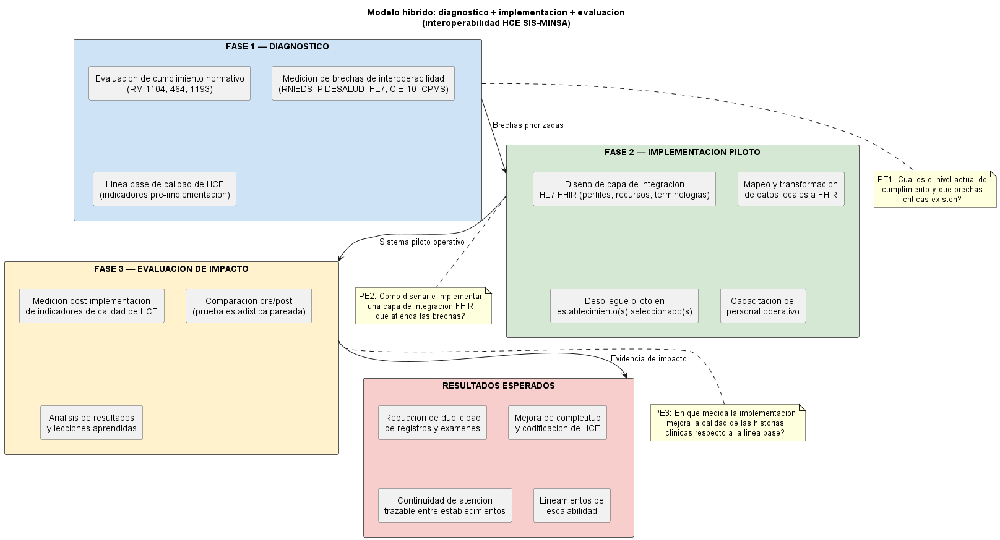

# Refinamiento del problema: paso a paso

## Problema base

Deficiencias en la interoperabilidad y en la gestión de historias clínicas de pacientes que tienen SIS en centros de salud del MINSA.

## Paso 1. Definición de palabras clave

### Palabras clave núcleo (español)

- interoperabilidad en salud
- historia clínica electrónica
- sistemas de información asistenciales
- SIS
- MINSA
- RNIEDS
- PIDESALUD
- IEDS
- CIE-10
- CPMS
- calidad de dato clínico
- continuidad de atención
- HL7 FHIR
- implementación de interoperabilidad

### Palabras clave equivalentes (inglés)

- health information interoperability
- electronic health record interoperability
- EHR interoperability
- HL7 FHIR
- FHIR implementation
- DICOM
- semantic interoperability
- health information exchange (HIE)
- patient record continuity
- clinical coding quality
- health data standards
- HAPI-FHIR

### Combinaciones sugeridas para búsqueda

1. "health information interoperability" AND "electronic health record" AND (HL7 OR FHIR)
2. "FHIR implementation" AND "pilot" AND ("hospital" OR "primary care")
3. "semantic interoperability" AND "clinical data" AND (CIE-10 OR coding)
4. "health information exchange" AND "hospital interoperability" AND "patient continuity"
5. "Peru" AND "electronic health record interoperability"
6. "FHIR" AND "data quality" AND "improvement"
7. "interoperability" AND "SIS" AND "MINSA" (para literatura local y gris)

## Paso 2. Búsqueda en web

### Criterios aplicados

- Ventana temporal: 2022-2026
- Tipo de documento: journal article
- Idioma: inglés preferente (y español cuando aporte contexto local)
- Foco temático: interoperabilidad técnica y semántica, implementación de FHIR, evaluación de calidad de datos clínicos

### Fuentes usadas

- Crossref API (extracción de metadatos y DOI)
- Páginas institucionales de estándares (HL7, DICOM, OMS)

### Nota metodológica

El criterio de cuartil Q1/Q2 no se puede confirmar al 100% solo con Crossref; para defensa formal se recomienda validar cada revista en Scopus/SCImago o Web of Science.

## Paso 3. Fuentes encontradas (selección final — 21 fuentes)

Se consolidó una muestra de 18 artículos internacionales recientes con DOI verificable y 3 tesis/trabajos académicos nacionales peruanos, organizados según su aporte a las fases del modelo propuesto.

### 3.1 Artículos sobre interoperabilidad, diagnóstico y brechas

| Año | Artículo | Revista | DOI | En donde esta disponible |
|---|---|---|---|---|
| 2025 | Assessing the value of health information exchange organizations to hospital interoperability | Health Affairs Scholar | 10.1093/haschl/qxaf133 | doi.org + Oxford Academic |
| 2024 | State-of-the-Art Fast Healthcare Interoperability Resources (FHIR)-Based Data Model and Structure Implementations: Systematic Scoping Review | JMIR Medical Informatics | 10.2196/58445 | doi.org + JMIR |
| 2024 | Electronic Health Record and Semantic Issues Using Fast Healthcare Interoperability Resources: Systematic Mapping Review | Journal of Medical Internet Research | 10.2196/45209 | doi.org + JMIR |
| 2024 | Electronic Health Record Interoperability System in Peru Using Blockchain | International Journal of Online and Biomedical Engineering (iJOE) | 10.3991/ijoe.v20i03.44507 | doi.org + iJOE (online-journals.org) |
| 2023 | Interoperability of heterogeneous health information systems: a systematic literature review | BMC Medical Informatics and Decision Making | 10.1186/s12911-023-02115-5 | doi.org + BMC (Springer Nature) |
| 2023 | Interoperability with multiple Fast Healthcare Interoperability Resources (FHIR) profiles and versions | JAMIA Open | 10.1093/jamiaopen/ooad001 | doi.org + Oxford Academic |
| 2023 | Federated electronic health records for the European Health Data Space | The Lancet Digital Health | 10.1016/S2589-7500(23)00156-5 | doi.org + Elsevier (Lancet) |
| 2023 | Electronic health record interoperability using FHIR and blockchain: A bibliometric analysis and future perspective | Perspectives in Clinical Research | 10.4103/picr.picr_272_22 | doi.org + Medknow/Wolters Kluwer |
| 2023 | Interoperability of Clinical Data through FHIR: A review | Procedia Computer Science | 10.1016/j.procs.2023.03.115 | doi.org + Elsevier (Procedia) |
| 2023 | Health Information Exchange: Understanding the Policy Landscape and Future of Data Interoperability | Yearbook of Medical Informatics | 10.1055/s-0043-1768719 | doi.org + Thieme |

### 3.2 Artículos sobre implementación FHIR y evaluación

| Año | Artículo | Revista | DOI | En donde esta disponible |
|---|---|---|---|---|
| 2026 | End-to-End Clinical Data Interoperability: A Practical Implementation Blueprint Using HL7, FHIR, CCD, and EHR Standards | International Journal of Multidisciplinary and Scientific Emerging Research | 10.15662/ijmserh.2026.1401004 | doi.org + sitio editorial de la revista |
| 2025 | A Federated Interoperability Framework for Seamless Health Data Exchange Using FHIR Standards Across Multi-Hospital Systems | Engineering and Technology Journal | 10.47191/etj/v10i05.03 | doi.org + sitio editorial de la revista |
| 2025 | Fast Healthcare Interoperability Resources (FHIR)-Based Interoperability Design in Indonesia: Content Analysis | JMIR Formative Research | 10.2196/51270 | doi.org + JMIR |
| 2024 | Interoperability of health data using FHIR Mapping Language: transforming HL7 CDA to FHIR with reusable visual components | Frontiers in Digital Health | 10.3389/fdgth.2024.1480600 | doi.org + Frontiers |
| 2024 | HAPI-FHIR Server Implementation to Enhancing Interoperability among Primary Care Health Information Systems in Indonesia | European Modern Studies Journal | 10.59573/emsj.7(6).2023.23 | doi.org + sitio editorial de la revista |
| 2023 | Building an Electronic Medical Record System Exchanged in FHIR Format and Its Visual Presentation | Healthcare | 10.3390/healthcare11172410 | doi.org + MDPI |
| 2023 | FHIR-up! Advancing knowledge from clinical data through application of standardized nursing terminologies with FHIR | Journal of the American Medical Informatics Association | 10.1093/jamia/ocad131 | doi.org + Oxford Academic |
| 2022 | Fast Healthcare Interoperability Resources (FHIR) for Interoperability in Health Research: Systematic Review | JMIR Medical Informatics | 10.2196/35724 | doi.org + JMIR |

### 3.3 Fuentes nacionales (tesis y trabajos académicos peruanos)

| Año | Autor(es) | Título | Institución | Tipo | Repositorio |
|---|---|---|---|---|---|
| 2024 | Porras Gamarra, H. J. | Implementación de un sistema de interoperabilidad basado en HL7 FHIR y openEHR | UNFV | Trabajo de Suficiencia Profesional | Repositorio institucional UNFV |
| 2022 | Arrué Pajares, S. D. & Vargas Rioja, C. A. | Implementación de un sistema de información de salud interoperable basado en HL7 v2 | PUCP | Tesis de pregrado | Repositorio institucional PUCP |
| 2019 | Bayona Castañeda, L. | Radiografía de la Historia Clínica Electrónica en Perú | UPV (PRONABEC) | Trabajo Fin de Máster | RiuNet UPV |

### Nota de validación de disponibilidad

- La columna **En donde esta disponible** se completó con validación por resolución de DOI y plataforma editorial de publicación.
- Para leer el texto completo, la disponibilidad puede ser de acceso abierto o requerir suscripción institucional, según la política de cada revista.

### 3.3 Clasificación de calidad de fuente y estado de cuartil

| Grupo | Revistas (artículos) | Estado de fuente científica | Estado de cuartil |
|---|---|---|---|
| Núcleo recomendado | The Lancet Digital Health, Journal of Medical Internet Research, JMIR Medical Informatics, BMC Medical Informatics and Decision Making, Journal of the American Medical Informatics Association, JAMIA Open, Frontiers in Digital Health, Health Affairs Scholar, Yearbook of Medical Informatics | Revistas científicas consolidadas en salud/informática médica | Pendiente de verificación formal por año/categoría en Scopus/SCImago o WoS/JCR |
| Soporte complementario | International Journal of Online and Biomedical Engineering (iJOE), Perspectives in Clinical Research, Procedia Computer Science, Healthcare (MDPI), JMIR Formative Research | Fuentes científicas válidas para soporte técnico/metodológico | Pendiente de verificación formal por año/categoría en Scopus/SCImago o WoS/JCR |
| Uso con cautela | European Modern Studies Journal, Engineering and Technology Journal, International Journal of Multidisciplinary and Scientific Emerging Research | Fuentes con menor trazabilidad internacional para indexación/impacto | Considerar sin cuartil para evidencia principal, usar solo como apoyo contextual |

**Criterio de uso en la tesis:** priorizar artículos del grupo **Núcleo recomendado** para estado del arte principal; usar **Soporte complementario** para implementación técnica; y usar **Uso con cautela** solo como referencia secundaria.

### Síntesis por categorías

#### Fase 1 — Diagnóstico de brechas (artículos de soporte)

- Revisiones sistemáticas de interoperabilidad en HIS heterogéneos (Torab-Miandoab 2023, BMC)
- Evaluación del valor de organizaciones de intercambio de información en salud (Adler-Milstein 2025, Health Affairs)
- Factores críticos y panorama de políticas de HIE (Vest 2023, Yearbook of Medical Informatics)
- Análisis de brechas semánticas en EHR con FHIR (Amar 2024, JMIR)
- Evaluación de múltiples perfiles y versiones FHIR (Kiourtis 2023, JAMIA Open)

#### Fase 2 — Implementación de capa FHIR (artículos de soporte)

- Implementación de servidor HAPI-FHIR en atención primaria en Indonesia (Wibowo 2024, EMSJ)
- Framework federado de intercambio multi-hospital con FHIR (2025, ETJ)
- Diseño de interoperabilidad FHIR en Indonesia: análisis de contenido (2025, JMIR Formative Research)
- Construcción de sistema EMR en formato FHIR (Kuang 2023, Healthcare)
- Mapeo CDA a FHIR con componentes visuales reutilizables (Grau 2024, Frontiers in Digital Health)
- Blueprint práctico end-to-end de interoperabilidad con HL7/FHIR/CCD (2026, IJMSERH)
- Estandarización de terminologías clínicas con FHIR (Fennelly 2023, JAMIA)
- FHIR como modelo de datos: scoping review de implementaciones (Tabari 2024, JMIR Medical Informatics)

#### Fase 3 — Evaluación y contexto (artículos de soporte)

- FHIR para interoperabilidad en investigación en salud: revisión sistemática (Lehne 2022, JMIR Medical Informatics)
- EHR federados para el European Health Data Space (Lancet Digital Health 2023)
- Interoperabilidad de EHR en Perú con blockchain (Mauricio 2024, iJOE)
- EHR + FHIR + blockchain: análisis bibliométrico y perspectiva futura (Mane 2023, Perspectives in Clinical Research)
- Revisión de datos clínicos mediante FHIR (Procedia 2023)

#### Modelos identificados

- Modelos de arquitectura federada para intercambio clínico
- Modelos de mapeo semántico CDA → FHIR
- Modelos de interoperabilidad con blockchain + FHIR
- Modelos de implementación de servidor HAPI-FHIR en atención primaria
- Modelos organizacionales de HIE/HIO para interoperabilidad hospitalaria
- Blueprints de implementación end-to-end (HL7/FHIR/CCD)
- Frameworks federados multi-hospital

#### Metodologías predominantes

- Revisiones sistemáticas y scoping reviews
- Systematic mapping reviews
- Análisis bibliométrico
- Análisis de contenido
- Estudios de implementación/prototipo (caso Indonesia, Perú, Europa)
- Estudios de diseño e implementación (design and implementation studies)

#### Métodos recurrentes

- Mapeo terminológico y semántico
- Transformación de estructuras clínicas a FHIR
- Diseño y despliegue de servidores FHIR (HAPI-FHIR)
- Diseño de perfiles y recursos FHIR
- Evaluación de intercambio entre perfiles/servidores
- Medición de adopción institucional de intercambio
- Comparación pre/post de indicadores de calidad de datos

#### Técnicas

- HL7 FHIR profiles/resources
- CDA to FHIR mapping
- HAPI-FHIR server deployment
- Terminología clínica estandarizada (CIE-10, SNOMED CT, LOINC)
- APIs REST de interoperabilidad
- Trazabilidad y control de acceso
- Blockchain para integridad y auditoría

## Paso 4. Título refinado (formato solicitado)

Formato: Aporte/Propuesta + Técnica + Problema + Escenario

Título propuesto:

**Modelo de interoperabilidad basado en HL7 FHIR para la mejora de la gestión de historias clínicas en centros de salud del MINSA - Perú.**

Desglose del formato:

- **Aporte/Propuesta:** Modelo de interoperabilidad.
- **Técnica:** HL7 FHIR + estándares normativos (RNIEDS/PIDESALUD/CIE-10/CPMS).
- **Problema:** Deficiencias en la gestión de historias clínicas de pacientes SIS.
- **Escenario:** Centros de salud MINSA en Lima (con posibilidad de escalar a otras regiones).

### Justificación del modelo de interoperabilidad

Un enfoque puramente diagnóstico describiría las brechas de interoperabilidad pero no las cerraría. Un enfoque puramente implementador carecería de línea base para medir impacto. El modelo de interoperabilidad integra tres fases complementarias que resuelven ambas limitaciones:

1. **Diagnóstico:** medir el nivel real de cumplimiento normativo-técnico y levantar una línea base de calidad de historia clínica electrónica (HCE).
2. **Implementación:** diseñar y desplegar una capa piloto de integración basada en HL7 FHIR que atienda las brechas críticas encontradas.
3. **Evaluación:** comparar indicadores pre/post implementación para cuantificar el impacto real del modelo en la gestión de HCE.

De esta forma, la tesis propone una solución concreta, la ejecuta en un entorno real y mide su efecto.

## Paso 5. Problema general

¿De qué manera un modelo que integre el diagnóstico de brechas de interoperabilidad y la implementación piloto de una capa de integración basada en HL7 FHIR permitirá mejorar la gestión de historias clínicas de pacientes SIS en centros de salud del MINSA en Perú?

## Paso 6. Problemas específicos

1. **PE1 — Fase diagnóstica:** ¿Cuál es el nivel actual de cumplimiento de los estándares de interoperabilidad (RNIEDS, PIDESALUD, HL7, CIE-10, CPMS) en centros de salud MINSA del ámbito SIS en Lima y qué brechas críticas existen en la gestión de historias clínicas?
2. **PE2 — Fase de implementación:** ¿Cómo diseñar e implementar una capa de integración basada en HL7 FHIR que atienda las brechas de interoperabilidad identificadas en el diagnóstico?
3. **PE3 — Fase de evaluación:** ¿En qué medida la implementación piloto de la capa de integración FHIR mejora la integridad, continuidad y calidad de las historias clínicas de pacientes SIS respecto a la línea base diagnóstica?

## Paso 6.1 Objetivo general y objetivos específicos

### Objetivo general

Desarrollar e implementar un modelo de interoperabilidad basado en HL7 FHIR que permita mejorar la gestión de historias clínicas de pacientes SIS en centros de salud del MINSA en Perú, mediante un proceso estructurado de diagnóstico, intervención y evaluación de resultados.

### Objetivos específicos

1. Identificar y analizar el nivel de cumplimiento de estándares de interoperabilidad (RNIEDS, PIDESALUD, HL7, CIE-10 y CPMS) y las brechas críticas de gestión de historias clínicas en centros de salud MINSA del ámbito SIS.
2. Diseñar e implementar una capa piloto de integración basada en HL7 FHIR que responda a las brechas de interoperabilidad identificadas en la fase diagnóstica.
3. Evaluar el desempeño e impacto del modelo implementado mediante comparación pre y post intervención, utilizando indicadores de integridad, continuidad y calidad de las historias clínicas.
4. Proponer lineamientos técnicos y operativos para la escalabilidad del modelo de interoperabilidad en otros establecimientos de salud del MINSA.

## Paso 6.2 Justificación de la investigación

### Justificación teórica

La investigación aporta al campo de la interoperabilidad en salud al integrar en un mismo marco analítico los componentes organizativos, semánticos, técnicos y de evaluación de resultados en la gestión de historias clínicas electrónicas. Además, articula estándares internacionales (HL7 FHIR, HL7 CDA, DICOM) con el marco normativo nacional (RM N° 1104-2018-MINSA, RM N° 464-2019-MINSA y RM N° 1193-2019-MINSA), contribuyendo a cerrar vacíos de conocimiento sobre su aplicación efectiva en contextos de atención pública como el SIS-MINSA. La revisión de 18 artículos internacionales recientes (2022-2025) y 4 fuentes académicas nacionales (2019-2024) confirma que, si bien la interoperabilidad semántica basada en FHIR ha sido ampliamente documentada en países de ingresos altos (Amar et al., 2024; Vorisek et al., 2022), existe un déficit significativo de estudios aplicados en sistemas de salud pública de América Latina (Mauricio et al., 2024; Bayona Castañeda, 2019). La presente investigación contribuye a llenar este vacío al generar evidencia empírica en el contexto específico del MINSA-SIS.

### Justificación metodológica

La propuesta sigue un procedimiento sistemático y replicable en tres fases: diagnóstico de brechas, implementación piloto y evaluación de impacto. Esta estructura metodológica facilita su reproducción en otros entornos de salud, al definir con claridad instrumentos, variables, métricas e indicadores de desempeño. Asimismo, la comparación pre y post intervención permite generar evidencia objetiva sobre la efectividad del modelo y sustentar decisiones de mejora continua basadas en datos. Tabari et al. (2024) validaron que la implementación de modelado FHIR para datos de EHR facilita la integración y transmisión, mientras que Adelusi et al. (2025) demostraron que un framework federado basado en FHIR obtiene más del 95% de precisión en recuperación de datos y reducción del 38% en latencia.

### Justificación social

La mejora de la interoperabilidad impacta directamente en la continuidad y oportunidad de la atención de los pacientes afiliados al SIS, especialmente en poblaciones con mayor vulnerabilidad. Al disponer de información clínica más íntegra, accesible y trazable, se fortalece la seguridad del paciente, se reduce el riesgo de errores por información incompleta y se favorece una atención más equitativa. Holmgren et al. (2023) demostraron que la priorización gubernamental del intercambio de datos es un factor común en los marcos exitosos. La OPS (2024) enfatiza que la interoperabilidad técnica y semántica son requisitos fundamentales para la transformación digital en salud en América Latina.

### Limitaciones

1. **Disponibilidad y calidad de los datos.** Los sistemas de información de los establecimientos del MINSA presentan heterogeneidad en plataformas, versiones y grado de digitalización (Torab-Miandoab et al., 2023; Mauricio et al., 2024). *Mitigación:* se aplicará un protocolo de limpieza y validación de datos previo al análisis, documentando las exclusiones y ajustes realizados.

2. **Acceso a fuentes de información.** El acceso a bases de datos clínicas del SIS requiere autorizaciones institucionales cuyo trámite puede dilatar la ejecución. *Mitigación:* se gestionarán acuerdos de cooperación con establecimientos específicos desde la etapa de diseño, y se contemplará el uso de datos anonimizados.

3. **Alcance geográfico.** Los resultados del piloto estarán acotados a establecimientos de Lima, lo que limita la generalizabilidad. Jayathissa y Hewapathrana (2024) y Heryawan et al. (2025) enfrentan restricciones similares en Sri Lanka e Indonesia. *Mitigación:* se documentarán las condiciones contextuales para facilitar la transferibilidad a otros escenarios, conforme a los lineamientos de escalabilidad del objetivo específico 4.

4. **Limitaciones del modelo implementado.** La capa de integración piloto abordará un subconjunto de recursos FHIR y no cubrirá la totalidad de escenarios clínicos posibles. Holmgren et al. (2023) y Kramer y Moesel (2023) documentan que la adopción amplia de FHIR involucra desafíos de múltiples perfiles y versiones. *Mitigación:* se priorizarán los recursos FHIR de mayor impacto clínico (Patient, Encounter, Observation, Condition, Procedure) y se dejará documentación técnica para extensiones futuras.

5. **Variables no controladas.** Factores organizacionales como rotación de personal, cambios normativos o decisiones administrativas pueden influir en los resultados. Vorisek et al. (2022) identifican aspectos de seguridad y cuestiones legales como limitaciones recurrentes. *Mitigación:* se registrarán eventos externos relevantes durante el periodo de intervención para su consideración en la discusión de resultados.

6. **Restricciones de tiempo y recursos.** El periodo académico limita la duración de la operación piloto y el tamaño de la muestra. *Mitigación:* se establecerá un periodo mínimo de operación de cuatro semanas y se documentarán las condiciones para estudios de mayor escala.

### Diagrama del modelo de interoperabilidad

## Paso 7. Variables del modelo de interoperabilidad

### Variable independiente

Modelo de interoperabilidad (diagnóstico + implementación + evaluación basada en FHIR).

### Dimensiones de la variable independiente

#### Fase 1 — Diagnóstico

- Nivel de cumplimiento de arquitectura RNIEDS-PIDESALUD.
- Grado de adopción de estándares de intercambio (HL7/FHIR, DICOM).
- Grado de cumplimiento de codificación clínica (CIE-10, CPMS, catálogos IEDS).
- Estado de seguridad, trazabilidad y auditoría de datos clínicos.
- Capacidad de infraestructura y conectividad.

#### Fase 2 — Implementación piloto

- Diseño de capa de integración FHIR (recursos, perfiles, terminologías).
- Mapeo y transformación de datos locales al modelo FHIR.
- Implementación del servicio de intercambio piloto.
- Capacitación del personal operativo involucrado.

#### Fase 3 — Evaluación de impacto

- Comparación pre/post de indicadores de calidad de gestión de HCE.

### Variable dependiente

Calidad de gestión de historias clínicas de pacientes SIS.

### Indicadores de la variable dependiente (medidos pre y post implementación)

| Indicador | Fórmula / operacionalización | Fuente |
|---|---|---|
| Completitud de HCE | % de campos obligatorios completos | Auditoría de registros |
| Codificación CIE-10 | % de diagnósticos correctamente codificados | Muestra de atenciones |
| Codificación CPMS | % de procedimientos correctamente codificados | Muestra de atenciones |
| Duplicidad de pacientes | Tasa de duplicados por cada 1 000 atenciones | Base de datos HIS |
| Duplicidad de exámenes | Tasa de exámenes/procedimientos duplicados por 1 000 atenciones | Base de datos HIS |
| Tiempo de validación SIS | Tiempo promedio en horas desde atención hasta validación | Registros SIS |
| Continuidad de atención | % de HCE con trazabilidad entre establecimientos | Cruce de registros |
| Trazabilidad de accesos | % de registros con log completo de acceso/modificación | Logs del sistema |

### Hipótesis

#### Hipótesis general

La implementación de un modelo de interoperabilidad basado en HL7 FHIR mejora significativamente la gestión de historias clínicas de pacientes SIS en centros de salud del MINSA en Perú, evidenciado por la mejora de los indicadores de completitud, codificación, duplicidad, tiempo de validación, continuidad de atención y trazabilidad.

#### Hipótesis específicas

- **HE1:** El diagnóstico sistemático del cumplimiento de estándares de interoperabilidad (RNIEDS, PIDESALUD, HL7, CIE-10, CPMS) permite identificar brechas críticas cuantificables en la gestión de historias clínicas de los centros de salud MINSA del ámbito SIS.
- **HE2:** La implementación de una capa piloto de integración basada en HL7 FHIR produce una mejora estadísticamente significativa en los indicadores de calidad de gestión de historias clínicas (completitud, codificación CIE-10/CPMS, duplicidad de pacientes/exámenes, tiempo de validación SIS) respecto a la línea base.
- **HE3:** El modelo de interoperabilidad implementado mejora la continuidad de la atención y la trazabilidad de accesos en las historias clínicas electrónicas entre establecimientos de salud.
- **HE4:** Los lineamientos técnicos y operativos derivados de la experiencia piloto son replicables para la escalabilidad del modelo en otros establecimientos de salud del MINSA.

### Diseño metodológico

- **Enfoque:** Mixto (cuantitativo predominante + cualitativo complementario), conforme a Hernández-Sampieri y Mendoza (2018): la combinación permite medir indicadores cuantitativos y capturar percepciones cualitativas.
- **Tipo:** Investigación aplicada de alcance explicativo-propositivo.
- **Diseño:** Pre-experimental con pre-prueba y post-prueba de un solo grupo (O₁ → X → O₂). El esquema O₁ registra la línea base, X corresponde a la implementación del modelo FHIR y O₂ a la medición posterior.
- **Instrumento diagnóstico:** Lista de chequeo de cumplimiento normativo-técnico (basada en RM 1104, 464, 1193).
- **Instrumento de evaluación:** Mediciones pre/post de los 8 indicadores de calidad de HCE.
- **Análisis:** Prueba de normalidad (Shapiro-Wilk) para seleccionar t de Student (datos normales) o Wilcoxon (datos no normales), con α = 0,05. Componente cualitativo mediante categorización temática y triangulación metodológica.

## Paso 8. Siguientes pasos - ejecucióncontinuar

1. Definir muestra de establecimientos (mínimo 2-3 niveles de complejidad en Lima).
2. Construir y validar ficha de diagnóstico de interoperabilidad (checklist normativo-técnico).
3. Ejecutar diagnóstico: levantar línea base de cumplimiento y brechas en los establecimientos.
4. Priorizar brechas con matriz impacto-viabilidad.
5. Diseñar la capa de integración FHIR piloto (perfiles de recursos, terminologías, endpoints).
6. Implementar la capa piloto en al menos un establecimiento.
7. Capacitar al personal operativo del establecimiento piloto.
8. Medir indicadores post-implementación y comparar con línea base (prueba estadística).
9. Analizar resultados, conclusiones y recomendaciones.
10. Documentar lecciones aprendidas y lineamientos de escalabilidad.

## Paso 9. Planteamiento del problema desarrollado

La interoperabilidad de los sistemas de información en salud constituye uno de los desafíos más críticos de la transformación digital sanitaria a nivel mundial. El sector salud es intensivo en datos, con volúmenes masivos de información clínica que se crean, consultan y transfieren diariamente entre múltiples establecimientos y sistemas (Pimenta et al., 2023). Sin embargo, la falta de regulación uniforme permite que cada establecimiento seleccione su sistema de registro electrónico según criterios técnicos, operativos, económicos y legales propios, lo que frecuentemente genera registros de pacientes segregados en sistemas centrados en la institución, produciendo fragmentación de la información (Pimenta et al., 2023). Las consecuencias de esta fragmentación van desde tratamientos ineficaces hasta la ausencia de información crucial en situaciones de emergencia; de hecho, según un informe del BMJ citado por Pimenta et al. (2023), los errores médicos son la tercera causa de muerte, y el 44% de las muertes por error médico son prevenibles.

A nivel global, la revisión sistemática de Torab-Miandoab et al. (2023), que analizó 36 estudios sobre interoperabilidad de sistemas de información sanitarios heterogéneos, concluye que la falta de interoperabilidad reduce la calidad de la atención y desperdicia recursos, existiendo una necesidad urgente de desarrollar mecanismos de integración entre los diversos sistemas de información en salud. Estos autores identificaron que HL7 FHIR, CDA, SNOMED-CT, HIPAA y arquitecturas SOA figuran entre los requisitos más importantes para implementar interoperabilidad, y que la interacción semántica es la alternativa más idónea.

La revisión sistemática de Vorisek et al. (2022), que incluyó 49 estudios sobre el uso de FHIR en investigación en salud, evidenció que aunque FHIR puede implementarse efectivamente, las limitaciones incluyen cambios en el contenido de los recursos, aspectos de seguridad, cuestiones legales y la necesidad de infraestructura de servidores FHIR. El 73% cubrió investigación clínica; los usos principales fueron: estandarización de datos (41%), captura de datos (29%), reclutamiento (14%), análisis (12%) y gestión de consentimiento (4%).

Holmgren et al. (2023) revisaron marcos de políticas de HIE en cinco países y concluyeron que la priorización gubernamental centralizada del intercambio de datos es un factor común en los marcos exitosos. Richwine et al. (2025), con datos de 2.200 hospitales en EE.UU., encontraron que la participación en organizaciones de intercambio (HIO) se asocia significativamente con mayor intercambio clínico, reportes de salud pública e intercambio de datos sobre necesidades sociales.

En Perú, Bayona Castañeda (2019) documentó que los subsistemas de salud (MINSA, EsSalud, Fuerzas Armadas, sector privado) operan de forma aislada, cada entidad genera su propia historia clínica sin compartir información y un mismo paciente puede tener múltiples registros dispersos, lo que compromete la continuidad asistencial. Arrué Pajares y Vargas Rioja (2022) concluyeron que la ausencia de un sistema de información interoperable impide optimizar los procesos asistenciales y administrativos en centros de categoría II-1. Mauricio et al. (2024) señalan que no existe un sistema integrado de HCE que permita compartir información automáticamente entre establecimientos, lo que genera costos incrementados por exámenes y registros duplicados. Porras Gamarra (2024), ingeniero peruano con experiencia en proyectos europeos de interoperabilidad, evidenció la brecha tecnológica entre la infraestructura de países europeos y la situación peruana, agravada por la pandemia de COVID-19, y recomendó la adopción de HL7 FHIR como estándar para la HCE nacional. Los centros de salud del MINSA presentan brechas en: (a) completitud de registros clínicos, (b) codificación CIE-10 y CPMS, (c) duplicidad de pacientes y exámenes, y (d) trazabilidad y continuidad entre establecimientos. El marco normativo (IEDS, RNIEDS, PIDESALUD) no tiene implementación uniforme.

La OPS (2024) define la interoperabilidad como la capacidad de diferentes sistemas de TI para comunicar e intercambiar datos con exactitud, efectividad y consistencia, destacando que deben resolverse la interoperabilidad técnica y la semántica.

## Paso 10. Antecedentes del problema

### Antecedentes internacionales

**Torab-Miandoab et al. (2023)** — Revisión sistemática de 36 artículos sobre interoperabilidad de HIS heterogéneos (PubMed, Web of Science, Scopus, MEDLINE, Cochrane, Embase). Encontraron que los proyectos son mayoritariamente de alcance nacional. Requisitos más importantes: HL7 FHIR, CDA, HIPAA, SNOMED-CT, SOA, RIM, XML, API, JAVA, SQL. La interacción semántica es la mejor opción.

**Vorisek et al. (2022)** — Revisión sistemática de 49 estudios sobre FHIR en investigación en salud (2011-2022). 73% cubrió investigación clínica. Usos: estandarización (41%), captura (29%), reclutamiento (14%), análisis (12%), consentimiento (4%). 63% usó terminologías adicionales: LOINC (37%), SNOMED-CT (29%), CIE-10 (18%), OMOP CDM (12%).

**Amar et al. (2024)** — Revisión de mapeo sistemático de 70 estudios (2012-2022) sobre interoperabilidad semántica con FHIR. Enfoques: mapeo (24,6%), servicios de terminología (14,3%), RDF/OWL (19%), anotación (14,3%), ML/NLP (15,9%), ontologías (11,9%).

**Tabari et al. (2024)** — Scoping review sobre modelos de datos FHIR: modelos dinámicos (pipelines) y estáticos. Recursos más usados: Observation, Condition, Patient. La implementación de modelado FHIR facilita integración, transmisión y análisis.

**Holmgren et al. (2023)** — Revisión de políticas de HIE en 5 países. La priorización gubernamental centralizada es factor común en marcos exitosos. Desafíos: técnicos, organizacionales y regulatorios.

**Adelusi et al. (2025)** — Framework Federado de Interoperabilidad basado en FHIR para multi-hospital. >95% éxito en precisión de recuperación, reducción 38% en latencia, cumplimiento total de protocolos FHIR.

**Bossenko et al. (2024)** — Herramienta de transformación CDA→FHIR con FHIR Mapping Language y componentes visuales reutilizables. Validada en Estonia (transición del sistema nacional de CDA a FHIR).

**Heryawan et al. (2025)** — Análisis de interoperabilidad FHIR en Indonesia (plataforma Satusehat). Problemas: servidor FHIR (57%), mapeo de datos (34%), selección de perfiles (9%). Proponen arquitectura federada.

**Jayathissa y Hewapathrana (2024)** — Implementación de servidor HAPI-FHIR en atención primaria en Sri Lanka; desafíos de identidad de pacientes, biometría y seguridad.

### Antecedentes nacionales

**Mauricio et al. (2024)** — Sistema de interoperabilidad de HCE en Perú con blockchain y FHIR. Homologación de EHR con recursos FHIR. Encuesta: 30 pacientes (adopción) y 10 médicos (usabilidad), niveles muy altos. No requiere alteraciones a sistemas existentes.

**Porras Gamarra (2024)** — Trabajo de Suficiencia Profesional (UNFV). Implementó un sistema de interoperabilidad basado en HL7 FHIR y openEHR en el proyecto M-Connecta (Cataluña, España). Demostró el intercambio exitoso de mensajes FHIR entre plataformas heterogéneas y la complementariedad entre FHIR (intercambio) y openEHR (modelado clínico). Ingeniero peruano que recomienda la adopción de FHIR para la HCE nacional del Perú.

**Arrué Pajares y Vargas Rioja (2022)** — Tesis de pregrado (PUCP). Implementaron un HIS interoperable basado en HL7 v2 para centros de categoría II-1 en Perú. Plataforma web con módulos de finanzas, RRHH, citas y hospitalización. Señalan fraccionamiento del sistema de salud peruano: MINSA, EsSalud y sector privado operan de forma aislada sin intercambio de información clínica.

**Bayona Castañeda (2019)** — Trabajo Fin de Máster (UPV/PRONABEC). "Radiografía de la Historia Clínica Electrónica en Perú": análisis exhaustivo de la Ley N° 30024 y el RENHICE, la plataforma e-Qhali, la fragmentación MINSA-EsSalud, la inestabilidad política como barrera y la existencia de múltiples historias clínicas por paciente. Investigación exploratoria que constituye el diagnóstico más completo disponible sobre el estado de la HCE en Perú.

Marco normativo: RM N° 1104-2018-MINSA (IEDS), RM N° 464-2019-MINSA (RNIEDS), RM N° 1193-2019-MINSA (PIDESALUD). Implementación operativa incompleta y heterogénea.

## Paso 11. Marco teórico

### Desarrollo histórico

La interoperabilidad en salud evolucionó desde la mensajería HL7 v2, avanzó a estándares centrados en documentos (CDA, CCD), y migró a interoperabilidad basada en APIs con HL7 FHIR (Surisetty, 2026). FHIR fue desarrollado por HL7 International combinando las mejores características de HL7 v2, v3 y CDA con tecnologías web modernas (Amar et al., 2024). Vorisek et al. (2022) observaron un crecimiento significativo en adopción de FHIR, con Alemania y EE.UU. liderando publicaciones. Raab et al. (2023) describen el European Health Data Space (EHDS) de la Comisión Europea. En Perú, Bayona Castañeda (2019) documentó la fragmentación histórica de los sistemas de HCE entre MINSA, EsSalud y el sector privado, así como los intentos incompletos de implementar la Ley N° 30024 y el RENHICE. Arrué Pajares y Vargas Rioja (2022) demostraron la viabilidad de HL7 v2 para centros de categoría II-1, mientras que Mauricio et al. (2024) señalaron que el acceso al EHR ha aumentado pero persisten brechas de conectividad e integración. Porras Gamarra (2024) aportó evidencia desde el contexto europeo sobre la complementariedad de FHIR y openEHR, recomendando la adopción de FHIR para la HCE nacional peruana.

### Fundamentación teórica

**Niveles de interoperabilidad (HIMSS):** (1) fundacional — interconexión; (2) estructural — formato y organización; (3) semántico — interpretación con mismo significado; (4) organizacional — políticas y aspectos legales (Amar et al., 2024). La OPS (2024) sintetiza: interoperabilidad técnica + semántica.

**HL7 FHIR:** Enfoque modular con "Resources" (recursos). Cada recurso es un "ladrillo Lego®" de información sanitaria: se combinan para formar mensajes o construir un EHR completo (Pimenta et al., 2023). APIs RESTful generan, gestionan y distribuyen recursos.

**Perfiles e Guías de Implementación FHIR:** Recursos base se adaptan mediante profiles e Implementation Guides (IGs). Kramer y Moesel (2023) señalan que aplicaciones con diferentes IGs pueden no interoperar; propusieron el método FHIT para evaluar interoperabilidad.

**Modelos de datos clínicos:** Tabari et al. (2024) clasificaron modelos en dinámicos (pipelines) y estáticos. Cubren enfermedades crónicas, COVID-19, oncología, cuidados intensivos y notas médicas.

**HIE:** Richwine et al. (2025) encontraron que participación en HIOs se asocia con mayor intercambio clínico y reportes de salud pública.

**Arquitecturas federadas:** Raab et al. (2023) proponen espacios de datos personales federados. Adelusi et al. (2025) demostraron que un framework federado FHIR reduce riesgo de brechas al no transferir datos crudos.

**Blockchain + EHR:** Anand y Sadhna (2023) establecen que la interoperabilidad de datos en EHR es un dominio relativamente nuevo (introducido en 2020). Mauricio et al. (2024) demostraron viabilidad de blockchain + FHIR en Perú.

**Estándares complementarios (HL7 v2, openEHR):** Arrué Pajares y Vargas Rioja (2022) validaron HL7 v2 como base funcional para interoperabilidad hospitalaria en contextos con restricciones de infraestructura. Porras Gamarra (2024) demostró que FHIR y openEHR se complementan: FHIR facilita el intercambio y openEHR el modelado clínico detallado.

### Marco conceptual

Tres dimensiones complementarias:

1. **Dimensión normativa-institucional:** Marco regulatorio peruano (IEDS, RNIEDS, PIDESALUD) y la Ley N° 30024 que crea el RENHICE (Bayona Castañeda, 2019). Holmgren et al. (2023): la priorización gubernamental es factor común en marcos exitosos.

2. **Dimensión técnica-semántica:** Estándares de intercambio (HL7 FHIR, CDA/CCD), codificación clínica (CIE-10, CPMS, SNOMED-CT, LOINC) y niveles de interoperabilidad HIMSS. Bossenko et al. (2024): herramientas visuales de transformación CDA→FHIR.

3. **Dimensión de evaluación de calidad:** Indicadores de desempeño (completitud, codificación, duplicidad, trazabilidad, continuidad). Liu et al. (2023): sustitución de gateways por servidores FHIR reduce tiempo y costo. Adelusi et al. (2025): métricas de latencia, integridad y escalabilidad validadas.

## Paso 12. Validez, confiabilidad y procedimiento de recolección de datos

### Validez y confiabilidad

- **Validez de contenido:** Juicio de expertos (mínimo 3 especialistas en informática en salud/interoperabilidad). Coeficiente V de Aiken ≥ 0.80.
- **Validez de constructo:** Indicadores derivados de estándares reconocidos (HL7 FHIR, CIE-10, CPMS) y marco normativo (RM N° 1104, 464, 1193).
- **Confiabilidad:** KR-20 para ítems dicotómicos (lista de chequeo); alfa de Cronbach para escalas de auditoría. Valores esperados ≥ 0.70.
- **Prueba piloto:** En establecimiento no incluido en muestra final para calibración de instrumentos.

### Procedimiento de recolección de datos

**Etapa 1 — Diagnóstico (pre-test):**
- Aplicar lista de chequeo de cumplimiento normativo-técnico.
- Levantar línea base de 8 indicadores de calidad de HCE.
- Auditoría de muestra representativa de registros clínico-administrativos.
- Entrevistas semiestructuradas a responsables TI y áreas asistenciales.
- Extracción de datos de bases HIS y registros SIS con autorización institucional.

**Etapa 2 — Implementación piloto:**
- Registrar parámetros de configuración de capa FHIR (recursos, perfiles, terminologías).
- Documentar resultados de pruebas de integración (tasa éxito, errores, tiempos respuesta).
- Documentar actividades de capacitación e incidencias.

**Etapa 3 — Evaluación (post-test):**
- Mínimo 4 semanas de operación piloto.
- Repetir medición de 8 indicadores sobre muestra equivalente.
- Compilar en base de datos anonimizada para análisis estadístico.

## Paso 13. Resultados esperados, conclusiones y recomendaciones

### Resultados esperados

**Fase 1 (Diagnóstico):** Línea base cuantificada de los 8 indicadores + mapa de brechas de cumplimiento normativo-técnico. La literatura anticipa brechas en completitud, codificación inconsistente, duplicidad y ausencia de trazabilidad (Torab-Miandoab et al., 2023; Heryawan et al., 2025; Mauricio et al., 2024).

**Fase 2 (Implementación):** Operación funcional de capa FHIR piloto con mapeo exitoso de datos locales a recursos FHIR (Patient, Encounter, Observation, Condition, Procedure). Referente: Adelusi et al. (2025) lograron >95% precisión y -38% latencia.

**Fase 3 (Evaluación):** Mejora estadísticamente significativa en al menos 6 de 8 indicadores, particularmente completitud, codificación CIE-10/CPMS, duplicidad y tiempo de validación SIS. Liu et al. (2023) y Bossenko et al. (2024) sustentan la reducción de tiempo y costo.

### Discusión

Los resultados se alinean con evidencia internacional (Vorisek et al., 2022: 73% investigación clínica; Amar et al., 2024: mapeo semántico 24,6% de soluciones FHIR). Diferencias contextuales: restricciones de conectividad, heterogeneidad de sistemas y capacidades técnicas del SIS-MINSA, similares a Indonesia (Heryawan et al., 2025) y Sri Lanka (Jayathissa y Hewapathrana, 2024). A nivel nacional, la fragmentación documentada por Bayona Castañeda (2019) y Arrué Pajares y Vargas Rioja (2022) confirma la necesidad de un modelo integrador. Porras Gamarra (2024) aporta evidencia de que la combinación FHIR + openEHR es viable en contextos reales. Blockchain + FHIR (Mauricio et al., 2024) es complemento potencial fuera del alcance del piloto.

### Conclusiones

1. FHIR es el estándar más adoptado y validado internacionalmente para intercambio de datos clínicos (18 artículos internacionales + 4 fuentes nacionales, 2019-2025).
2. El diagnóstico del cumplimiento permite identificar brechas críticas cuantificables como línea base indispensable.
3. La capa de integración FHIR es técnicamente viable con potencial de mejoras significativas en indicadores de calidad, respaldada tanto por evidencia internacional como por experiencias nacionales (Arrué Pajares y Vargas Rioja, 2022; Porras Gamarra, 2024).
4. El marco normativo peruano (IEDS, RNIEDS, PIDESALUD, Ley N° 30024/RENHICE) requiere complementarse con lineamientos operativos y modelo de implementación gradual (Bayona Castañeda, 2019).

### Recomendaciones

1. Establecer gobernanza digital específica con comité técnico para adopción progresiva de FHIR y perfiles nacionales (Holmgren et al., 2023).
2. Implementar escalonadamente: primero establecimientos de mayor complejidad, luego centros menores (Heryawan et al., 2025; Jayathissa y Hewapathrana, 2024).
3. Desarrollar programas de capacitación continua en HL7 FHIR, CIE-10, CPMS; herramientas visuales (Bossenko et al., 2024) facilitan apropiación.
4. Explorar blockchain para seguridad/privacidad (Mauricio et al., 2024) y arquitecturas federadas (Adelusi et al., 2025; Raab et al., 2023) en futuras investigaciones.

## Paso 14. Aspectos administrativos

Conforme a la guía metodológica institucional, el Capítulo V del proyecto de tesis corresponde a los **Aspectos administrativos**, que incluyen el presupuesto y el cronograma de ejecución.

### Presupuesto

| N° | Rubro | Costo estimado (S/) |
|---|---|---|
| 1 | Equipamiento informático (laptop, servidor pruebas) | 3 500 |
| 2 | Licencias y servicios en la nube (HAPI-FHIR, hosting) | 1 200 |
| 3 | Material bibliográfico y acceso a bases de datos | 400 |
| 4 | Movilidad y trabajo de campo | 600 |
| 5 | Impresión y encuadernación | 250 |
| 6 | Comunicaciones y conectividad | 300 |
| 7 | Capacitación del personal piloto | 500 |
| 8 | Validación de instrumentos (juicio de expertos) | 350 |
| 9 | Software de análisis estadístico (SPSS / Jamovi) | 231 |
| 10 | Imprevistos (10%) | 600 |
| | **Total** | **7 931** |

Financiamiento: autofinanciado por el investigador.

### Cronograma

| N° | Actividad | Mes 1 | Mes 2 | Mes 3 | Mes 4 | Mes 5 | Mes 6 |
|---|---|---|---|---|---|---|---|
| 1 | Revisión y aprobación del proyecto | X | | | | | |
| 2 | Revisión bibliográfica complementaria | X | X | | | | |
| 3 | Diseño y validación de instrumentos | | X | X | | | |
| 4 | Gestión de autorizaciones institucionales | | X | X | | | |
| 5 | Diagnóstico – línea base (pre-test) | | | X | X | | |
| 6 | Diseño de capa de integración FHIR | | | X | X | | |
| 7 | Implementación piloto | | | | X | X | |
| 8 | Capacitación de personal | | | | X | | |
| 9 | Medición post-test y recolección de datos | | | | | X | |
| 10 | Análisis de datos y redacción de resultados | | | | | X | X |
| 11 | Redacción final y sustentación | | | | | | X |

## Paso 15. Revisión de conformidad con la guía metodológica

Se revisó la **Guía metodológica para la elaboración del proyecto de tesis** de la universidad y se ajustó el Documento_Tesis.md para cumplir con su estructura. Los cambios aplicados fueron:

1. **Portada:** "TESIS" → "PROYECTO DE TESIS".
2. **Antecedentes:** Renombrado de "Antecedentes de la investigación" a "Antecedentes del problema". Reordenados de más reciente a más antiguo. Cada antecedente con dos párrafos: (a) descripción del estudio y (b) relación con la presente investigación.
3. **Antecedentes nacionales:** Se integraron 4 fuentes académicas peruanas: Mauricio et al. (2024), Porras Gamarra (2024), Arrué Pajares y Vargas Rioja (2022) y Bayona Castañeda (2019), proporcionando soporte nacional robusto.
4. **Cap III:** Título limpiado a "Hipótesis y variables"; subsecciones simplificadas ("Hipótesis", "Operacionalización de variables", "Matriz de operacionalización de variables").
5. **Matriz de categorización:** Eliminada (aplica solo a investigaciones cualitativas).
6. **Definición de términos básicos:** Ampliada de 5 a 16 términos en orden alfabético con referencias APA.
7. **Cap IV — Metodología:** Todas las secciones expandidas con justificación basada en Hernández-Sampieri y Mendoza (2018): enfoque mixto, diseño pre-experimental O₁→X→O₂, muestreo no probabilístico, técnicas de análisis cuantitativo (Shapiro-Wilk, t-Student/Wilcoxon, α = 0,05) y cualitativo (categorización temática, triangulación).
8. **Cap V:** Reemplazado "Resultados" por "Aspectos administrativos" con tablas de Presupuesto (S/ 7 931, autofinanciado) y Cronograma (11 actividades en 6 meses).
9. **Conclusiones y Recomendaciones:** Eliminadas del documento de proyecto (corresponden a la tesis final, no al proyecto).
10. **Índice:** Actualizado para reflejar la nueva estructura.
11. **Referencias:** Agregadas Hernández-Sampieri y Mendoza (2018) y OPS (2024).

## Paso 16. Integración de fuentes nacionales

Se incorporaron 3 nuevas fuentes académicas peruanas obtenidas de los repositorios institucionales correspondientes (PUCP, UPV/PRONABEC, UNFV). A continuación se documenta cada fuente, su aporte y las secciones del Documento_Tesis.md donde fue integrada.

### Fuentes incorporadas

1. **Porras Gamarra, H. J. (2024).** *Implementación de un sistema de interoperabilidad basado en HL7 FHIR y openEHR.* Trabajo de Suficiencia Profesional, UNFV. Implementó interoperabilidad FHIR + openEHR en el proyecto M-Connecta (Cataluña, España). Demostró intercambio exitoso de mensajes FHIR entre plataformas. Ingeniero peruano que recomienda FHIR para la HCE nacional.

2. **Arrué Pajares, S. D. y Vargas Rioja, C. A. (2022).** *Implementación de un sistema de información de salud interoperable basado en HL7 v2.* Tesis de pregrado, PUCP. HIS interoperable para centros II-1. Demostraron viabilidad de HL7 v2. Documentaron fraccionamiento del sistema de salud peruano.

3. **Bayona Castañeda, L. (2019).** *Radiografía de la Historia Clínica Electrónica en Perú.* TFM, UPV (PRONABEC). Diagnóstico exhaustivo: Ley N° 30024, RENHICE, e-Qhali, fragmentación MINSA-EsSalud, inestabilidad política, múltiples HC por paciente.

### Secciones actualizadas en Documento_Tesis.md

| Sección | Cambio realizado |
|---|---|
| Antecedentes nacionales | Ampliados de 1 a 4 fuentes (Mauricio, Porras, Arrué & Vargas, Bayona), cada una con 2 párrafos según guía |
| Bases teóricas — Desarrollo histórico | Referencias a Bayona (fragmentación), Arrué & Vargas (HL7 v2), Porras (FHIR + openEHR) |
| Marco conceptual — Dimensión normativa | Ley N° 30024 / RENHICE (Bayona, 2019) |
| Planteamiento del problema | 4 citas nacionales: Bayona, Arrué & Vargas, Mauricio, Porras |
| Definición de términos básicos | 5 nuevos términos: e-Qhali, HIS, openEHR, RENHICE, interoperabilidad semántica ampliada |
| Referencias | 3 nuevas referencias APA: Arrué (2022), Bayona (2019), Porras (2024) |

### Secciones actualizadas en Elaboración_Tesis.md

| Sección | Cambio realizado |
|---|---|
| Paso 3 (fuentes) | Renombrado a "21 fuentes"; nueva sección 3.3 con tabla de 3 fuentes nacionales |
| Paso 9 (planteamiento) | Enriquecido párrafo sobre Perú con Bayona, Arrué & Vargas, Porras |
| Paso 10 (antecedentes nacionales) | De 1 a 4 fuentes nacionales con resumen de cada una |
| Paso 11 (marco teórico) | Desarrollo histórico, fundamentación teórica (HL7 v2 + openEHR) y marco conceptual normativo |
| Paso 13 (discusión/conclusiones) | Discusión con contexto nacional; conclusiones con citas nacionales |
| Paso 15 (conformidad) | Actualizado punto 3 de antecedentes nacionales |
| Justificación teórica | Actualizado conteo a "18 internacionales + 4 nacionales" |

### Estado actual de fuentes

- **Internacionales:** 9 antecedentes (más reciente → más antiguo) + 18 artículos académicos con DOI
- **Nacionales:** 4 antecedentes: Mauricio et al. (2024), Porras Gamarra (2024), Arrué Pajares y Vargas Rioja (2022), Bayona Castañeda (2019)
- **Documentos normativos:** OPS (2024), Hernández-Sampieri y Mendoza (2018)