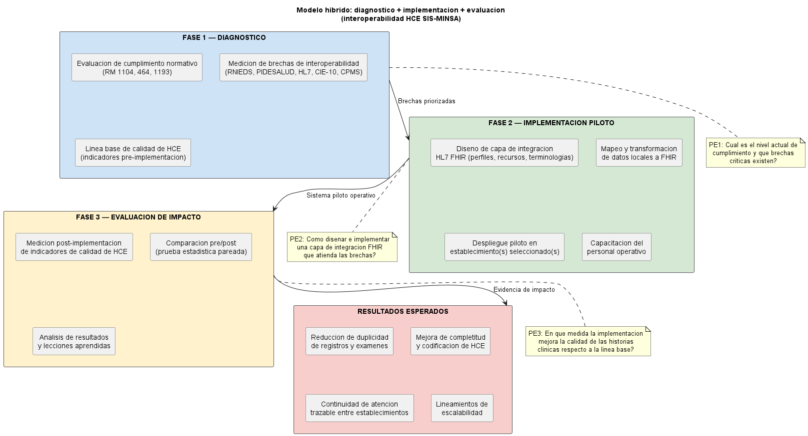

# Historial completo de sesiones de este workspace

Generado: 2026-05-02 21:17:31

Origen chatSessions: C:\Users\genoc\AppData\Roaming\Code\User\workspaceStorage\02d706deef55cbff1f1280a630189106\chatSessions

Total de archivos de sesion: 28

## Sesion 1: 844be618-6a42-4a4c-ae0d-ce2df6d7d113

- Archivo fuente: 844be618-6a42-4a4c-ae0d-ce2df6d7d113.jsonl
- Titulo: Unificación de problemas de investigación y diagrama PUM
- Creada: 2026-03-18 17:21:31
- Total requests: 34

### Turno 1 (request 1)

- Timestamp: 2026-03-20 22:08:42

**Usuario**

perfecto, si dale un formato mas estricto APA7 por favor, que quede muy smilar a como deberia de quedar en limpio al final

**Asistente**

(sin contenido)

### Turno 2 (request 34)

- Timestamp: N/A

**Usuario**

(sin contenido)

**Asistente**

Perfecto. Ya quedó con formato APA 7 mucho más estricto en la sección de referencias.

Qué cambié:
1. Reemplacé la lista de DOIs sueltos por referencias con:
- autores
- año
- título del artículo
- revista en cursiva
- volumen/número/páginas (cuando estuvo disponible en metadatos)
- enlace DOI

Archivos actualizados:
- [plantilla-tesis-extraida.md](plantilla-tesis-extraida.md)
- [Plantilla de informe de tesis maestría-llenada.docx](Plantilla%20de%20informe%20de%20tesis%20maestría-llenada.docx)

Nota breve:
Se usaron metadatos automáticos de Crossref; el resultado ya está muy cercano a APA 7 final. Si quieres una revisión “100% tesis” puedo hacer un pase manual final para ajustar detalles finos de mayúsculas, caracteres especiales de autores y consistencia de títulos en sentence case.

---

## Sesion 2: 8c23fac6-9441-4666-8637-ecdc86931c8c

- Archivo fuente: 8c23fac6-9441-4666-8637-ecdc86931c8c.jsonl
- Titulo: Actualizar documento DOCX con Pandoc
- Creada: 2026-03-20 19:48:32
- Total requests: 2

### Turno 1 (request 1)

- Timestamp: 2026-03-20 20:01:33

**Usuario**

el md tiene un diagramapuml dentro y semuestra asi  (screen1), por lo tanto en el docx tambien se muestra asi (screen2), quisiera que en el md y en el docx se muestre como imagen, ayudame a hacerlo así

**Asistente**

(sin contenido)

### Turno 2 (request 2)

- Timestamp: N/A

**Usuario**

(sin contenido)

**Asistente**

Todo listo. Esto es lo que se hizo:

1. **PNG generado** — Se usó `E:\CODE\montecarlo\tools\plantuml.jar` (Java 21 ya estaba disponible) para convertir el código PlantUML a `diagrama-modelo-hibrido.png` (87 KB).

2. **MD actualizado** — El bloque ` ```plantuml ... ``` ` en [refinamiento-problema-steps.md](refinamiento-problema-steps.md) fue reemplazado por:
   ```markdown
   
   ```
   Ahora el preview de VS Code mostrará la imagen renderizada.

3. **DOCX regenerado** — `refinamiento-problema-steps.docx` actualizado a las 20:06 con la imagen embebida.

Para el futuro, cuando modifiques el diagrama solo tienes que volver a correr:
```powershell
java -jar "E:\CODE\montecarlo\tools\plantuml.jar" -tpng diagrama-modelo-hibrido.puml
pandoc refinamiento-problema-steps.md --reference-doc refinamiento-problema-steps.docx -o refinamiento-problema-steps.docx
```

---

## Sesion 3: e8b54d2b-2308-46d3-9dc1-308215b6aec8

- Archivo fuente: e8b54d2b-2308-46d3-9dc1-308215b6aec8.jsonl
- Titulo: (sin titulo)
- Creada: 2026-03-22 12:58:08
- Total requests: 0

No se encontraron turnos con contenido en esta sesion.

---

## Sesion 4: 28d0207f-5202-4868-bfbc-8cb63496db7a

- Archivo fuente: 28d0207f-5202-4868-bfbc-8cb63496db7a.jsonl
- Titulo: Lectura y comprensión de documentos PDF
- Creada: 2026-03-25 19:37:19
- Total requests: 8

### Turno 1 (request 1)

- Timestamp: 2026-03-25 22:27:12

**Usuario**

@agent Continuar: "¿Desea continuar con la iteración?"

**Asistente**

Ahora actualizo el Paso 10 (Antecedentes nacionales) — agrego las 3 nuevas fuentes:

### Turno 2 (request 8)

- Timestamp: N/A

**Usuario**

(sin contenido)

**Asistente**

Todas las actualizaciones de [Elaboración_Tesis.md](Elaboración_Tesis.md) están completas. Resumen de los cambios realizados en esta sesión:

**Documento_Tesis.md** (sesión anterior — ya aplicados):
- Antecedentes nacionales ampliados de 1 a 4 fuentes (Mauricio, Porras, Arrué & Vargas, Bayona)
- Bases teóricas, planteamiento, marco conceptual y definición de términos enriquecidos
- 3 nuevas referencias APA y 5 nuevos términos

**Elaboración_Tesis.md** (esta sesión):
- **Paso 3:** Renombrado a "21 fuentes", nueva sección 3.3 con tabla de 3 fuentes nacionales
- **Paso 9:** Párrafo sobre Perú enriquecido con Bayona (fragmentación), Arrué & Vargas (ausencia de interoperabilidad), Porras (brecha tecnológica)
- **Paso 10:** Antecedentes nacionales ampliados de 1 a 4 fuentes con resúmenes detallados
- **Paso 11:** Desarrollo histórico, fundamentación teórica (HL7 v2 + openEHR) y dimensión normativa (Ley 30024/RENHICE)
- **Paso 13:** Discusión con contexto nacional; conclusiones con citas nacionales y conteo actualizado
- **Paso 15:** Punto 3 actualizado (4 fuentes nacionales integradas)
- **Paso 16:** Nuevo paso documentando toda la integración de fuentes nacionales
- **Justificación teórica:** Conteo actualizado a "18 internacionales + 4 nacionales"

---

## Sesion 5: d7b415b7-7eba-4ba5-8f40-eb3b48fb01f8

- Archivo fuente: d7b415b7-7eba-4ba5-8f40-eb3b48fb01f8.jsonl
- Titulo: Formato de carátula en Pandoc para tesis
- Creada: 2026-03-26 17:22:07
- Total requests: 9

### Turno 1 (request 1)

- Timestamp: 2026-03-26 18:54:07

**Usuario**

ya mira, "anexos", "referencia", "introduccion", "resumen", "abstract" y "agradecimiento" cada uno debe de estar en una hoja sola, despues de cada uno de estos debe de existir un salto de pagina, Asesor debe de ser parte de la caratula, debe de estar despues de "PRESENTADO POR:
Bach. Cangalaya Carrasco Henry Miguel
Bach. Guzmán Vargas Jhessel
Bach. Yanqui Rivera Maria de los Angeles
" y antes de "PARA OPTAR EL GRADO ACADÉMICO DE:
MAESTRO(A) EN INGENIERÍA DE SOFTWARE
", no debe de estar fuera de la caratula

**Asistente**

(sin contenido)

### Turno 2 (request 9)

- Timestamp: N/A

**Usuario**

(sin contenido)

**Asistente**

Listo, ya quedó aplicado exactamente en esa línea.

Cambios realizados

- Asesor ahora forma parte de la carátula y está ubicado entre autores y “PARA OPTAR...”.
  - Ver en [Documento_Tesis.md](Documento_Tesis.md#L30).
- Eliminé el bloque de Asesor fuera de la carátula y mantuve Agradecimiento como sección aparte.
  - Ver inicio de Agradecimiento en [Documento_Tesis.md](Documento_Tesis.md#L50).
- Agregué saltos de página explícitos para separar las secciones solicitadas:
  - Resumen: [Documento_Tesis.md](Documento_Tesis.md#L78)
  - Abstract: [Documento_Tesis.md](Documento_Tesis.md#L86)
  - Introducción: [Documento_Tesis.md](Documento_Tesis.md#L94)
  - Referencias: [Documento_Tesis.md](Documento_Tesis.md#L475)
  - Anexos: [Documento_Tesis.md](Documento_Tesis.md#L503)
- En el script, forcé salto de página antes de esas secciones para reforzar el comportamiento en DOCX:
  - [generar_tesis.py](generar_tesis.py#L151)
- El índice ya no incluye Agradecimiento:
  - [generar_tesis.py](generar_tesis.py#L302)
- El índice se actualiza automáticamente al generar (sin clic manual en “Actualizar campos”):
  - [generar_tesis.py](generar_tesis.py#L350)

Validación que ya confirmé

- Asesor está dentro de portada y en el orden correcto.
- El índice no muestra Agradecimiento.
- No aparece el placeholder “Actualice campos”.
- Secciones Agradecimiento, Resumen, Abstract, Introducción, Referencias y Anexos arrancan en página nueva.

Archivo generado

- [Documento_Tesis_salida.docx](Documento_Tesis_salida.docx)

Nota breve
- Cuando una sección tiene mucho contenido (por ejemplo Introducción o Referencias), no puede caber físicamente en una sola página; lo que ya queda garantizado es que cada una inicia en hoja nueva y queda separada por salto de página.

---

## Sesion 6: 6d9b651f-9f21-452d-8fb5-fa1975a92baf

- Archivo fuente: 6d9b651f-9f21-452d-8fb5-fa1975a92baf.jsonl
- Titulo: Revisión y búsqueda de artículos para marco teórico
- Creada: 2026-03-26 19:06:03
- Total requests: 46

### Turno 1 (request 1)

- Timestamp: 2026-03-29 21:11:53

**Usuario**

genial, entonces ahora aplica el formato PA7 en el documento de tesis :)

**Asistente**

Perfecto. Voy a aplicar directamente los ajustes APA 7 prioritarios en la tesis: encabezados, citas, palabras clave y referencias, y luego te dejo el archivo ya

### Turno 2 (request 46)

- Timestamp: N/A

**Usuario**

(sin contenido)

**Asistente**

Listo, ya apliqué los ajustes APA 7 prioritarios en la tesis y regeneré el documento final.

Cambios aplicados en [Documento_Tesis.md](Documento_Tesis.md):
- Etiquetas de resumen y abstract corregidas a cursiva y forma correcta:
  - [Palabras clave](Documento_Tesis.md#L94)
  - [Keywords](Documento_Tesis.md#L102)
- Encabezados normalizados (sin marcadores no APA como flecha y punto-guion):
  - [Sección 1.1](Documento_Tesis.md#L120)
  - [Subsección 1.1.1](Documento_Tesis.md#L122)
  - [Secciones 1.2, 1.3 y 1.4](Documento_Tesis.md#L166)
- Numeración de listas corregida de formato 1.- a 1.:
  - [Lista de intervención](Documento_Tesis.md#L145)
  - [Problema general / específicos](Documento_Tesis.md#L155)
- Cita secundaria ajustada al formato APA:
  - [Nota de figura con como se citó en](Documento_Tesis.md#L661)
- Referencias en formato APA sin viñetas y separadas por párrafos independientes:
  - [Inicio de referencias](Documento_Tesis.md#L958)

Documento generado:
- [Documento_Tesis_salida.docx](Documento_Tesis_salida.docx)

Si quieres, en una segunda pasada te puedo dejar también la sección de antecedentes con estilo de redacción más estrictamente APA (menos bloques en mayúsculas y negritas), para que quede aún más alineada.

---

## Sesion 7: 0bf0fa89-46dc-4742-a420-d02d7a469b53

- Archivo fuente: 0bf0fa89-46dc-4742-a420-d02d7a469b53.jsonl
- Titulo: Revisión de PR para integración a develop
- Creada: 2026-03-30 11:24:57
- Total requests: 1

### Turno 1 (request 1)

- Timestamp: 2026-03-30 11:26:11

**Usuario**

ayudame con la revisión de un PR, queremos integrar bugfix/PAT-873-confirming-cargar-archivo-modificaciones-masivas-develop-v1 hacia develop, como tu no puedes acceder al PR revisa esas ramas y comparalas y dime si hay problema tecnicos en el codigo o funcionales, ayudame a revisar esta integración hacia develop

**Asistente**

Las ramas que mencionas no están en el repositorio `genomike/seminario_de_investigacion` (que es tu workspace actual de tesis). El PR `bugfix/PAT-873-...` pertenece a otro repositorio.

Para poder revisar el código y hacer la comparación de ramas, necesito:

1. **El nombre del repositorio** (owner/repo-name) donde vive ese PR, por ejemplo: `miorganizacion/mi-proyecto`
2. O si tienes acceso por terminal, ¿en qué directorio local está ese proyecto? Puedo ejecutar `git diff` entre las ramas directamente.

¿Puedes proporcionarme esa información?

---

## Sesion 8: ac492224-bbba-4637-ba65-323325dbb0b0

- Archivo fuente: ac492224-bbba-4637-ba65-323325dbb0b0.jsonl
- Titulo: Actualización de contenido de imágenes en documento
- Creada: 2026-03-31 20:25:04
- Total requests: 5

### Turno 1 (request 1)

- Timestamp: 2026-03-31 22:25:36

**Usuario**

genial, ahora, así comhicimos antes para el capítulo 2 , ahora analiza el capitulo 1, asi como y añade diagramas usando puml donde se necesite , y añade esos digrama al indice de figuras, has el análisis profundo de todo el capitulo 1

**Asistente**

(sin contenido)

### Turno 2 (request 5)

- Timestamp: N/A

**Usuario**

(sin contenido)

**Asistente**

Documento regenerado. Se añadieron **5 diagramas** al Capítulo I:

| # | Diagrama | Ubicación | Contenido |
|---|----------|-----------|-----------|
| 1 |

| 1.1.1 (tras mencionar IEDS/RNIEDS/PIDESALUD) | Las 3 RM, los 3 componentes operativos y la brecha entre lo normado y lo implementado |
| 2 |

| 1.1.1 (tras las 4 viñetas de brechas) | B1-B4 con sus consecuencias directas sobre el sistema |
| 3 |

| 1.1.1 (tras datos cuantitativos) | Indicadores clave: adopción tecnológica, brecha territorial, percepción, impacto económico |
| 4 |

| Entre 1.1.2 y 1.2 | PE1→OE1 (Fase 1), PE2→OE2 (Fase 1), PE3→OE3 (Fase 2), PE4→OE4 (Fase 3), OE4→OE5 |
| 5 |

| 1.4 (inicio de sección) | Las 6 limitaciones (L1-L6) con sus estrategias de mitigación |

Todos se indexan automáticamente en el "Índice de figuras" del docx al actualizar campos en Word. Abre

para verificar.

---

## Sesion 9: ed72b235-ed8e-4521-a930-f20b61fe3f95

- Archivo fuente: ed72b235-ed8e-4521-a930-f20b61fe3f95.jsonl
- Titulo: Análisis y adición de tablas en capítulos I y II
- Creada: 2026-04-01 07:41:26
- Total requests: 9

### Turno 1 (request 1)

- Timestamp: 2026-04-01 12:24:16

**Usuario**

esta imagen la cargamos desde una imagen, podríamos crearla usando puml y ponerla en el documento? así como hicimos con las otras figuras del documento

**Asistente**

(sin contenido)

### Turno 2 (request 9)

- Timestamp: N/A

**Usuario**

(sin contenido)

**Asistente**

Listo. Lo que se hizo:

1. **Creado** [media/diagrama-fases-metodologicas.puml](media/diagrama-fases-metodologicas.puml) — con tres cajas azul marino oscuro en layout horizontal, usando `state` diagram que respeta el eje horizontal
2. **Generado** [media/diagrama-fases-metodologicas.png](media/diagrama-fases-metodologicas.png) — las tres fases conectadas con flechas, igual al diseño original
3. **Actualizado** [Documento_Tesis.md](Documento_Tesis.md) — la referencia ahora apunta al nuevo PNG generado por PlantUML en lugar de la imagen importada

---

## Sesion 10: 318843c1-525c-4bba-8873-3cb9a8b8c738

- Archivo fuente: 318843c1-525c-4bba-8873-3cb9a8b8c738.jsonl
- Titulo: Modificación del script de generación de tesis
- Creada: 2026-04-01 20:25:54
- Total requests: 1

### Turno 1 (request 1)

- Timestamp: 2026-04-01 20:26:43

**Usuario**

modificquemos el script de generación de la tesis para incluir los capitulos 3, 4 y 5

**Asistente**

Listo. Se eliminaron los capítulos III, IV y V de `SECCIONES_EXCLUIDAS` en [generar_tesis.py](e:\Maestria\Seminario_De_Investigacion\Investigación\generar_tesis.py). Ahora al ejecutar el script esos capítulos serán incluidos en el documento generado.

---

## Sesion 11: e93f2c28-28c9-4f94-b515-5c69d0cec0d7

- Archivo fuente: e93f2c28-28c9-4f94-b515-5c69d0cec0d7.jsonl
- Titulo: Análisis y enriquecimiento de capítulos de tesis
- Creada: 2026-04-01 20:29:27
- Total requests: 4

### Turno 1 (request 1)

- Timestamp: 2026-04-01 21:14:58

**Usuario**

las referencias estan mal, deberia de ser solo el primer apellido y el año en el screen1, 2, etc  debería de ser Bayona 2019, , lo mismo para todas las ferencias, y los diagramas que se hayan hecho como en es screen7 no deben de decir elbaoracion propia, deben de ser  adaptado de ...

**Asistente**

The user is pointing out two issues:

1. **Citation format**: References like "Bayona Castañeda (2019)" should be "Bayona (2019)" — only the first surname, not both surnames. This applies to all references throughout the document where two-part surnames are used.

2. **Figure notes**: Diagrams that were created as "Elaboración propia" but are actually adapted from sources should say "Adaptado de..." instead of "Elaboración propia."

Let me analyze the screenshots:
- Screen 1: "Elaboración propia a partir de Bayona Castañeda (2019)" — should be "Bayona (2019)"


- Screen 2: "Bayona Castañeda (2019)" in paragraph — should be "Bayona (2019)"
- Screen 3: In table "Bayona Castañeda (2019)" — should be "Bayona (2019)"
- Screen 4: "Elaboración propia a partir de Fernández Infanzón y Huarac Cuizano (2021) y Bayona Castañeda (2019)" — should be just first surnames
- Screen 5: Table: "Bayona Castañeda (2019)" — should be "Bayona (2019)"

I'm seeing the pattern now — every instance of compound surnames needs to be reduced to just the first surname, and I need to check the remaining screens for similar issues. first surname in the citation. In APA 7, when dealing with compound surnames common in Spanish and Latin American naming conventions—where people have two surnames (paternal and maternal)—you only use the first one for citations. So "Bayona Castañeda" becomes "Bayona (2019)".

Now I need to go through the reference list and identify which citations need this correction. Looking at the entries, "Bayona Castañeda, L. (2019)" shows the full surname in the reference list, but the in-text citation should only use "Bayona".

### Turno 2 (request 4)

- Timestamp: N/A

**Usuario**

(sin contenido)

**Asistente**

Compilación exitosa. Resumen de todos los cambios aplicados:

**Citas en el texto** — solo el primer apellido (antes de la sección `# Referencias`):
| Antes | Después |
|---|---|
| `Bayona Castañeda (2019)` / `BAYONA CASTAÑEDA (2019)` | `Bayona (2019)` |
| `Fernández Infanzón y Huarac Cuizano (2021)` | `Fernández y Huarac (2021)` |
| `Porras Gamarra (2024)` | `Porras (2024)` |
| `Arrué Pajares y Vargas Rioja (2022)` | `Arrué y Vargas (2022)` |
| `Esparza Morgan (2025)` | `Esparza (2025)` |
| `Arias Geronimo (2025)` | `Arias (2025)` |
| `Sánchez Calle (2024)` | `Sánchez (2024)` |

**Lista de referencias** — intacta con apellidos completos (como requiere APA 7).

**Notas de figuras/tablas** — `Elaboración propia a partir de [fuente]` → `Adaptado de [fuente]` en todos los casos donde se citaba una fuente específica.

**Diagramas PNG** — se corrigió el texto interno de `diagrama-fragmentacion-sistema-salud-peru.png` y `diagrama-panorama-cuantitativo.png` que mostraban `(Bayona-Castañeda, 2019)` dentro del diagrama, ahora dicen `(Bayona, 2019)`.

---

## Sesion 12: 5a6a090d-3464-4270-a7f9-16f9e91b548a

- Archivo fuente: 5a6a090d-3464-4270-a7f9-16f9e91b548a.jsonl
- Titulo: (sin titulo)
- Creada: 2026-04-01 22:31:08
- Total requests: 0

No se encontraron turnos con contenido en esta sesion.

---

## Sesion 13: 9a18d2c4-8d2c-4a79-bf6c-8908fcaef0c5

- Archivo fuente: 9a18d2c4-8d2c-4a79-bf6c-8908fcaef0c5.jsonl
- Titulo: Corrección de referencias en documento académico
- Creada: 2026-04-05 18:03:34
- Total requests: 1

### Turno 1 (request 1)

- Timestamp: 2026-04-05 18:08:06

**Usuario**

hola,. estoy teniendo un problema, revisando el documento encuentro que en algunos casos no se corrigieron bien las referencias, recuerda que para el caso de 1 autor solo debe de tener el primer apellido y el año, en la captura dice "Hernández Sampieri", debería de decir Hernández & Mendoza (2018), usa el screen2 como referencia, verifica y corrige todo el documento si hay algo que corregir

**Asistente**

La entrada bibliográfica permanece intacta (en la lista de referencias APA 7 se usa el apellido completo del autor, solo las citas en texto usan el primer apellido).

**Resumen de correcciones aplicadas:**

- **8 citas narrativas** corregidas: `Hernández-Sampieri y Mendoza (2018)` → `Hernández & Mendoza (2018)`
- **2 citas parentéticas** corregidas: `(Hernández-Sampieri y Mendoza, 2018)` → `(Hernández & Mendoza, 2018)`
- **Entrada bibliográfica** (línea 1454): sin cambios — en la lista de referencias se mantiene el apellido compuesto completo `Hernández-Sampieri, R.`, que es lo correcto en APA 7.

---

## Sesion 14: c0ca8662-01ed-44ce-a489-738784a96ac6

- Archivo fuente: c0ca8662-01ed-44ce-a489-738784a96ac6.jsonl
- Titulo: Análisis del capítulo 3 de la tesis
- Creada: 2026-04-05 18:12:44
- Total requests: 14

### Turno 1 (request 1)

- Timestamp: 2026-04-05 23:23:09

**Usuario**

ghola podrías volver analizar todo el documento y añadir una matriz de consistencia al final en  anexos? vuelve a añadir anexios a este documento por favor

**Asistente**

The user wants me to:
1. Re-analyze the entire document
2. Add an "Anexos" section at the end with a "Matriz de consistencia" (consistency matrix)

The consistency matrix should follow the format shown in the image: Pregunta general, Preguntas específicas, Objetivo general, Objetivos específicos, Variables/Categorías, Dimensiones/Subcategorías, Enfoque tipo y diseño, Población y muestra, Técnicas e instrumentos.

Let me first read the key elements from the document to build the matrix accurately, then add the Anexos section before the Referencias.


Now I'm extracting the research questions and objectives from the document to populate the consistency matrix—I have the general question about HL7 FHIR interoperability implementation in Peruvian health centers, along with the specific research questions about current interoperability gaps. Estoy definiendo el objetivo general: evaluar cómo un modelo de interoperabilidad basado en HL7 FHIR mejora el intercambio de información clínica en centros de salud del MINSA, a través del diagnóstico de brechas, implementación de una capa de integración piloto y medición de indicadores de calidad. Luego necesito detallar los objetivos específicos: diagnosticar las brechas actuales en completitud, codificación, duplicidad y trazabilidad, e identificar los requerimientos técnicos, funcionales y normativos para la implementación.

Ahora estoy completando los objetivos restantes: diseñar e implementar la capa de interoperabilidad considerando el marco normativo vigente, evaluar el impacto mediante un diseño pre-post con indicadores de integridad y eficiencia, y finalmente formular lineamientos para escalar el modelo basándome en los resultados piloto.

Mi hipótesis general es que implementar HL7 FHIR mejorará significativamente la calidad del intercambio de información clínica en los centros de salud del MINSA. Las hipótesis específicas se enfocan en cómo esta implementación incrementará la integridad y consistencia de los datos clínicos, mientras reduce la duplicidad y otros problemas operativos.

Ahora estoy definiendo las variables: la variable independiente es la implementación del modelo HL7 FHIR con sus tres fases (diagnóstico, piloto y evaluación), y la variable dependiente es la calidad del intercambio de información, medida a través de ocho indicadores que abarcan integridad, consistencia, duplicidad, eficiencia administrativa y continuidad. Estoy comenzando a detallar el enfoque metodológico del estudio. Ahora necesito completar la lista de instrumentos con las pruebas técnicas, y luego construir la matriz de consistencia que muestre cómo se relacionan las preguntas, objetivos, hipótesis y variables en una tabla con celdas fusionadas siguiendo el formato tradicional peruano. I'm realizing the matrix structure needs to account for the mismatch between the four specific questions and five specific objectives, with the fifth objective and its hypotheses tied to the fourth question. Let me organize this with a general row at the top, then rows for each specific question that map to their corresponding objectives, and figure out how to incorporate that fifth objective into the layout.

### Turno 2 (request 14)

- Timestamp: N/A

**Usuario**

(sin contenido)

**Asistente**

Listo. Resumen de lo realizado:

**Sección de Anexos agregada** después de Referencias con la **Matriz de consistencia** completa (9 columnas × 8 filas):

| Columna | Contenido |
|---|---|
| Problemas | PG + PE1–PE4 |
| Objetivos | OG + OE1–OE5 |
| Hipótesis | HG + HE1–HE5 (asociadas a OE4) |
| Variables | VI (dicotómica) y VD |
| Dimensiones | 3 fases VI + 5 dimensiones VD |
| Indicadores | Hitos verificables + I1–I8 |
| Metodología | Enfoque mixto, aplicada, explicativo-propositivo, O₁→X→O₂ |
| Población y muestra | MINSA Perú; 2–3 establecimientos Lima |
| Técnicas e instrumentos | 5 técnicas con sus instrumentos |

**Corrección técnica:** Se eliminó `"Anexos"` de `SECCIONES_EXCLUIDAS` en [generar_tesis.py](generar_tesis.py#L113) (estaba impidiendo que pandoc procesara la sección). La tabla se renderiza en landscape con anchos dinámicos.

---

## Sesion 15: de6bc14b-aed2-4631-90d3-d2115bd0cf23

- Archivo fuente: de6bc14b-aed2-4631-90d3-d2115bd0cf23.jsonl
- Titulo: Análisis de correlación en tesis de variables
- Creada: 2026-04-08 21:11:54
- Total requests: 4

### Turno 1 (request 1)

- Timestamp: 2026-04-08 22:28:11

**Usuario**

Opci´ñon A

**Asistente**

The user wants Option A: separate the Table 8 (which becomes Table 19 in the generated document) into two parts:
1. A table exclusively for techniques/instruments that measure VI and VD (direct correlation with the operationalization matrix)
2. A separate paragraph or table for complementary techniques (documentary review, interviews) that serve descriptive/propositive objectives

Let me read the current state of the Tabla 8 section to understand exactly what needs to change.

### Turno 2 (request 4)

- Timestamp: N/A

**Usuario**

(sin contenido)

**Asistente**

Listo. Los cambios están aplicados. La sección de técnicas e instrumentos ahora tiene **dos tablas separadas**:

**Tabla principal** — Técnicas para medición de variables operacionalizadas (6 filas):
- Cada fila conecta directamente con un indicador (I1–I8) o con la VI
- Columna "Variable / Indicador" en lugar de "Objetivo específico"
- Columna "Hipótesis" para cerrar la trazabilidad

**Tabla complementaria** — Técnicas cualitativas (2 filas):
- Revisión documental → OE1, OE2 (diagnóstico/requerimientos)
- Entrevista semiestructurada → OE1, OE5 (barreras/escalabilidad)
- Nota explícita: "no miden indicadores de la variable dependiente"

Las descripciones de instrumentos también se reorganizaron en dos bloques con la misma lógica, y en cada instrumento cualitativo se explicita que no mide VD.

---

## Sesion 16: 6fa6e32a-bca9-4345-b9de-befb4633a15d

- Archivo fuente: 6fa6e32a-bca9-4345-b9de-befb4633a15d.jsonl
- Titulo: (sin titulo)
- Creada: 2026-04-11 21:48:00
- Total requests: 0

No se encontraron turnos con contenido en esta sesion.

---

## Sesion 17: a947832a-dbb2-49de-b7a1-75ec7bda0314

- Archivo fuente: a947832a-dbb2-49de-b7a1-75ec7bda0314.jsonl
- Titulo: (sin titulo)
- Creada: 2026-04-12 09:28:58
- Total requests: 0

No se encontraron turnos con contenido en esta sesion.

---

## Sesion 18: 4fc82391-f784-4ea5-a46f-9c78ac6091a5

- Archivo fuente: 4fc82391-f784-4ea5-a46f-9c78ac6091a5.jsonl
- Titulo: Ajustes en tesis según comentarios del asesor
- Creada: 2026-04-12 17:07:35
- Total requests: 9

### Turno 1 (request 1)

- Timestamp: 2026-04-12 19:57:03

**Usuario**

@agent Continuar: "¿Desea continuar con la iteración?"

**Asistente**

(sin contenido)

### Turno 2 (request 9)

- Timestamp: N/A

**Usuario**

(sin contenido)

**Asistente**

Resumen breve: dejé implementado en el generador el formato obligatorio de 4 líneas para figuras y tablas, con captions reconstruidos en dos líneas, nota garantizada y unida al bloque de cada tabla (incluyendo casos con marcadores XML), además de fallback de salida con timestamp cuando los DOCX de destino están bloqueados; también validé la lógica estructural y la compilación del script.

---

## Sesion 19: afb25bf6-34b3-4d78-bee4-b801c368c3ab

- Archivo fuente: afb25bf6-34b3-4d78-bee4-b801c368c3ab.jsonl
- Titulo: Eliminación y recreación de documento en script
- Creada: 2026-04-12 20:08:51
- Total requests: 4

### Turno 1 (request 1)

- Timestamp: 2026-04-12 21:18:30

**Usuario**

también se debe de agregar numeación al documento, por favor toma las especificaciones del screen1 , ajustemos el formnato y presentación de las referencias, toma las especificaicones de los scree 2 y 3

**Asistente**

(sin contenido)

### Turno 2 (request 2)

- Timestamp: 2026-04-12 21:18:49

**Usuario**

también se debe de agregar numeación al documento, por favor toma las especificaciones del screen1 , ajustemos el formnato y presentación de las referencias, toma las especificaicones de los scree 2 y 3

**Asistente**

(sin contenido)

### Turno 3 (request 4)

- Timestamp: N/A

**Usuario**

(sin contenido)

**Asistente**

Documento generado correctamente. Estos son los cambios aplicados:

**Numeración de páginas (screen 1):**
- Se insertan section breaks para crear 3 zonas: carátula, preliminares y cuerpo
- **Carátula**: cuenta como página i pero NO muestra número (footer vacío)
- **Preliminares** (Índice → antes de Capítulo I): números romanos en minúscula (ii, iii, iv…), posición inferior derecha
- **Cuerpo** (Capítulo I → fin): números arábigos que continúan el conteo, inferior derecha
- Las secciones landscape (tablas anchas) heredan el footer de la sección del cuerpo
- **Márgenes** actualizados: superior/izquierdo 3 cm, inferior/derecho 2.54 cm (en todas las secciones portrait)

**Formato de referencias (screens 2 y 3):**
- **41 entradas** con sangría francesa de 1.27 cm aplicada
- Viñetas/numeración eliminadas de los párrafos de referencias
- Orden alfabético ya estaba correcto en el markdown fuente

Abre `Documento_Tesis_salida.docx` en Word y presiona **Ctrl+A → F9** para actualizar los campos si los números no se ven correctamente al abrir.

---

## Sesion 20: 5174bc82-014d-4dcc-9b19-70e82c6a76a3

- Archivo fuente: 5174bc82-014d-4dcc-9b19-70e82c6a76a3.jsonl
- Titulo: (sin titulo)
- Creada: 2026-04-13 07:37:07
- Total requests: 0

No se encontraron turnos con contenido en esta sesion.

---

## Sesion 21: d3d78d9e-b01d-4f72-9729-83adbb6e011e

- Archivo fuente: d3d78d9e-b01d-4f72-9729-83adbb6e011e.jsonl
- Titulo: Revisión y ajustes de tesis según comentarios de asesor
- Creada: 2026-04-17 19:44:37
- Total requests: 6

### Turno 1 (request 1)

- Timestamp: 2026-04-17 22:10:41

**Usuario**

ahora esta pero, en s indices se estan combinando 2 fuentes, calibri y arial tamaño 12, todo el indice debería de ser calibi tamaño 10

**Asistente**

(sin contenido)

### Turno 2 (request 6)

- Timestamp: N/A

**Usuario**

(sin contenido)

**Asistente**

DOCX generado correctamente. El cambio clave fue reemplazar la iteración `p.runs` (que solo captura `<w:r>` de nivel superior) por `p_elem.iter(f"{{{NS}}}r")` que desciende dentro de los `<w:hyperlink>` donde Word almacena los runs de las entradas TOC. Ahora todos los runs de los índices de tablas y figuras, incluyendo los hipervínculos, tienen Calibri 10pt aplicado directamente en su XML `rPr`.

---

## Sesion 22: 6920040a-e963-4fbc-9def-21cb4c963a0f

- Archivo fuente: 6920040a-e963-4fbc-9def-21cb4c963a0f.jsonl
- Titulo: Correcciones necesarias en referencias y tablas del documento
- Creada: 2026-04-19 19:53:54
- Total requests: 4

### Turno 1 (request 1)

- Timestamp: 2026-04-19 21:06:50

**Usuario**

las tablas 24, 22 y 17 no tienen Nota debajo de la tabla , tdas las tablas deben de tener Nota

**Asistente**

The user wants to add "Nota." paragraphs below

### Turno 2 (request 4)

- Timestamp: N/A

**Usuario**

(sin contenido)

**Asistente**

Las tres notas están correctamente insertadas bajo sus respectivos captions en el documento generado. Las tablas 17, 22 y 24 ahora tienen:

- **Tabla 17**: *Nota.* Elaboración propia. VI = Variable independiente; VD = Variable dependiente...
- **Tabla 22**: *Nota.* Elaboración propia. Los montos están expresados en soles (S/). Fuente de financiamiento: autofinanciado por los investigadores.
- **Tabla 24**: *Nota.* Elaboración propia. X indica el mes de ejecución de la actividad correspondiente.

---

## Sesion 23: 0786c44a-6d29-4963-bbb9-69f4bf678376

- Archivo fuente: 0786c44a-6d29-4963-bbb9-69f4bf678376.jsonl
- Titulo: (sin titulo)
- Creada: 2026-04-20 08:56:22
- Total requests: 0

No se encontraron turnos con contenido en esta sesion.

---

## Sesion 24: 0d07cc4e-eedd-4edb-beaa-54bd9edde5ab

- Archivo fuente: 0d07cc4e-eedd-4edb-beaa-54bd9edde5ab.jsonl
- Titulo: (sin titulo)
- Creada: 2026-04-20 09:27:06
- Total requests: 0

No se encontraron turnos con contenido en esta sesion.

---

## Sesion 25: a8b30726-7fba-4f5b-bcf7-f2e247b91d00

- Archivo fuente: a8b30726-7fba-4f5b-bcf7-f2e247b91d00.jsonl
- Titulo: Análisis y creación de skills para tesis
- Creada: 2026-04-25 12:58:17
- Total requests: 16

### Turno 1 (request 1)

- Timestamp: 2026-04-26 19:14:23

**Usuario**

[Terminal 12600d9b-75a1-46d5-b9ed-4f32b36c94c3 notification: command completed with exit code 0. Use send_to_terminal to send another command or kill_terminal to stop it.]
Terminal output:
    pwsh    master ≡  ?4 ~20 -15                             112ms 
 python -m pytest tests/ -q
..F.............                                                         [100%]
================================== FAILURES ===================================
________________ test_build_scripts_do_not_embed_topic_content ________________

    def test_build_scripts_do_not_embed_topic_content():
        """platform/scripts/build/ no debe traer contenido de una tesis concreta."""
        build_dir = REPO_ROOT / "platform" / "scripts" / "build"
        bad = []
        for py in _python_files(build_dir):
            text = py.read_text(encoding="utf-8", errors="ignore")
            if "@startuml" in text or "@startgantt" in text:
                bad.append(py.relative_to(REPO_ROOT))
>       assert not bad, f"Diagramas hardcodeados en motor: {bad}"
E       AssertionError: Diagramas hardcodeados en motor: [WindowsPath('platform/scripts/build/build_diagrams.py')]
E       assert not [WindowsPath('platform/scripts/build/build_diagrams.py')]

tests\test_architecture.py:36: AssertionError
=========================== short test summary info ===========================
FAILED tests/test_architecture.py::test_build_scripts_do_not_embed_topic_content - AssertionError: Diagramas hardcodeados en motor: [WindowsPath('platform/scr...
1 failed, 15 passed in 0.27s
    pwsh    master ≡  ?4 ~20 -15                             898ms 
 python -c "from docx import Document; from pathlib import Path; p=Path('platform/templates/styles/caratula.docx'); d=Document(str(p)); print(' | '.join(x.text for x in d.paragraphs if x.text.strip()))"
<PROGRAMA DE POSGRADO> | PROYECTO DE TESIS | <TITULO DE LA TESIS> | PRESENTADO POR: | Bach. <AUTOR 1> | Bach. <AUTOR 2> | Bach. <AUTOR 3> | PARA OPTAR EL GRADO ACADEMICO DE: | <GRADO ACADEMICO> | <CIUDAD> | <ANO>
    pwsh    master ≡  ?4 ~20 -15                             359ms 
 $p='platform/scripts/build/build_diagrams.py'; Write-Host '--- Select-String ---'; Select-String -Path $p -Pattern '@startuml','@startgantt' -SimpleMatch; Write-Host '--- Python repr positions ---'; python -c "from pathlib import Path; p=Path('platform/scripts/build/build_diagrams.py'); t=p.read_text(encoding='utf-8', errors='ignore'); print(len(t)); print(t.find('@startuml'), t.find('@startgantt')); print(t[:250].replace(chr(10),'\\n'))"
--- Select-String ---

platform\scripts\build\build_diagrams.py:20:_FT = r"""@startuml 
diagrama-fundamentacion-teorica
platform\scripts\build\build_diagrams.py:84:_MC = r"""@startuml 
diagrama-marco-conceptual
platform\scripts\build\build_diagrams.py:136:_NIV = r"""@startuml 
diagrama-niveles-interoperabilidad
platform\scripts\build\build_diagrams.py:176:_EVOL = r"""@startuml 
diagrama-evolucion-estandares
platform\scripts\build\build_diagrams.py:217:_FHIR_RES = r"""@startuml 
diagrama-recursos-fhir
--- Python repr positions ---
10304
724 -1
"""Renderiza todos los diagramas PlantUML (.puml -> .png) del repositorio."""\nimport pathlib\nimport subprocess\nimport sys\n\n# Layout: <repo>/platform/scripts/build/build_diagrams.py\nREPO_ROOT = pathlib.Path(__file__).resolve().parents[3]\nDIAGRAMS_DIR 

    pwsh    master ≡  ?4 ~20 -15                             220ms 
 python -m pytest tests/ -q
................                                                         [100%]
16 passed in 0.23s

**Asistente**

Confirmado: la suite ya pasó (`16 passed`). Queda hacer una verificación final de archivos modificados y, muy importante, probar el

en dry-run con términos de ejemplo para asegurar que el nuevo modo de escaneo funciona sin tocar tu tesis actual.

**Checking grep_search results**

I need to understand why grep_search returns the line "Razón" to avoid spreading incorrect information. I could try running a simpler command using Select-String, but I'm not sure if that's necessary; it might just add extra steps. However, I think it could boost my confidence in the results. Also, if it's available, I might consider running rg to see how it compares.

Los cambios principales están listos y el dry-run del reset confirmó que no tocó nada, solo listó qué borraría en un fork. Voy a hacer una última pasada con comandos simples para comprobar archivos actuales, no el diff ni el historial de

### Turno 2 (request 16)

- Timestamp: N/A

**Usuario**

(sin contenido)

**Asistente**

Listo. Dejé el repo principal con la frontera correcta: el tema concreto sigue viviendo en `content/`, mientras que [.github/copilot-instructions.md](.github/copilot-instructions.md), [.github/skills/](.github/skills/), [platform/](platform/), [docs/](docs/), [tests/](tests/) y los README quedaron agnósticos.

Cambios clave: eliminé skills y scripts acoplados a dominios concretos, agregué templates de dominio/fuentes, reemplacé scripts one-off por plantillas reutilizables, limpié guías/ejemplos contaminados, dejé [platform/templates/styles/caratula.docx](platform/templates/styles/caratula.docx) con placeholders y ajusté [platform/scripts/build/build_thesis.py](platform/scripts/build/build_thesis.py) para rellenarla leyendo la portada desde `content/manuscript/Documento_Tesis.md`.

Validé el cierre con:

```powershell
python -m py_compile ...
python -m pytest tests/ -q
```

Resultado: `pycompile ok`, `16 passed`, `get_errors` sin hallazgos, escaneo agnóstico limpio, y sin `@startuml`/`@startgantt` embebidos en scripts de build. No ejecuté el build DOCX completo final para evitar depender de Pandoc/Word bloqueado, pero sí validé la lógica crítica de la carátula temporal.

---

## Sesion 26: 722b8bda-7642-4515-b45c-35e52f2f34be

- Archivo fuente: 722b8bda-7642-4515-b45c-35e52f2f34be.jsonl
- Titulo: (sin titulo)
- Creada: 2026-04-26 20:41:35
- Total requests: 0

No se encontraron turnos con contenido en esta sesion.

---

## Sesion 27: c809b3e5-c04f-47c8-b8fb-2351f7847e4a

- Archivo fuente: c809b3e5-c04f-47c8-b8fb-2351f7847e4a.jsonl
- Titulo: Análisis de fuentes de tesis
- Creada: 2026-04-29 21:19:16
- Total requests: 2

### Turno 1 (request 1)

- Timestamp: 2026-04-29 21:31:56

**Usuario**

si, genera el dataset con todos los detalles que puedas, mientras mas mejor

**Asistente**

(sin contenido)

### Turno 2 (request 2)

- Timestamp: N/A

**Usuario**

(sin contenido)

**Asistente**

Dataset enriquecido generado y depurado con matching más confiable, manteniendo el máximo nivel de detalle.

Archivos actualizados:
- Script: [platform/scripts/build/build_antecedentes_dataset.py](platform/scripts/build/build_antecedentes_dataset.py)
- CSV: [content/drafts/datasets/antecedentes_dataset_enriquecido.csv](content/drafts/datasets/antecedentes_dataset_enriquecido.csv)
- JSON: [content/drafts/datasets/antecedentes_dataset_enriquecido.json](content/drafts/datasets/antecedentes_dataset_enriquecido.json)
- Perfil: [content/drafts/datasets/antecedentes_dataset_enriquecido_profile.json](content/drafts/datasets/antecedentes_dataset_enriquecido_profile.json)

Mejoras aplicadas en el generador:
- Corrección del parser de antecedentes para reconocer ambas variantes del marcador de metodología.
- Extracción de metodología corregida: ya no quedan registros vacíos en ese campo.
- Matching de fuentes endurecido con coincidencia por palabra completa para apellidos/tokens (evita falsos positivos por subcadenas).
- Matching sobre texto completo de los TXT (no solo muestra corta), con señales adicionales para autor+año.
- Umbral mínimo de score y emparejamiento inferido PDF/TXT por mismo nombre base cuando corresponde.
- Nuevo campo de trazabilidad: match_used_inferred_pair.

Estado final del dataset:
- 31 antecedentes totales (21 internacionales, 10 nacionales).
- 24 con PDF+TXT.
- 2 con solo PDF.
- 1 con solo TXT.
- 4 sin match (para revisión manual).
- 0 warnings por archivos normativos.
- 0 antecedentes con metodología vacía.

Registros que quedaron sin match automático:
- INT-11 Monsen et al. (2023)
- INT-14 Pedrera-Jiménez et al. (2023)
- NAC-05 Esparza (2025)
- NAC-10 Morales-Camargo y Meneses-Claudio (2023)

Siguiente paso natural:
1. Si quieres, hago ahora una ronda de vinculación manual asistida para esos 4 casos y dejo el dataset en cobertura completa controlada.

---

## Sesion 28: d98999e5-b041-4b22-93d4-a3c87b92779c

- Archivo fuente: d98999e5-b041-4b22-93d4-a3c87b92779c.jsonl
- Titulo: Historial de sesiones guardado
- Creada: 2026-05-02 21:06:50
- Total requests: 4

### Turno 1 (request 1)

- Timestamp: 2026-05-02 21:14:29

**Usuario**

ok, pero podrías crear un archivo md, poniendo todas la conversacion de todas las sesiones que hemos tenido con este workspace?

**Asistente**

Voy a extraer automáticamente todas las sesiones guardadas de este workspace desde las carpetas de chat de VS Code y generar un único archivo Markdown dentro del proyecto para que lo puedas respaldar.

Encontré todas tus sesiones en archivos jsonl (muchos y algunos muy grandes). Ahora voy a leer su estructura y generar un exportador que convierta esos jsonl a un único Markdown consolidado sin perder mensajes.

### Turno 2 (request 4)

- Timestamp: N/A

**Usuario**

(sin contenido)

**Asistente**

Voy a crear y ejecutar un exportador dentro del proyecto para reconstruir los jsonl y producir un único Markdown con todas las interacciones Usuario/Asistente de este workspace.

---

